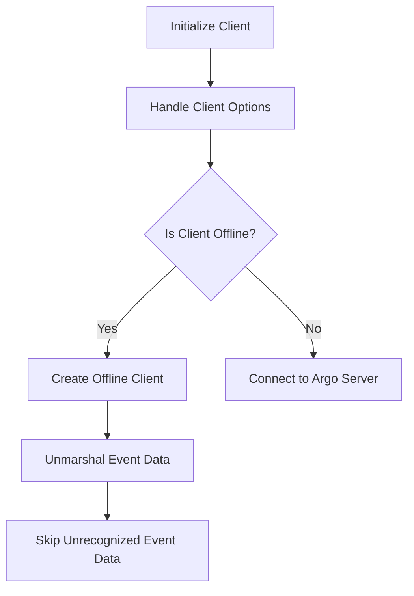

This document will cover the Client Creation and Configuration Flow, which includes:

1. Initializing the client
2. Handling client options
3. Creating an offline client
4. Unmarshalling event data
5. Skipping unrecognized event data.

Technical document: <SwmLink doc-title="Client Creation and Configuration Flow">[Client Creation and Configuration Flow](/.swm/client-creation-and-configuration-flow.mgf01p1z.sw.md)</SwmLink>

# [Initializing the Client](http://localhost:5001/repos/Z2l0aHViJTNBJTNBaW50dWl0LWFyZ28td29ya2Zsb3dzLWRlbW8lM0ElM0FTd2ltbS1EZW1v/docs/mgf01p1z#creating-and-configuring-the-client)

The client initialization process begins by setting up the client configuration using the provided Argo server URL, authentication supplier, and client configuration. This step ensures that the client has the necessary information to connect to the Argo server and authenticate itself. For the end user, this means that the client is prepared to interact with the Argo server securely and efficiently.

# [Handling Client Options](http://localhost:5001/repos/Z2l0aHViJTNBJTNBaW50dWl0LWFyZ28td29ya2Zsb3dzLWRlbW8lM0ElM0FTd2ltbS1EZW1v/docs/mgf01p1z#handling-client-options)

In this step, various client options are processed to determine how the client should operate. The options include whether the client should work offline or connect to the Argo server, validating the Argo server URL and instance ID, and configuring the client accordingly. If the client is set to operate offline, it will not connect to the Argo server but will instead read and store workflow templates from files. For the end user, this step ensures that the client operates in the desired mode, either online or offline, based on their configuration.

# [Creating an Offline Client](http://localhost:5001/repos/Z2l0aHViJTNBJTNBaW50dWl0LWFyZ28td29ya2Zsb3dzLWRlbW8lM0ElM0FTd2ltbS1EZW1v/docs/mgf01p1z#creating-an-offline-client)

When the client is set to operate offline, an offline client is created. This client reads and parses workflow templates from the provided file paths and stores them in memory. This is particularly useful for users who need to lint a set of files without connecting to a cluster. For the end user, this means they can perform workflow template validation and linting locally without needing an active connection to the Argo server.

# [Unmarshalling Event Data](http://localhost:5001/repos/Z2l0aHViJTNBJTNBaW50dWl0LWFyZ28td29ya2Zsb3dzLWRlbW8lM0ElM0FTd2ltbS1EZW1v/docs/mgf01p1z#unmarshalling-event-data)

The unmarshalling process involves extracting necessary fields from incoming event data. This step ensures that the data is correctly parsed and any errors are handled appropriately. For the end user, this means that the client can accurately interpret and process event data, which is crucial for maintaining the integrity and functionality of workflows.

# [Skipping Unrecognized Event Data](http://localhost:5001/repos/Z2l0aHViJTNBJTNBaW50dWl0LWFyZ28td29ya2Zsb3dzLWRlbW8lM0ElM0FTd2ltbS1EZW1v/docs/mgf01p1z#skipping-unrecognized-event-data)

During the unmarshalling process, there may be parts of the event data that are unrecognized or irrelevant. This step involves skipping over these parts to ensure that the unmarshalling process can continue smoothly. For the end user, this means that the client can handle a variety of event data formats and continue processing without interruption, even if some parts of the data are not needed.

&nbsp;

*This is an auto-generated document by Swimm 🌊 and has not yet been verified by a human*

<SwmMeta version="3.0.0" repo-id="Z2l0aHViJTNBJTNBaW50dWl0LWFyZ28td29ya2Zsb3dzLWRlbW8lM0ElM0FTd2ltbS1EZW1v" repo-name="intuit-argo-workflows-demo">Powered by [Swimm](/)</SwmMeta>
