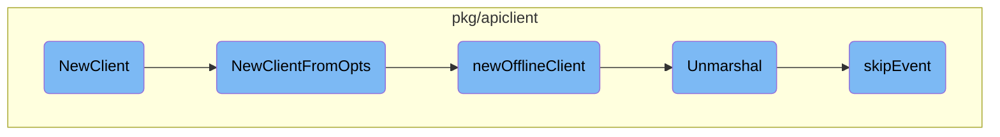
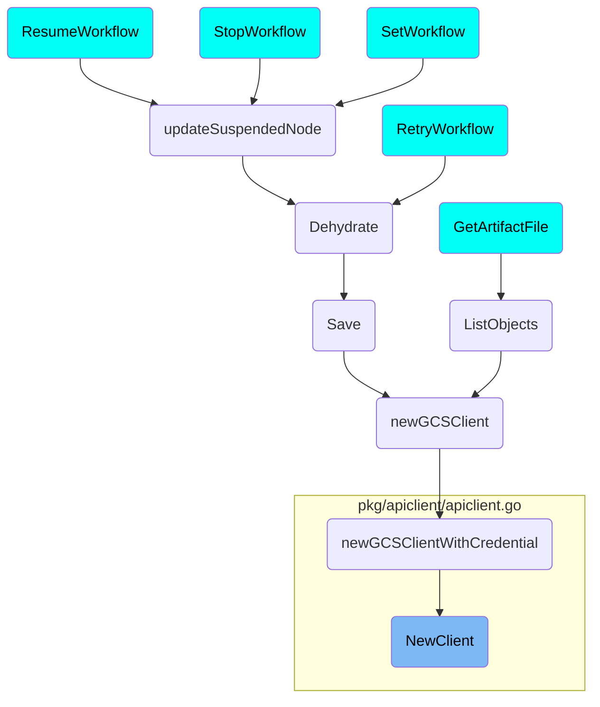

This document explains the process of creating and configuring a client for Argo Workflows. It covers the steps involved in initializing the client, handling client options, creating an offline client, unmarshalling event data, and skipping unrecognized event data.

The flow starts with initializing the client using the provided Argo server URL, authentication supplier, and client configuration. Next, it processes various client options to determine if the client should operate offline or connect to the Argo server. If offline, it creates a client that reads and stores workflow templates from files. The flow also includes unmarshalling event data to extract necessary fields and skipping over unrecognized parts of the data to ensure smooth processing.

# Flow drill down



<SwmSnippet path="/pkg/apiclient/apiclient.go" line="52">

---

## Creating and Configuring the Client

The <SwmToken path="pkg/apiclient/apiclient.go" pos="53:2:2" line-data="func NewClient(argoServer string, authSupplier func() string, clientConfig clientcmd.ClientConfig) (context.Context, Client, error) {">`NewClient`</SwmToken> function is deprecated and delegates to <SwmToken path="pkg/apiclient/apiclient.go" pos="52:7:7" line-data="// DEPRECATED: use NewClientFromOpts">`NewClientFromOpts`</SwmToken>. It initializes the client configuration using the provided Argo server URL, authentication supplier, and client configuration.

```go
// DEPRECATED: use NewClientFromOpts
func NewClient(argoServer string, authSupplier func() string, clientConfig clientcmd.ClientConfig) (context.Context, Client, error) {
	return NewClientFromOpts(Opts{
		ArgoServerOpts: ArgoServerOpts{URL: argoServer},
		AuthSupplier:   authSupplier,
		ClientConfigSupplier: func() clientcmd.ClientConfig {
			return clientConfig
		},
		Context: context.Background(),
	})
}
```

---

</SwmSnippet>

<SwmSnippet path="/pkg/apiclient/apiclient.go" line="64">

---

## Handling Client Options

The <SwmToken path="pkg/apiclient/apiclient.go" pos="64:2:2" line-data="func NewClientFromOpts(opts Opts) (context.Context, Client, error) {">`NewClientFromOpts`</SwmToken> function processes various client options. It checks if the client should operate offline, validates the Argo server URL and instance ID, and configures the client accordingly. If the client is offline, it calls <SwmToken path="pkg/apiclient/apiclient.go" pos="67:3:3" line-data="		return newOfflineClient(opts.OfflineFiles)">`newOfflineClient`</SwmToken>.

```go
func NewClientFromOpts(opts Opts) (context.Context, Client, error) {
	log.WithField("opts", opts).Debug("Client options")
	if opts.Offline {
		return newOfflineClient(opts.OfflineFiles)
	}
	if opts.ArgoServerOpts.URL != "" && opts.InstanceID != "" {
		return nil, nil, fmt.Errorf("cannot use instance ID with Argo Server")
	}
	if opts.ArgoServerOpts.HTTP1 {
		if opts.AuthSupplier == nil {
			return nil, nil, fmt.Errorf("AuthSupplier cannot be empty when connecting to Argo Server")
		}
		return newHTTP1Client(opts.ArgoServerOpts.GetURL(), opts.AuthSupplier(), opts.ArgoServerOpts.InsecureSkipVerify, opts.ArgoServerOpts.Headers, opts.ArgoServerOpts.HTTP1Client)
	} else if opts.ArgoServerOpts.URL != "" {
		if opts.AuthSupplier == nil {
			return nil, nil, fmt.Errorf("AuthSupplier cannot be empty when connecting to Argo Server")
		}
		return newArgoServerClient(opts.ArgoServerOpts, opts.AuthSupplier())
	} else {
		if opts.ClientConfigSupplier != nil {
			opts.ClientConfig = opts.ClientConfigSupplier()
```

---

</SwmSnippet>

<SwmSnippet path="/pkg/apiclient/offline-client.go" line="43">

---

## Creating an Offline Client

The <SwmToken path="pkg/apiclient/offline-client.go" pos="43:2:2" line-data="// newOfflineClient creates a client that keeps all files (or files recursively contained within a path) given to it in memory.">`newOfflineClient`</SwmToken> function creates a client that operates without connecting to a cluster. It reads and parses workflow templates from the provided file paths, storing them in memory for linting purposes.

```go
// newOfflineClient creates a client that keeps all files (or files recursively contained within a path) given to it in memory.
// It is useful for linting a set of files without having to connect to a cluster.
func newOfflineClient(paths []string) (context.Context, Client, error) {
	clusterWorkflowTemplateGetter := &offlineClusterWorkflowTemplateGetter{
		clusterWorkflowTemplates: map[string]*wfv1.ClusterWorkflowTemplate{},
	}
	workflowTemplateGetters := offlineWorkflowTemplateGetterMap{}

	for _, basePath := range paths {
		err := file.WalkManifests(basePath, func(path string, bytes []byte) error {
			var generic map[string]interface{}
			if err := yaml.Unmarshal(bytes, &generic); err != nil {
				return fmt.Errorf("failed to parse YAML from file %s: %w", path, err)
			}
			switch generic["kind"] {
			case "ClusterWorkflowTemplate":
				cwftmpl := new(wfv1.ClusterWorkflowTemplate)
				if err := yaml.Unmarshal(bytes, &cwftmpl); err != nil {
					return fmt.Errorf("failed to unmarshal file %s as a ClusterWorkflowTemplate: %w", path, err)
				}

```

---

</SwmSnippet>

<SwmSnippet path="/pkg/apiclient/event/event.pb.go" line="555">

---

## Unmarshalling Event Data

The <SwmToken path="pkg/apiclient/event/event.pb.go" pos="555:9:9" line-data="func (m *EventRequest) Unmarshal(dAtA []byte) error {">`Unmarshal`</SwmToken> method in <SwmToken path="pkg/apiclient/event/event.pb.go" pos="555:6:6" line-data="func (m *EventRequest) Unmarshal(dAtA []byte) error {">`EventRequest`</SwmToken> processes incoming byte data, extracting fields like <SwmToken path="pkg/apiclient/offline-client.go" pos="74:12:12" line-data="				getter, ok := workflowTemplateGetters[wftmpl.Namespace]">`Namespace`</SwmToken>, <SwmToken path="pkg/apiclient/event/event.pb.go" pos="41:1:1" line-data="	Discriminator string `protobuf:&quot;bytes,2,opt,name=discriminator,proto3&quot; json:&quot;discriminator,omitempty&quot;`">`Discriminator`</SwmToken>, and <SwmToken path="pkg/apiclient/event/event.pb.go" pos="43:1:1" line-data="	Payload              *v1alpha1.Item `protobuf:&quot;bytes,3,opt,name=payload,proto3&quot; json:&quot;payload,omitempty&quot;`">`Payload`</SwmToken>. It ensures the data is correctly parsed and handles any errors that occur during the process.

```go
func (m *EventRequest) Unmarshal(dAtA []byte) error {
	l := len(dAtA)
	iNdEx := 0
	for iNdEx < l {
		preIndex := iNdEx
		var wire uint64
		for shift := uint(0); ; shift += 7 {
			if shift >= 64 {
				return ErrIntOverflowEvent
			}
			if iNdEx >= l {
				return io.ErrUnexpectedEOF
			}
			b := dAtA[iNdEx]
			iNdEx++
			wire |= uint64(b&0x7F) << shift
			if b < 0x80 {
				break
			}
		}
		fieldNum := int32(wire >> 3)
```

---

</SwmSnippet>

<SwmSnippet path="/pkg/apiclient/event/event.pb.go" line="876">

---

## Skipping Unrecognized Event Data

The <SwmToken path="pkg/apiclient/event/event.pb.go" pos="876:2:2" line-data="func skipEvent(dAtA []byte) (n int, err error) {">`skipEvent`</SwmToken> function is used to skip over unrecognized or irrelevant parts of the event data. It ensures that the unmarshalling process can continue smoothly even if some parts of the data are not needed.

```go
func skipEvent(dAtA []byte) (n int, err error) {
	l := len(dAtA)
	iNdEx := 0
	depth := 0
	for iNdEx < l {
		var wire uint64
		for shift := uint(0); ; shift += 7 {
			if shift >= 64 {
				return 0, ErrIntOverflowEvent
			}
			if iNdEx >= l {
				return 0, io.ErrUnexpectedEOF
			}
			b := dAtA[iNdEx]
			iNdEx++
			wire |= (uint64(b) & 0x7F) << shift
			if b < 0x80 {
				break
			}
		}
		wireType := int(wire & 0x7)
```

---

</SwmSnippet>

# Where is this flow used?

This flow is used multiple times in the codebase as represented in the following diagram:

(Note - these are only some of the entry points of this flow)



&nbsp;

*This is an auto-generated document by Swimm 🌊 and has not yet been verified by a human*

<SwmMeta version="3.0.0" repo-id="Z2l0aHViJTNBJTNBaW50dWl0LWFyZ28td29ya2Zsb3dzLWRlbW8lM0ElM0FTd2ltbS1EZW1v" repo-name="intuit-argo-workflows-demo"><sup>Powered by [Swimm](/)</sup></SwmMeta>
