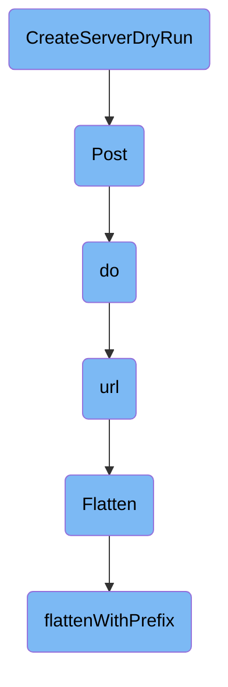

In this document, we will explain the process of creating a server dry run. This process involves simulating the creation of a workflow on the server without actually committing it. This is useful for validating the workflow configuration before making any real changes.

The flow starts with the creation of a server dry run, which involves making a POST request to the server with a <SwmToken path="workflow/util/util.go" pos="208:4:4" line-data="		Param(&quot;dryRun&quot;, &quot;All&quot;).">`dryRun`</SwmToken> parameter. This request is handled by the <SwmToken path="pkg/apiclient/http1/facade.go" pos="45:5:5" line-data="	return h.do(ctx, in, out, &quot;POST&quot;, path)">`do`</SwmToken> function, which sets up the HTTP request, serializes the input data to JSON, and sends it to the server. The URL for the request is constructed by the <SwmToken path="pkg/apiclient/http1/facade.go" pos="101:10:10" line-data="	u, err := h.url(method, path, in)">`url`</SwmToken> function, which formats the input data into query parameters. The response from the server is then processed to check for errors and decode the output if necessary. The <SwmToken path="pkg/apiclient/http1/facade.go" pos="145:14:14" line-data="	for s, v := range flatten.Flatten(in) {">`Flatten`</SwmToken> function is used to convert the input data into a map using <SwmToken path="util/flatten/flatten.go" pos="29:22:24" line-data="// Flatten converts a struct into a map[string]string using dot-notation.">`dot-notation`</SwmToken>, which is then used to create query parameters for the URL.

# Flow drill down



<SwmSnippet path="/workflow/util/util.go" line="200">

---

## <SwmToken path="workflow/util/util.go" pos="200:2:2" line-data="// CreateServerDryRun fills the workflow struct with the server&#39;s representation without creating it and returns an error, if there is any">`CreateServerDryRun`</SwmToken>

The <SwmToken path="workflow/util/util.go" pos="200:2:2" line-data="// CreateServerDryRun fills the workflow struct with the server&#39;s representation without creating it and returns an error, if there is any">`CreateServerDryRun`</SwmToken> function is responsible for filling the workflow struct with the server's representation without actually creating it. This is useful for validating the workflow configuration before committing it. The function makes a POST request with a <SwmToken path="workflow/util/util.go" pos="208:4:4" line-data="		Param(&quot;dryRun&quot;, &quot;All&quot;).">`dryRun`</SwmToken> parameter to simulate the creation.

```go
// CreateServerDryRun fills the workflow struct with the server's representation without creating it and returns an error, if there is any
func CreateServerDryRun(ctx context.Context, wf *wfv1.Workflow, wfClientset wfclientset.Interface) (*wfv1.Workflow, error) {
	// Keep the workflow metadata because it will be overwritten by the Post request
	workflowTypeMeta := wf.TypeMeta
	err := wfClientset.ArgoprojV1alpha1().RESTClient().Post().
		Namespace(wf.Namespace).
		Resource("workflows").
		Body(wf).
		Param("dryRun", "All").
		Do(ctx).
		Into(wf)
	wf.TypeMeta = workflowTypeMeta
	return wf, err
}
```

---

</SwmSnippet>

<SwmSnippet path="/pkg/apiclient/http1/facade.go" line="44">

---

## Post

The Post function is a wrapper that calls the do function with the HTTP method set to POST. This function is used to send the workflow data to the server.

```go
func (h Facade) Post(ctx context.Context, in, out interface{}, path string) error {
	return h.do(ctx, in, out, "POST", path)
}
```

---

</SwmSnippet>

<SwmSnippet path="/pkg/apiclient/http1/facade.go" line="92">

---

## do

The do function handles the actual HTTP request. It serializes the input data to JSON, constructs the URL, sets up the HTTP request with headers, and sends it. The response is then processed to check for errors and decode the output if necessary. This function is crucial for communicating with the server and handling the response.

```go
func (h Facade) do(ctx context.Context, in interface{}, out interface{}, method string, path string) error {
	var data []byte
	if method != "GET" {
		var err error
		data, err = json.Marshal(in)
		if err != nil {
			return err
		}
	}
	u, err := h.url(method, path, in)
	if err != nil {
		return err
	}
	req, err := http.NewRequestWithContext(ctx, method, u.String(), bytes.NewReader(data))
	if err != nil {
		return err
	}
	headers, err := parseHeaders(h.headers)
	if err != nil {
		return err
	}
```

---

</SwmSnippet>

<SwmSnippet path="/pkg/apiclient/http1/facade.go" line="143">

---

## url

The url function constructs the URL for the HTTP request. It flattens the input data into query parameters and replaces placeholders in the path. This function ensures that the URL is correctly formatted for the request.

```go
func (h Facade) url(method, path string, in interface{}) (*url.URL, error) {
	query := url.Values{}
	for s, v := range flatten.Flatten(in) {
		x := "{" + s + "}"
		if strings.Contains(path, x) {
			path = strings.Replace(path, x, v, 1)
		} else if method == "GET" {
			query.Set(s, v)
		}
	}
	// remove any that were not provided
	path = regexp.MustCompile("{[^}]*}").ReplaceAllString(path, "")
	return url.Parse(h.baseUrl + path + "?" + query.Encode())
}
```

---

</SwmSnippet>

<SwmSnippet path="/util/flatten/flatten.go" line="29">

---

## Flatten

The Flatten function converts a struct into a map using <SwmToken path="util/flatten/flatten.go" pos="29:22:24" line-data="// Flatten converts a struct into a map[string]string using dot-notation.">`dot-notation`</SwmToken>. This is used to create query parameters from the input data. The function calls <SwmToken path="util/flatten/flatten.go" pos="33:1:1" line-data="	flattenWithPrefix(toMap(in), out, &quot;&quot;)">`flattenWithPrefix`</SwmToken> to handle nested structures.

```go
// Flatten converts a struct into a map[string]string using dot-notation.
// E.g. listOptions.continue="10"
func Flatten(in interface{}) map[string]string {
	out := make(map[string]string)
	flattenWithPrefix(toMap(in), out, "")
	return out
}
```

---

</SwmSnippet>

<SwmSnippet path="/util/flatten/flatten.go" line="15">

---

## <SwmToken path="util/flatten/flatten.go" pos="15:2:2" line-data="func flattenWithPrefix(in map[string]interface{}, out map[string]string, prefix string) {">`flattenWithPrefix`</SwmToken>

The <SwmToken path="util/flatten/flatten.go" pos="15:2:2" line-data="func flattenWithPrefix(in map[string]interface{}, out map[string]string, prefix string) {">`flattenWithPrefix`</SwmToken> function recursively processes a map, converting it into a flat map with <SwmToken path="util/flatten/flatten.go" pos="29:22:24" line-data="// Flatten converts a struct into a map[string]string using dot-notation.">`dot-notation`</SwmToken> keys. This is used by the Flatten function to handle nested structures in the input data.

```go
func flattenWithPrefix(in map[string]interface{}, out map[string]string, prefix string) {
	for k, v := range in {
		if v == nil {
			continue
		}
		switch reflect.TypeOf(v).Kind() {
		case reflect.Map:
			flattenWithPrefix(toMap(v), out, prefix+k+".")
		default:
			out[prefix+k] = fmt.Sprintf("%v", v)
		}
	}
}
```

---

</SwmSnippet>

&nbsp;

*This is an auto-generated document by Swimm 🌊 and has not yet been verified by a human*

<SwmMeta version="3.0.0" repo-id="Z2l0aHViJTNBJTNBaW50dWl0LWFyZ28td29ya2Zsb3dzLWRlbW8lM0ElM0FTd2ltbS1EZW1v" repo-name="intuit-argo-workflows-demo"><sup>Powered by [Swimm](/)</sup></SwmMeta>
