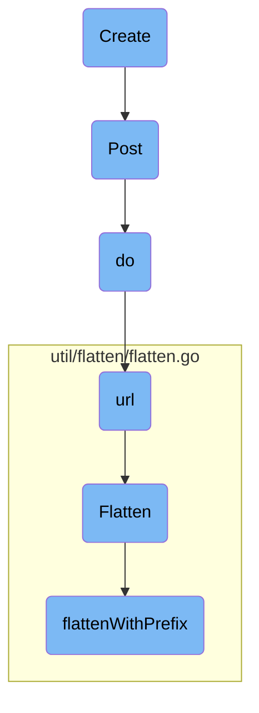
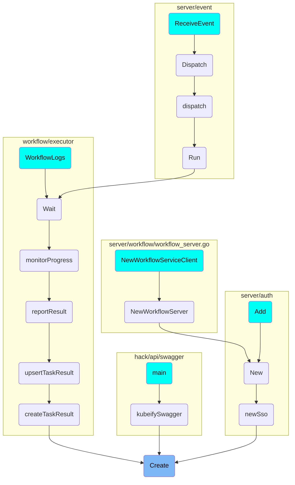

In this document, we will explain the process of creating a workflow. The process involves constructing a POST request with the workflow data, sending it to the server, and handling the server's response.

The flow starts with creating a representation of the workflow and then constructing a POST request with this data. This request is sent to the server, which processes it and returns the created workflow's representation. The server's response is then handled to complete the creation process.

# Flow drill down



<SwmSnippet path="/pkg/client/clientset/versioned/typed/workflow/v1alpha1/workflow.go" line="95">

---

## Creating the Workflow

The <SwmToken path="pkg/client/clientset/versioned/typed/workflow/v1alpha1/workflow.go" pos="95:2:2" line-data="// Create takes the representation of a workflow and creates it.  Returns the server&#39;s representation of the workflow, and an error, if there is any.">`Create`</SwmToken> function is responsible for taking the representation of a workflow and creating it on the server. It constructs a POST request with the workflow data and sends it to the server. The server's response, which includes the created workflow's representation, is then returned.

```go
// Create takes the representation of a workflow and creates it.  Returns the server's representation of the workflow, and an error, if there is any.
func (c *workflows) Create(ctx context.Context, workflow *v1alpha1.Workflow, opts v1.CreateOptions) (result *v1alpha1.Workflow, err error) {
	result = &v1alpha1.Workflow{}
	err = c.client.Post().
		Namespace(c.ns).
		Resource("workflows").
		VersionedParams(&opts, scheme.ParameterCodec).
		Body(workflow).
		Do(ctx).
		Into(result)
	return
}
```

---

</SwmSnippet>

<SwmSnippet path="/pkg/apiclient/http1/facade.go" line="44">

---

## Posting the Workflow

The <SwmToken path="pkg/apiclient/http1/facade.go" pos="44:8:8" line-data="func (h Facade) Post(ctx context.Context, in, out interface{}, path string) error {">`Post`</SwmToken> function is used to send a POST request to a specified path. It calls the <SwmToken path="pkg/apiclient/http1/facade.go" pos="45:5:5" line-data="	return h.do(ctx, in, out, &quot;POST&quot;, path)">`do`</SwmToken> function with the method set to 'POST'.

```go
func (h Facade) Post(ctx context.Context, in, out interface{}, path string) error {
	return h.do(ctx, in, out, "POST", path)
}
```

---

</SwmSnippet>

<SwmSnippet path="/pkg/apiclient/http1/facade.go" line="92">

---

### Executing the POST Request

The <SwmToken path="pkg/apiclient/http1/facade.go" pos="92:8:8" line-data="func (h Facade) do(ctx context.Context, in interface{}, out interface{}, method string, path string) error {">`do`</SwmToken> function handles the execution of the HTTP request. It serializes the input data to JSON, constructs the URL, and sets up the HTTP request with the appropriate headers. It then sends the request using an HTTP client and processes the response.

```go
func (h Facade) do(ctx context.Context, in interface{}, out interface{}, method string, path string) error {
	var data []byte
	if method != "GET" {
		var err error
		data, err = json.Marshal(in)
		if err != nil {
			return err
		}
	}
	u, err := h.url(method, path, in)
	if err != nil {
		return err
	}
	req, err := http.NewRequestWithContext(ctx, method, u.String(), bytes.NewReader(data))
	if err != nil {
		return err
	}
	headers, err := parseHeaders(h.headers)
	if err != nil {
		return err
	}
```

---

</SwmSnippet>

<SwmSnippet path="/pkg/apiclient/http1/facade.go" line="143">

---

### Constructing the URL

The <SwmToken path="pkg/apiclient/http1/facade.go" pos="143:8:8" line-data="func (h Facade) url(method, path string, in interface{}) (*url.URL, error) {">`url`</SwmToken> function constructs the URL for the HTTP request. It flattens the input data into a map of query parameters and replaces placeholders in the path with actual values. It then constructs the final URL with the query parameters.

```go
func (h Facade) url(method, path string, in interface{}) (*url.URL, error) {
	query := url.Values{}
	for s, v := range flatten.Flatten(in) {
		x := "{" + s + "}"
		if strings.Contains(path, x) {
			path = strings.Replace(path, x, v, 1)
		} else if method == "GET" {
			query.Set(s, v)
		}
	}
	// remove any that were not provided
	path = regexp.MustCompile("{[^}]*}").ReplaceAllString(path, "")
	return url.Parse(h.baseUrl + path + "?" + query.Encode())
}
```

---

</SwmSnippet>

<SwmSnippet path="/util/flatten/flatten.go" line="29">

---

## Flattening the Input Data

The <SwmToken path="util/flatten/flatten.go" pos="29:2:2" line-data="// Flatten converts a struct into a map[string]string using dot-notation.">`Flatten`</SwmToken> function converts a struct into a map of strings using <SwmToken path="util/flatten/flatten.go" pos="29:22:24" line-data="// Flatten converts a struct into a map[string]string using dot-notation.">`dot-notation`</SwmToken>. This is used to create query parameters from the input data.

```go
// Flatten converts a struct into a map[string]string using dot-notation.
// E.g. listOptions.continue="10"
func Flatten(in interface{}) map[string]string {
	out := make(map[string]string)
	flattenWithPrefix(toMap(in), out, "")
	return out
}
```

---

</SwmSnippet>

<SwmSnippet path="/util/flatten/flatten.go" line="15">

---

### Flattening with Prefix

The <SwmToken path="util/flatten/flatten.go" pos="15:2:2" line-data="func flattenWithPrefix(in map[string]interface{}, out map[string]string, prefix string) {">`flattenWithPrefix`</SwmToken> function is a helper function used by <SwmToken path="pkg/apiclient/http1/facade.go" pos="145:14:14" line-data="	for s, v := range flatten.Flatten(in) {">`Flatten`</SwmToken> to recursively flatten nested maps. It adds a prefix to the keys to maintain the <SwmToken path="util/flatten/flatten.go" pos="29:22:24" line-data="// Flatten converts a struct into a map[string]string using dot-notation.">`dot-notation`</SwmToken> structure.

```go
func flattenWithPrefix(in map[string]interface{}, out map[string]string, prefix string) {
	for k, v := range in {
		if v == nil {
			continue
		}
		switch reflect.TypeOf(v).Kind() {
		case reflect.Map:
			flattenWithPrefix(toMap(v), out, prefix+k+".")
		default:
			out[prefix+k] = fmt.Sprintf("%v", v)
		}
	}
}
```

---

</SwmSnippet>

# Where is this flow used?

This flow is used multiple times in the codebase as represented in the following diagram:

(Note - these are only some of the entry points of this flow)



&nbsp;

*This is an auto-generated document by Swimm 🌊 and has not yet been verified by a human*

<SwmMeta version="3.0.0" repo-id="Z2l0aHViJTNBJTNBaW50dWl0LWFyZ28td29ya2Zsb3dzLWRlbW8lM0ElM0FTd2ltbS1EZW1v" repo-name="intuit-argo-workflows-demo"><sup>Powered by [Swimm](/)</sup></SwmMeta>
