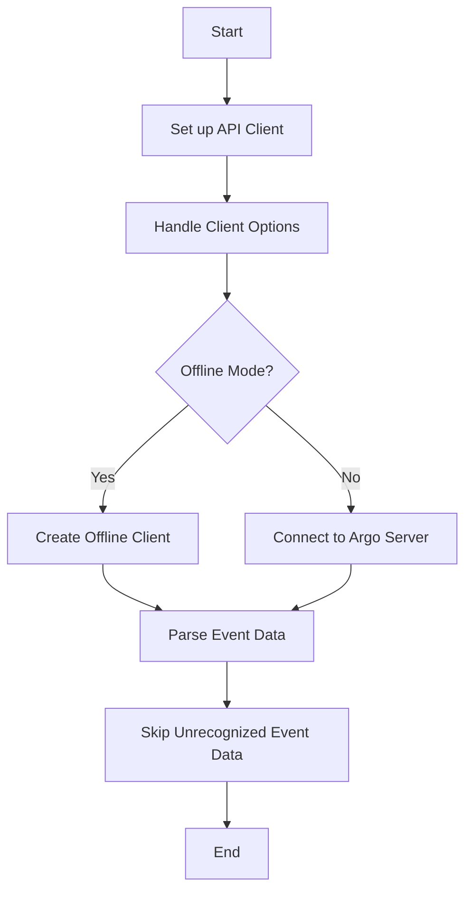

This document will cover the process of creating and configuring an API client. We'll cover:

1. Setting up the API client
2. Handling client options
3. Creating an offline client
4. Parsing event data
5. Skipping unrecognized event data.

Technical document: <SwmLink doc-title="Creating and Configuring an API Client">[Creating and Configuring an API Client](/.swm/creating-and-configuring-an-api-client.zgqh4kmv.sw.md)</SwmLink>

# [Setting up the API Client](http://localhost:5001/repos/Z2l0aHViJTNBJTNBaW50dWl0LWFyZ28td29ya2Zsb3dzLWRlbW8lM0ElM0FTd2ltbS1EZW1v/docs/zgqh4kmv#creating-the-api-client)

The process begins with setting up the API client. This involves defining necessary options such as authentication and configuration suppliers. These options are essential for ensuring that the client can securely and correctly interact with the Argo server or operate in offline mode. The setup includes specifying the instance ID, authentication method, and configuration details.

# [Handling Client Options](http://localhost:5001/repos/Z2l0aHViJTNBJTNBaW50dWl0LWFyZ28td29ya2Zsb3dzLWRlbW8lM0ElM0FTd2ltbS1EZW1v/docs/zgqh4kmv#handling-client-options)

Once the API client is set up, the next step is to handle the client options. This involves determining whether the client should operate in offline mode or connect to the Argo server. If the client is to operate offline, it will load workflow templates into memory. If it is to connect to the Argo server, it will ensure that the necessary authentication and configuration details are provided. This step is crucial for defining how the client will function and interact with the system.

# [Creating an Offline Client](http://localhost:5001/repos/Z2l0aHViJTNBJTNBaW50dWl0LWFyZ28td29ya2Zsb3dzLWRlbW8lM0ElM0FTd2ltbS1EZW1v/docs/zgqh4kmv#creating-offline-client)

If the client is to operate in offline mode, an offline client is created. This client loads workflow templates from specified paths into memory. This allows for operations such as linting without needing to connect to a Kubernetes cluster. This is particularly useful in scenarios where connectivity is limited or for testing purposes. The offline client ensures that users can still perform necessary operations even without an active connection to the Argo server.

# [Parsing Event Data](http://localhost:5001/repos/Z2l0aHViJTNBJTNBaW50dWl0LWFyZ28td29ya2Zsb3dzLWRlbW8lM0ElM0FTd2ltbS1EZW1v/docs/zgqh4kmv#unmarshalling-event-data)

The next step involves parsing event data. This is done using the Unmarshal method, which processes the data according to the protobuf format. It extracts important fields such as Namespace, Discriminator, and Payload. This step ensures that the event data is correctly interpreted and can be used by the client for further processing. Proper parsing of event data is essential for the client to function correctly and respond to events appropriately.

# [Skipping Unrecognized Event Data](http://localhost:5001/repos/Z2l0aHViJTNBJTNBaW50dWl0LWFyZ28td29ya2Zsb3dzLWRlbW8lM0ElM0FTd2ltbS1EZW1v/docs/zgqh4kmv#skipping-unrecognized-event-data)

Finally, the client must handle unrecognized or irrelevant parts of the event data. This is done using the skipEvent function, which skips over any unrecognized fields. This ensures that the client can handle events gracefully, even if they contain unexpected or unknown fields. By skipping unrecognized data, the client can continue to operate smoothly without being disrupted by irrelevant information.

&nbsp;

*This is an auto-generated document by Swimm 🌊 and has not yet been verified by a human*

<SwmMeta version="3.0.0" repo-id="Z2l0aHViJTNBJTNBaW50dWl0LWFyZ28td29ya2Zsb3dzLWRlbW8lM0ElM0FTd2ltbS1EZW1v" repo-name="intuit-argo-workflows-demo">Powered by [Swimm](/)</SwmMeta>
