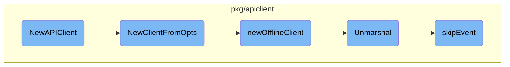

In this document, we will explain the process of creating a new API client. The process involves setting up necessary options, handling client configurations, creating offline clients, and processing event data.

The flow starts with creating a new API client by setting up options like authentication and configuration suppliers. It then processes these options to determine if the client should operate in offline mode or connect to the Argo server. If offline, it loads workflow templates into memory for operations like linting. The flow also includes parsing event data and handling unrecognized parts of the event data to ensure smooth client operations.

# Flow drill down



<SwmSnippet path="/cmd/argo/commands/client/conn.go" line="57">

---

## Creating the API Client

The <SwmToken path="cmd/argo/commands/client/conn.go" pos="57:2:2" line-data="func NewAPIClient(ctx context.Context) (context.Context, apiclient.Client, error) {">`NewAPIClient`</SwmToken> function is responsible for creating a new API client. It sets up the necessary options, including authentication and configuration suppliers, and then calls <SwmToken path="cmd/argo/commands/client/conn.go" pos="58:5:5" line-data="	return apiclient.NewClientFromOpts(">`NewClientFromOpts`</SwmToken> to create the client.

```go
func NewAPIClient(ctx context.Context) (context.Context, apiclient.Client, error) {
	return apiclient.NewClientFromOpts(
		apiclient.Opts{
			ArgoServerOpts: ArgoServerOpts,
			InstanceID:     instanceID,
			AuthSupplier: func() string {
				authString, err := GetAuthString()
				if err != nil {
					log.Fatal(err)
				}
				return authString
			},
			ClientConfigSupplier: func() clientcmd.ClientConfig { return GetConfig() },
			Offline:              Offline,
			OfflineFiles:         OfflineFiles,
			Context:              ctx,
		})
}
```

---

</SwmSnippet>

<SwmSnippet path="/pkg/apiclient/apiclient.go" line="64">

---

## Handling Client Options

The <SwmToken path="pkg/apiclient/apiclient.go" pos="64:2:2" line-data="func NewClientFromOpts(opts Opts) (context.Context, Client, error) {">`NewClientFromOpts`</SwmToken> function processes the options provided for creating the client. It checks if the client should operate in offline mode, and if so, it calls <SwmToken path="pkg/apiclient/apiclient.go" pos="67:3:3" line-data="		return newOfflineClient(opts.OfflineFiles)">`newOfflineClient`</SwmToken>. It also handles various configurations for connecting to the Argo server, ensuring that the necessary authentication and configuration details are provided.

```go
func NewClientFromOpts(opts Opts) (context.Context, Client, error) {
	log.WithField("opts", opts).Debug("Client options")
	if opts.Offline {
		return newOfflineClient(opts.OfflineFiles)
	}
	if opts.ArgoServerOpts.URL != "" && opts.InstanceID != "" {
		return nil, nil, fmt.Errorf("cannot use instance ID with Argo Server")
	}
	if opts.ArgoServerOpts.HTTP1 {
		if opts.AuthSupplier == nil {
			return nil, nil, fmt.Errorf("AuthSupplier cannot be empty when connecting to Argo Server")
		}
		return newHTTP1Client(opts.ArgoServerOpts.GetURL(), opts.AuthSupplier(), opts.ArgoServerOpts.InsecureSkipVerify, opts.ArgoServerOpts.Headers, opts.ArgoServerOpts.HTTP1Client)
	} else if opts.ArgoServerOpts.URL != "" {
		if opts.AuthSupplier == nil {
			return nil, nil, fmt.Errorf("AuthSupplier cannot be empty when connecting to Argo Server")
		}
		return newArgoServerClient(opts.ArgoServerOpts, opts.AuthSupplier())
	} else {
		if opts.ClientConfigSupplier != nil {
			opts.ClientConfig = opts.ClientConfigSupplier()
```

---

</SwmSnippet>

<SwmSnippet path="/pkg/apiclient/offline-client.go" line="43">

---

### Creating Offline Client

The <SwmToken path="pkg/apiclient/offline-client.go" pos="43:2:2" line-data="// newOfflineClient creates a client that keeps all files (or files recursively contained within a path) given to it in memory.">`newOfflineClient`</SwmToken> function creates a client that operates in offline mode. It loads workflow templates from the specified paths into memory, allowing for operations like linting without needing to connect to a Kubernetes cluster. This is useful for scenarios where connectivity is limited or for testing purposes.

```go
// newOfflineClient creates a client that keeps all files (or files recursively contained within a path) given to it in memory.
// It is useful for linting a set of files without having to connect to a cluster.
func newOfflineClient(paths []string) (context.Context, Client, error) {
	clusterWorkflowTemplateGetter := &offlineClusterWorkflowTemplateGetter{
		clusterWorkflowTemplates: map[string]*wfv1.ClusterWorkflowTemplate{},
	}
	workflowTemplateGetters := offlineWorkflowTemplateGetterMap{}

	for _, basePath := range paths {
		err := file.WalkManifests(basePath, func(path string, bytes []byte) error {
			var generic map[string]interface{}
			if err := yaml.Unmarshal(bytes, &generic); err != nil {
				return fmt.Errorf("failed to parse YAML from file %s: %w", path, err)
			}
			switch generic["kind"] {
			case "ClusterWorkflowTemplate":
				cwftmpl := new(wfv1.ClusterWorkflowTemplate)
				if err := yaml.Unmarshal(bytes, &cwftmpl); err != nil {
					return fmt.Errorf("failed to unmarshal file %s as a ClusterWorkflowTemplate: %w", path, err)
				}

```

---

</SwmSnippet>

<SwmSnippet path="/pkg/apiclient/event/event.pb.go" line="555">

---

## Unmarshalling Event Data

The <SwmToken path="pkg/apiclient/event/event.pb.go" pos="555:9:9" line-data="func (m *EventRequest) Unmarshal(dAtA []byte) error {">`Unmarshal`</SwmToken> method is used to parse event data from a byte array. It processes the data according to the protobuf format, extracting fields like <SwmToken path="cmd/argo/commands/client/conn.go" pos="76:2:2" line-data="func Namespace() string {">`Namespace`</SwmToken>, <SwmToken path="pkg/apiclient/event/event.pb.go" pos="41:1:1" line-data="	Discriminator string `protobuf:&quot;bytes,2,opt,name=discriminator,proto3&quot; json:&quot;discriminator,omitempty&quot;`">`Discriminator`</SwmToken>, and <SwmToken path="pkg/apiclient/event/event.pb.go" pos="43:1:1" line-data="	Payload              *v1alpha1.Item `protobuf:&quot;bytes,3,opt,name=payload,proto3&quot; json:&quot;payload,omitempty&quot;`">`Payload`</SwmToken>. This method ensures that the event data is correctly interpreted and can be used by the client.

```go
func (m *EventRequest) Unmarshal(dAtA []byte) error {
	l := len(dAtA)
	iNdEx := 0
	for iNdEx < l {
		preIndex := iNdEx
		var wire uint64
		for shift := uint(0); ; shift += 7 {
			if shift >= 64 {
				return ErrIntOverflowEvent
			}
			if iNdEx >= l {
				return io.ErrUnexpectedEOF
			}
			b := dAtA[iNdEx]
			iNdEx++
			wire |= uint64(b&0x7F) << shift
			if b < 0x80 {
				break
			}
		}
		fieldNum := int32(wire >> 3)
```

---

</SwmSnippet>

<SwmSnippet path="/pkg/apiclient/event/event.pb.go" line="876">

---

## Skipping Unrecognized Event Data

The <SwmToken path="pkg/apiclient/event/event.pb.go" pos="876:2:2" line-data="func skipEvent(dAtA []byte) (n int, err error) {">`skipEvent`</SwmToken> function is used to skip over unrecognized or irrelevant parts of the event data. This is important for ensuring that the client can handle events gracefully, even if they contain unexpected or unknown fields.

```go
func skipEvent(dAtA []byte) (n int, err error) {
	l := len(dAtA)
	iNdEx := 0
	depth := 0
	for iNdEx < l {
		var wire uint64
		for shift := uint(0); ; shift += 7 {
			if shift >= 64 {
				return 0, ErrIntOverflowEvent
			}
			if iNdEx >= l {
				return 0, io.ErrUnexpectedEOF
			}
			b := dAtA[iNdEx]
			iNdEx++
			wire |= (uint64(b) & 0x7F) << shift
			if b < 0x80 {
				break
			}
		}
		wireType := int(wire & 0x7)
```

---

</SwmSnippet>

&nbsp;

*This is an auto-generated document by Swimm 🌊 and has not yet been verified by a human*

<SwmMeta version="3.0.0" repo-id="Z2l0aHViJTNBJTNBaW50dWl0LWFyZ28td29ya2Zsb3dzLWRlbW8lM0ElM0FTd2ltbS1EZW1v" repo-name="intuit-argo-workflows-demo"><sup>Powered by [Swimm](/)</sup></SwmMeta>
