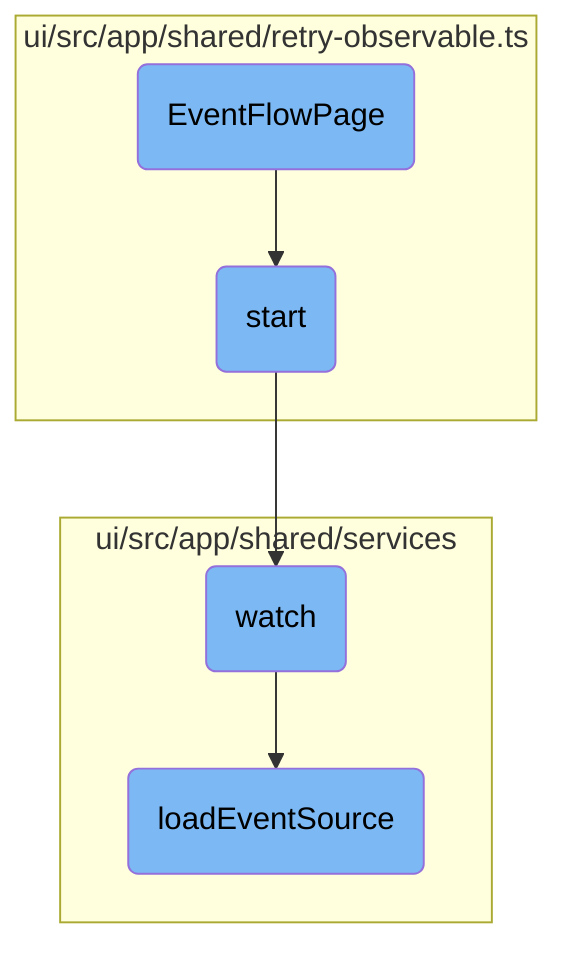

In this document, we will explain the process of initializing and managing the <SwmToken path="ui/src/app/event-flow/event-flow-page.tsx" pos="40:4:4" line-data="export function EventFlowPage({history, location, match}: RouteComponentProps&lt;any&gt;) {">`EventFlowPage`</SwmToken>. The process involves setting up various states, starting observables to watch for changes in event sources, and handling the data flow from these event sources.

The flow starts with initializing the <SwmToken path="ui/src/app/event-flow/event-flow-page.tsx" pos="40:4:4" line-data="export function EventFlowPage({history, location, match}: RouteComponentProps&lt;any&gt;) {">`EventFlowPage`</SwmToken> by setting up different states like namespace, <SwmToken path="ui/src/app/event-flow/event-flow-page.tsx" pos="47:4:4" line-data="    const [showFlow, setShowFlow] = useState(queryParams.get(&#39;showFlow&#39;) === &#39;true&#39;);">`showFlow`</SwmToken>, <SwmToken path="ui/src/app/event-flow/event-flow-page.tsx" pos="48:4:4" line-data="    const [showWorkflows, setShowWorkflows] = useState(queryParams.get(&#39;showWorkflows&#39;) !== &#39;false&#39;);">`showWorkflows`</SwmToken>, and others. Then, it starts an observable to watch for changes in event sources. This observable listens to an <SwmToken path="ui/src/app/shared/services/requests.ts" pos="41:9:9" line-data="            const eventSource = new EventSource(url);">`EventSource`</SwmToken> URL and handles different states of the connection, such as opening, receiving messages, and errors. The data from these event sources is then used to update the UI and manage the event flow page.

# Flow drill down



<SwmSnippet path="/ui/src/app/event-flow/event-flow-page.tsx" line="40">

---

## <SwmToken path="ui/src/app/event-flow/event-flow-page.tsx" pos="40:4:4" line-data="export function EventFlowPage({history, location, match}: RouteComponentProps&lt;any&gt;) {">`EventFlowPage`</SwmToken> Initialization

The <SwmToken path="ui/src/app/event-flow/event-flow-page.tsx" pos="40:4:4" line-data="export function EventFlowPage({history, location, match}: RouteComponentProps&lt;any&gt;) {">`EventFlowPage`</SwmToken> function initializes the event flow page by setting up various states such as <SwmToken path="ui/src/app/event-flow/event-flow-page.tsx" pos="46:4:4" line-data="    const [namespace, setNamespace] = useState(nsUtils.getNamespace(match.params.namespace) || &#39;&#39;);">`namespace`</SwmToken>, <SwmToken path="ui/src/app/event-flow/event-flow-page.tsx" pos="47:4:4" line-data="    const [showFlow, setShowFlow] = useState(queryParams.get(&#39;showFlow&#39;) === &#39;true&#39;);">`showFlow`</SwmToken>, <SwmToken path="ui/src/app/event-flow/event-flow-page.tsx" pos="48:4:4" line-data="    const [showWorkflows, setShowWorkflows] = useState(queryParams.get(&#39;showWorkflows&#39;) !== &#39;false&#39;);">`showWorkflows`</SwmToken>, <SwmToken path="ui/src/app/event-flow/event-flow-page.tsx" pos="49:4:4" line-data="    const [expanded, setExpanded] = useState(queryParams.get(&#39;expanded&#39;) === &#39;true&#39;);">`expanded`</SwmToken>, <SwmToken path="ui/src/app/event-flow/event-flow-page.tsx" pos="50:4:4" line-data="    const [selectedNode, setSelectedNode] = useState&lt;Node&gt;(queryParams.get(&#39;selectedNode&#39;));">`selectedNode`</SwmToken>, <SwmToken path="ui/src/app/event-flow/event-flow-page.tsx" pos="51:4:4" line-data="    const [tab, setTab] = useState&lt;Node&gt;(queryParams.get(&#39;tab&#39;));">`tab`</SwmToken>, <SwmToken path="ui/src/app/shared/retry-observable.ts" pos="37:1:1" line-data="            error: e =&gt; {">`error`</SwmToken>, <SwmToken path="ui/src/app/event-flow/event-flow-page.tsx" pos="81:4:4" line-data="    const [eventSources, setEventSources] = useState&lt;EventSource[]&gt;();">`eventSources`</SwmToken>, <SwmToken path="ui/src/app/event-flow/event-flow-page.tsx" pos="82:4:4" line-data="    const [sensors, setSensors] = useState&lt;Sensor[]&gt;();">`sensors`</SwmToken>, <SwmToken path="ui/src/app/event-flow/event-flow-page.tsx" pos="32:10:10" line-data="import {EventsPanel} from &#39;../workflows/components/events-panel&#39;;">`workflows`</SwmToken>, and <SwmToken path="ui/src/app/event-flow/event-flow-page.tsx" pos="38:6:6" line-data="import &#39;./event-flow-page.scss&#39;;">`flow`</SwmToken>. These states are crucial for managing the UI and the data displayed on the event flow page.

```tsx
export function EventFlowPage({history, location, match}: RouteComponentProps<any>) {
    // boiler-plate
    const {navigation} = useContext(Context);
    const queryParams = new URLSearchParams(location.search);

    // state for URL and query parameters
    const [namespace, setNamespace] = useState(nsUtils.getNamespace(match.params.namespace) || '');
    const [showFlow, setShowFlow] = useState(queryParams.get('showFlow') === 'true');
    const [showWorkflows, setShowWorkflows] = useState(queryParams.get('showWorkflows') !== 'false');
    const [expanded, setExpanded] = useState(queryParams.get('expanded') === 'true');
    const [selectedNode, setSelectedNode] = useState<Node>(queryParams.get('selectedNode'));
    const [tab, setTab] = useState<Node>(queryParams.get('tab'));

    useEffect(
        useQueryParams(history, p => {
            setShowFlow(p.get('showFlow') === 'true');
            setShowWorkflows(p.get('showWorkflows') === 'true');
            setExpanded(p.get('expanded') === 'true');
            setSelectedNode(p.get('selectedNode'));
            setTab(p.get('tab'));
        }),
```

---

</SwmSnippet>

<SwmSnippet path="/ui/src/app/shared/retry-observable.ts" line="27">

---

## Starting the Observable

The <SwmToken path="ui/src/app/shared/retry-observable.ts" pos="27:3:3" line-data="    public start(v?: V) {">`start`</SwmToken> method in <SwmToken path="ui/src/app/event-flow/event-flow-page.tsx" pos="28:3:3" line-data="import {RetryObservable} from &#39;../shared/retry-observable&#39;;">`RetryObservable`</SwmToken> is responsible for starting the observable that watches for changes in the event sources. It subscribes to the observable and handles the next item, errors, and reconnections.

```typescript
    public start(v?: V) {
        this.stop();
        this.subscription = this.watch(v).subscribe({
            next: next => {
                if (next) {
                    this.onItem(next);
                } else {
                    this.onOpen();
                }
            },
            error: e => {
                this.stop();
                this.onError(e);
                this.reconnect();
            }
        });
    }
```

---

</SwmSnippet>

<SwmSnippet path="/ui/src/app/shared/services/event-source-service.ts" line="32">

---

## Watching Event Sources

The <SwmToken path="ui/src/app/shared/services/event-source-service.ts" pos="32:1:1" line-data="    watch(namespace: string) {">`watch`</SwmToken> method in `event-source-service` sets up an observable to watch for changes in event sources within a specified namespace. It uses the <SwmToken path="ui/src/app/shared/services/event-source-service.ts" pos="33:5:5" line-data="        return requests.loadEventSource(`api/v1/stream/event-sources/${namespace}`).pipe(map(line =&gt; line &amp;&amp; (JSON.parse(line).result as EventSourceWatchEvent)));">`loadEventSource`</SwmToken> function to create the observable.

```typescript
    watch(namespace: string) {
        return requests.loadEventSource(`api/v1/stream/event-sources/${namespace}`).pipe(map(line => line && (JSON.parse(line).result as EventSourceWatchEvent)));
    },
```

---

</SwmSnippet>

<SwmSnippet path="/ui/src/app/shared/services/requests.ts" line="39">

---

## Loading Event Source

The <SwmToken path="ui/src/app/shared/services/requests.ts" pos="39:1:1" line-data="    loadEventSource(url: string): Observable&lt;string&gt; {">`loadEventSource`</SwmToken> function creates an observable that listens to an <SwmToken path="ui/src/app/shared/services/requests.ts" pos="41:9:9" line-data="            const eventSource = new EventSource(url);">`EventSource`</SwmToken> URL. It handles various states of the <SwmToken path="ui/src/app/shared/services/requests.ts" pos="41:9:9" line-data="            const eventSource = new EventSource(url);">`EventSource`</SwmToken> connection, such as opening, receiving messages, and errors.

```typescript
    loadEventSource(url: string): Observable<string> {
        return new Observable((observer: Observer<any>) => {
            const eventSource = new EventSource(url);
            // an null event is the best way I could find to get an event whenever we open the event source
            // otherwise, you'd have to wait for your first message (which maybe some time)
            eventSource.onopen = () => observer.next(null);
            eventSource.onmessage = x => observer.next(x.data);
            eventSource.onerror = () => {
                switch (eventSource.readyState) {
                    case EventSource.CONNECTING:
                        observer.error(new Error('Failed to connect to ' + url));
                        break;
                    case EventSource.OPEN:
                        observer.error(new Error('Error in open connection to ' + url));
                        break;
                    case EventSource.CLOSED:
                        observer.error(new Error('Connection closed to ' + url));
                        break;
                    default:
                        observer.error(new Error('Unknown error with ' + url));
                }
```

---

</SwmSnippet>

&nbsp;

*This is an auto-generated document by Swimm 🌊 and has not yet been verified by a human*

<SwmMeta version="3.0.0" repo-id="Z2l0aHViJTNBJTNBaW50dWl0LWFyZ28td29ya2Zsb3dzLWRlbW8lM0ElM0FTd2ltbS1EZW1v" repo-name="intuit-argo-workflows-demo"><sup>Powered by [Swimm](/)</sup></SwmMeta>
