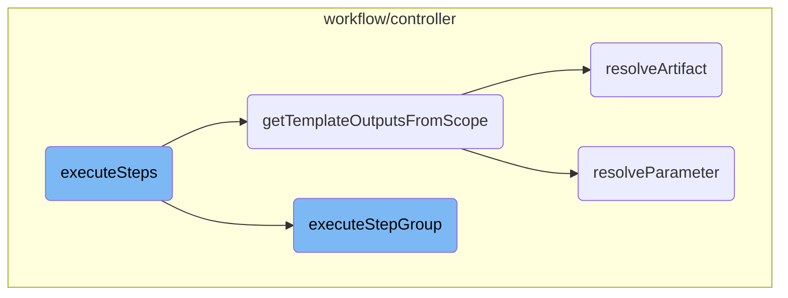

In this document, we will explain the process of executing steps in a workflow. The process involves initializing the node, setting up the execution context, iterating over each step group, and managing the outputs of each step.

The flow starts by initializing the node and setting up the execution context. Then, it iterates over each step group to execute them. During this process, it handles the connection between step groups and manages the outputs of each step to ensure they are correctly resolved and available for subsequent steps.

# Flow drill down



<SwmSnippet path="/workflow/controller/steps.go" line="40">

---

## Executing Steps

The <SwmToken path="workflow/controller/steps.go" pos="40:9:9" line-data="func (woc *wfOperationCtx) executeSteps(ctx context.Context, nodeName string, tmplCtx *templateresolution.Context, templateScope string, tmpl *wfv1.Template, orgTmpl wfv1.TemplateReferenceHolder, opts *executeTemplateOpts) (*wfv1.NodeStatus, error) {">`executeSteps`</SwmToken> function is responsible for orchestrating the execution of a series of steps within a workflow. It initializes the node, sets up the execution context, and iterates over each step group to execute them. It also handles the connection between step groups and manages the outputs of each step.

```go
func (woc *wfOperationCtx) executeSteps(ctx context.Context, nodeName string, tmplCtx *templateresolution.Context, templateScope string, tmpl *wfv1.Template, orgTmpl wfv1.TemplateReferenceHolder, opts *executeTemplateOpts) (*wfv1.NodeStatus, error) {
	node, err := woc.wf.GetNodeByName(nodeName)
	if err != nil {
		node = woc.initializeExecutableNode(nodeName, wfv1.NodeTypeSteps, templateScope, tmpl, orgTmpl, opts.boundaryID, wfv1.NodeRunning, opts.nodeFlag)
	}

	defer func() {
		nodePhase, err := woc.wf.Status.Nodes.GetPhase(node.ID)
		if err != nil {
			woc.log.Fatalf("was unable to obtain nodePhase for %s", node.ID)
			panic(fmt.Sprintf("unable to obtain nodePhase for %s", node.ID))
		}
		if nodePhase.Fulfilled() {
			woc.killDaemonedChildren(node.ID)
		}
	}()

	// The template scope of this step.
	stepTemplateScope := tmplCtx.GetTemplateScope()

	stepsCtx := stepsContext{
```

---

</SwmSnippet>

<SwmSnippet path="/workflow/controller/operator.go" line="2908">

---

## Getting Template Outputs from Scope

The <SwmToken path="workflow/controller/operator.go" pos="2908:2:2" line-data="// getTemplateOutputsFromScope resolves a template&#39;s outputs from the scope of the template">`getTemplateOutputsFromScope`</SwmToken> function resolves the outputs of a template from the scope. It processes both parameters and artifacts, ensuring that each output is correctly resolved and available for subsequent steps.

```go
// getTemplateOutputsFromScope resolves a template's outputs from the scope of the template
func getTemplateOutputsFromScope(tmpl *wfv1.Template, scope *wfScope) (*wfv1.Outputs, error) {
	if !tmpl.Outputs.HasOutputs() {
		return nil, nil
	}
	var outputs wfv1.Outputs
	if len(tmpl.Outputs.Parameters) > 0 {
		outputs.Parameters = make([]wfv1.Parameter, 0)
		for _, param := range tmpl.Outputs.Parameters {
			if param.ValueFrom == nil {
				return nil, fmt.Errorf("output parameters must have a valueFrom specified")
			}
			val, err := scope.resolveParameter(param.ValueFrom)
			if err != nil {
				// We have a default value to use instead of returning an error
				if param.ValueFrom.Default != nil {
					val = param.ValueFrom.Default.String()
				} else {
					return nil, err
				}
			}
```

---

</SwmSnippet>

<SwmSnippet path="/workflow/controller/steps.go" line="230">

---

## Executing Step Group

The <SwmToken path="workflow/controller/steps.go" pos="230:2:2" line-data="// executeStepGroup examines a list of parallel steps and executes them in parallel.">`executeStepGroup`</SwmToken> function handles the execution of a group of parallel steps. It resolves references to previous outputs, expands <SwmToken path="workflow/controller/steps.go" pos="248:14:14" line-data="	// Next, expand the step&#39;s withItems (if any)">`withItems`</SwmToken> clauses, and evaluates <SwmToken path="workflow/controller/steps.go" pos="231:29:29" line-data="// Handles referencing of variables in scope, expands `withItem` clauses, and evaluates `when` expressions">`when`</SwmToken> expressions to determine if each step should be executed. It also manages the execution context and ensures that all steps in the group are completed before proceeding.

```go
// executeStepGroup examines a list of parallel steps and executes them in parallel.
// Handles referencing of variables in scope, expands `withItem` clauses, and evaluates `when` expressions
func (woc *wfOperationCtx) executeStepGroup(ctx context.Context, stepGroup []wfv1.WorkflowStep, sgNodeName string, stepsCtx *stepsContext) (*wfv1.NodeStatus, error) {
	node, err := woc.wf.GetNodeByName(sgNodeName)
	if err != nil {
		return nil, err
	}
	if node.Fulfilled() {
		woc.log.Debugf("Step group node %v already marked completed", node)
		return node, nil
	}

	// First, resolve any references to outputs from previous steps, and perform substitution
	stepGroup, err = woc.resolveReferences(stepGroup, stepsCtx.scope)
	if err != nil {
		return woc.markNodeError(sgNodeName, err), nil
	}

	// Next, expand the step's withItems (if any)
	stepGroup, err = woc.expandStepGroup(sgNodeName, stepGroup, stepsCtx)
	if err != nil {
```

---

</SwmSnippet>

<SwmSnippet path="/workflow/controller/scope.go" line="90">

---

### Resolving Artifacts

The <SwmToken path="workflow/controller/scope.go" pos="90:9:9" line-data="func (s *wfScope) resolveArtifact(art *wfv1.Artifact) (*wfv1.Artifact, error) {">`resolveArtifact`</SwmToken> function resolves an artifact from the scope. It handles both direct references and expressions, ensuring that the correct artifact is retrieved and available for use in the workflow.

```go
func (s *wfScope) resolveArtifact(art *wfv1.Artifact) (*wfv1.Artifact, error) {
	if art == nil || (art.From == "" && art.FromExpression == "") {
		return nil, nil
	}

	var err error
	var val interface{}

	if art.FromExpression != "" {
		env := env.GetFuncMap(s.scope)
		program, err := expr.Compile(art.FromExpression, expr.Env(env))
		if err != nil {
			return nil, err
		}
		val, err = expr.Run(program, env)
		if err != nil {
			return nil, err
		}

	} else {
		val, err = s.resolveVar(art.From)
```

---

</SwmSnippet>

<SwmSnippet path="/workflow/controller/scope.go" line="74">

---

### Resolving Parameters

The <SwmToken path="workflow/controller/scope.go" pos="74:9:9" line-data="func (s *wfScope) resolveParameter(p *wfv1.ValueFrom) (interface{}, error) {">`resolveParameter`</SwmToken> function resolves a parameter from the scope. It processes both direct references and expressions, ensuring that the correct value is retrieved and available for use in the workflow.

```go
func (s *wfScope) resolveParameter(p *wfv1.ValueFrom) (interface{}, error) {
	if p == nil || (p.Parameter == "" && p.Expression == "") {
		return "", nil
	}
	if p.Expression != "" {
		env := env.GetFuncMap(s.scope)
		program, err := expr.Compile(p.Expression, expr.Env(env))
		if err != nil {
			return nil, err
		}
		return expr.Run(program, env)
	} else {
		return s.resolveVar(p.Parameter)
	}
}
```

---

</SwmSnippet>

&nbsp;

*This is an auto-generated document by Swimm 🌊 and has not yet been verified by a human*

<SwmMeta version="3.0.0" repo-id="Z2l0aHViJTNBJTNBaW50dWl0LWFyZ28td29ya2Zsb3dzLWRlbW8lM0ElM0FTd2ltbS1EZW1v" repo-name="intuit-argo-workflows-demo"><sup>Powered by [Swimm](/)</sup></SwmMeta>
