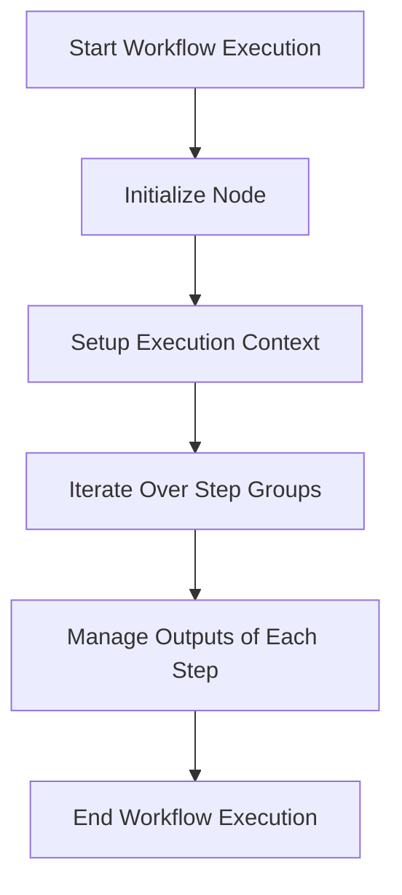

This document will cover the process of executing steps in a workflow. We'll cover:

1. Initializing the node
2. Setting up the execution context
3. Iterating over each step group
4. Managing the outputs of each step.

Technical document: <SwmLink doc-title="Executing Steps in a Workflow">[Executing Steps in a Workflow](/.swm/executing-steps-in-a-workflow.xh09i7a6.sw.md)</SwmLink>

# [Initializing the Node](http://localhost:5001/repos/Z2l0aHViJTNBJTNBaW50dWl0LWFyZ28td29ya2Zsb3dzLWRlbW8lM0ElM0FTd2ltbS1EZW1v/docs/xh09i7a6#initializing-the-node)

The process begins by initializing the node. This step involves setting up the initial state of the workflow node, which is essential for tracking the progress and status of the workflow execution. The node acts as a placeholder for the workflow's current state and helps in managing the execution flow.

# [Setting Up the Execution Context](http://localhost:5001/repos/Z2l0aHViJTNBJTNBaW50dWl0LWFyZ28td29ya2Zsb3dzLWRlbW8lM0ElM0FTd2ltbS1EZW1v/docs/xh09i7a6#setting-up-the-execution-context)

Next, the execution context is set up. This context includes all the necessary information and resources required for executing the workflow steps. It ensures that each step has access to the data and parameters it needs to function correctly. The execution context is crucial for maintaining consistency and ensuring that each step operates within the defined scope.

# [Iterating Over Each Step Group](http://localhost:5001/repos/Z2l0aHViJTNBJTNBaW50dWl0LWFyZ28td29ya2Zsb3dzLWRlbW8lM0ElM0FTd2ltbS1EZW1v/docs/xh09i7a6#iterating-over-each-step-group)

The workflow then iterates over each step group. A step group is a collection of steps that can be executed in parallel or sequentially. During this iteration, the workflow controller ensures that each step within the group is executed according to the defined order and dependencies. This process involves checking conditions, resolving references, and managing the execution flow to ensure that all steps are completed successfully.

# [Managing the Outputs of Each Step](http://localhost:5001/repos/Z2l0aHViJTNBJTNBaW50dWl0LWFyZ28td29ya2Zsb3dzLWRlbW8lM0ElM0FTd2ltbS1EZW1v/docs/xh09i7a6#managing-the-outputs-of-each-step)

Finally, the outputs of each step are managed. This involves collecting the results produced by each step and making them available for subsequent steps. The workflow controller ensures that all outputs are correctly resolved and stored, allowing the workflow to proceed smoothly. Managing outputs is essential for maintaining data integrity and ensuring that each step has the necessary information to execute correctly.

&nbsp;

*This is an auto-generated document by Swimm 🌊 and has not yet been verified by a human*

<SwmMeta version="3.0.0" repo-id="Z2l0aHViJTNBJTNBaW50dWl0LWFyZ28td29ya2Zsb3dzLWRlbW8lM0ElM0FTd2ltbS1EZW1v" repo-name="intuit-argo-workflows-demo">Powered by [Swimm](/)</SwmMeta>
