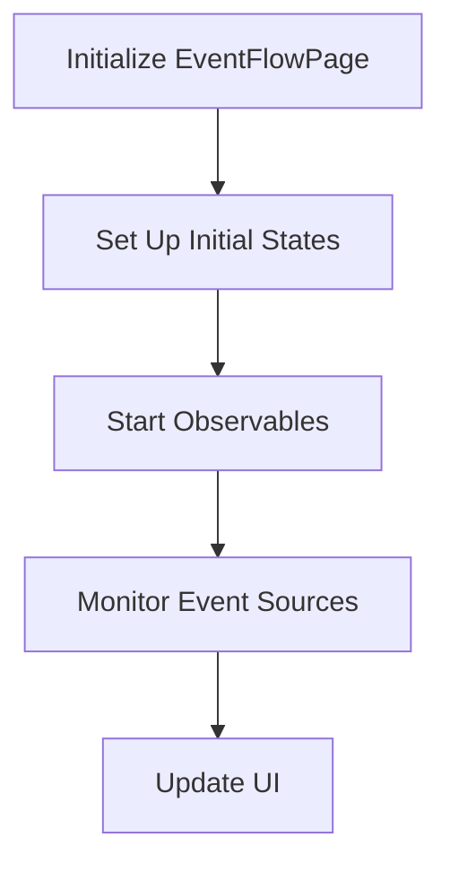

This document will cover the initialization and management of the EventFlowPage, which includes:

1. Setting up initial states
2. Starting observables to monitor event sources
3. Handling data flow from event sources to update the UI.

Technical document: <SwmLink doc-title="EventFlowPage Initialization and Management">[EventFlowPage Initialization and Management](/.swm/eventflowpage-initialization-and-management.k9p50ps8.sw.md)</SwmLink>

# [Setting Up Initial States](http://localhost:5001/repos/Z2l0aHViJTNBJTNBaW50dWl0LWFyZ28td29ya2Zsb3dzLWRlbW8lM0ElM0FTd2ltbS1EZW1v/docs/k9p50ps8#eventflowpage-initialization)

The initialization of the EventFlowPage involves setting up various states that are essential for managing the user interface and the data displayed on the event flow page. These states include:

- **Namespace**: Defines the scope within which the events are being monitored.
- **ShowFlow**: Determines whether the event flow should be displayed.
- **ShowWorkflows**: Controls the visibility of workflows.
- **Expanded**: Indicates whether the event details are expanded.
- **SelectedNode**: Keeps track of the currently selected node in the event flow.
- **Tab**: Manages the active tab in the UI.

These states are initialized based on the URL and query parameters, ensuring that the EventFlowPage reflects the correct context and user preferences.

# [Starting Observables](http://localhost:5001/repos/Z2l0aHViJTNBJTNBaW50dWl0LWFyZ28td29ya2Zsb3dzLWRlbW8lM0ElM0FTd2ltbS1EZW1v/docs/k9p50ps8#starting-the-observable)

The next step involves starting observables that monitor changes in event sources. Observables are mechanisms that allow the application to react to new data or changes in data streams. When an observable is started, it subscribes to an event source and listens for updates. This process includes:

- **Opening the Connection**: Establishing a connection to the event source.
- **Receiving Messages**: Handling incoming messages from the event source.
- **Error Handling**: Managing errors and attempting reconnections if the connection fails.

This ensures that the EventFlowPage remains up-to-date with the latest events and can react to changes in real-time.

# [Monitoring Event Sources](http://localhost:5001/repos/Z2l0aHViJTNBJTNBaW50dWl0LWFyZ28td29ya2Zsb3dzLWRlbW8lM0ElM0FTd2ltbS1EZW1v/docs/k9p50ps8#watching-event-sources)

Monitoring event sources involves setting up observables that watch for changes within a specified namespace. This is achieved by creating an observable that listens to an EventSource URL. The observable handles various states of the connection, such as:

- **Opening**: When the connection to the event source is established.
- **Receiving Messages**: When new messages are received from the event source.
- **Errors**: When there are errors in the connection, and appropriate error messages are generated.

By monitoring event sources, the application can dynamically update the EventFlowPage with the latest event data, providing users with real-time insights.

# [Updating the UI](http://localhost:5001/repos/Z2l0aHViJTNBJTNBaW50dWl0LWFyZ28td29ya2Zsb3dzLWRlbW8lM0ElM0FTd2ltbS1EZW1v/docs/k9p50ps8#loading-event-source)

The final step in the process is updating the user interface based on the data received from the event sources. This involves:

- **Handling Connection States**: Managing the different states of the EventSource connection, such as connecting, open, and closed.
- **Processing Messages**: Parsing and processing the messages received from the event source to update the UI components.
- **Error Management**: Displaying error messages to the user if there are issues with the connection.

By effectively managing the data flow from event sources to the UI, the EventFlowPage provides users with a seamless and interactive experience, allowing them to monitor and manage events efficiently.

&nbsp;

*This is an auto-generated document by Swimm 🌊 and has not yet been verified by a human*

<SwmMeta version="3.0.0" repo-id="Z2l0aHViJTNBJTNBaW50dWl0LWFyZ28td29ya2Zsb3dzLWRlbW8lM0ElM0FTd2ltbS1EZW1v" repo-name="intuit-argo-workflows-demo">Powered by [Swimm](/)</SwmMeta>
