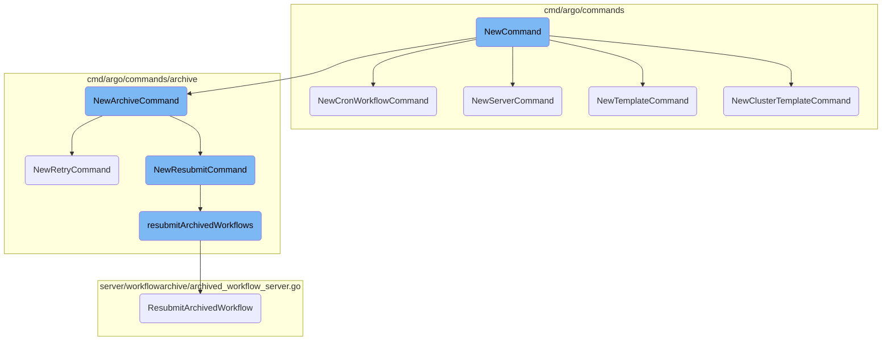
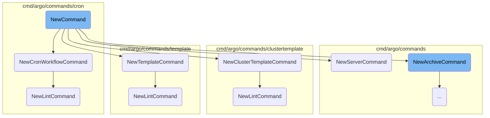
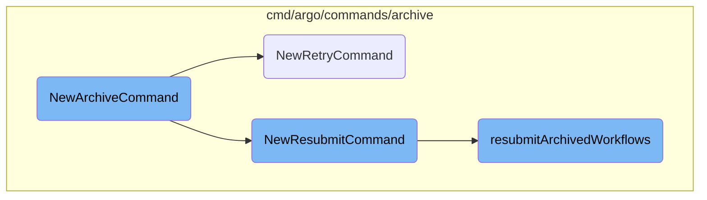
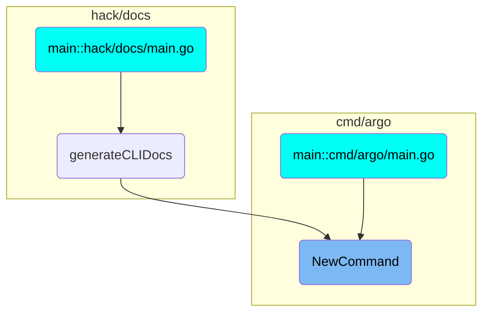

In this document, we will explain the process of initializing and managing commands in the Argo Workflows CLI. The process involves setting up the main command structure, registering subcommands, and configuring specific commands for different functionalities.

The flow starts with initializing the main command structure, which sets up the basic usage information and different modes of operation. Then, various subcommands are registered to extend the functionality of the CLI, allowing users to perform specific actions like managing workflows, templates, and archives. Each subcommand is configured to handle specific tasks, ensuring that the CLI is versatile and can handle a wide range of operations.

Here is a high level diagram of the flow, showing only the most important functions:



# Flow drill down

First, we'll zoom into this section of the flow:



<SwmSnippet path="/cmd/argo/commands/root.go" line="30">

---

## <SwmToken path="cmd/argo/commands/root.go" pos="30:2:2" line-data="// NewCommand returns a new instance of an argo command">`NewCommand`</SwmToken> Initialization

The <SwmToken path="cmd/argo/commands/root.go" pos="30:2:2" line-data="// NewCommand returns a new instance of an argo command">`NewCommand`</SwmToken> function initializes the main command-line interface for Argo Workflows. It sets up the command structure, usage information, and different modes of operation such as Kubernetes API Mode, Argo Server GRPC Mode, and Argo Server <SwmToken path="cmd/argo/commands/root.go" pos="78:6:6" line-data="#### Argo Server HTTP1 Mode">`HTTP1`</SwmToken> Mode. This initialization is used for providing users with a comprehensive CLI to interact with Argo Workflows.

```go
// NewCommand returns a new instance of an argo command
func NewCommand() *cobra.Command {
	command := &cobra.Command{
		Use:   CLIName,
		Short: "argo is the command line interface to Argo",
		Long: `
You can use the CLI in the following modes:

#### Kubernetes API Mode (default)

Requests are sent directly to the Kubernetes API. No Argo Server is needed. Large workflows and the workflow archive are not supported.

Use when you have direct access to the Kubernetes API, and don't need large workflow or workflow archive support.

If you're using instance ID (which is very unlikely), you'll need to set it:

	ARGO_INSTANCEID=your-instanceid

#### Argo Server GRPC Mode

Requests are sent to the Argo Server API via GRPC (using HTTP/2). Large workflows and the workflow archive are supported. Network load-balancers that do not support HTTP/2 are not supported.
```

---

</SwmSnippet>

<SwmSnippet path="/cmd/argo/commands/root.go" line="97">

---

## Subcommand Registration

The <SwmToken path="cmd/argo/commands/root.go" pos="30:2:2" line-data="// NewCommand returns a new instance of an argo command">`NewCommand`</SwmToken> function registers various subcommands like <SwmToken path="cmd/argo/commands/root.go" pos="97:5:5" line-data="	command.AddCommand(NewCompletionCommand())">`NewCompletionCommand`</SwmToken>, <SwmToken path="cmd/argo/commands/root.go" pos="98:5:5" line-data="	command.AddCommand(NewDeleteCommand())">`NewDeleteCommand`</SwmToken>, <SwmToken path="cmd/argo/commands/root.go" pos="99:5:5" line-data="	command.AddCommand(NewGetCommand())">`NewGetCommand`</SwmToken>, and others. These subcommands extend the functionality of the CLI, allowing users to perform specific actions such as deleting workflows, getting workflow details, and more. This modular approach ensures that the CLI is extensible and can handle a wide range of tasks.

```go
	command.AddCommand(NewCompletionCommand())
	command.AddCommand(NewDeleteCommand())
	command.AddCommand(NewGetCommand())
	command.AddCommand(NewLintCommand())
	command.AddCommand(NewListCommand())
	command.AddCommand(NewLogsCommand())
	command.AddCommand(NewResubmitCommand())
	command.AddCommand(NewResumeCommand())
	command.AddCommand(NewRetryCommand())
	command.AddCommand(NewServerCommand())
	command.AddCommand(NewSubmitCommand())
	command.AddCommand(NewSuspendCommand())
	command.AddCommand(auth.NewAuthCommand())
	command.AddCommand(NewWaitCommand())
	command.AddCommand(NewWatchCommand())
	command.AddCommand(NewCpCommand())
	command.AddCommand(NewStopCommand())
	command.AddCommand(NewNodeCommand())
	command.AddCommand(NewTerminateCommand())
	command.AddCommand(archive.NewArchiveCommand())
	command.AddCommand(NewVersionCommand())
```

---

</SwmSnippet>

<SwmSnippet path="/cmd/argo/commands/cron/root.go" line="7">

---

## <SwmToken path="cmd/argo/commands/cron/root.go" pos="7:2:2" line-data="func NewCronWorkflowCommand() *cobra.Command {">`NewCronWorkflowCommand`</SwmToken>

The <SwmToken path="cmd/argo/commands/cron/root.go" pos="7:2:2" line-data="func NewCronWorkflowCommand() *cobra.Command {">`NewCronWorkflowCommand`</SwmToken> function sets up the command for managing cron workflows. It includes subcommands for getting, listing, creating, deleting, linting, suspending, resuming, and updating cron workflows. This command is essential for users who need to automate workflows on a scheduled basis.

```go
func NewCronWorkflowCommand() *cobra.Command {
	command := &cobra.Command{
		Use:   "cron",
		Short: "manage cron workflows",
		Long:  `NextScheduledRun assumes that the workflow-controller uses UTC as its timezone`,
		RunE: func(cmd *cobra.Command, args []string) error {
			return cmd.Help()
		},
	}

	command.AddCommand(NewGetCommand())
	command.AddCommand(NewListCommand())
	command.AddCommand(NewCreateCommand())
	command.AddCommand(NewDeleteCommand())
	command.AddCommand(NewLintCommand())
	command.AddCommand(NewSuspendCommand())
	command.AddCommand(NewResumeCommand())
	command.AddCommand(NewUpdateCommand())

	return command
}
```

---

</SwmSnippet>

<SwmSnippet path="/cmd/argo/commands/server.go" line="38">

---

## <SwmToken path="cmd/argo/commands/server.go" pos="38:2:2" line-data="func NewServerCommand() *cobra.Command {">`NewServerCommand`</SwmToken>

The <SwmToken path="cmd/argo/commands/server.go" pos="38:2:2" line-data="func NewServerCommand() *cobra.Command {">`NewServerCommand`</SwmToken> function initializes the Argo Server, which is responsible for handling API requests and serving the Argo UI. It configures various server settings such as authentication modes, TLS, namespaces, and more. This command is critical for setting up the server environment where workflows are managed and executed.

```go
func NewServerCommand() *cobra.Command {
	var (
		authModes                []string
		configMap                string
		port                     int
		baseHRef                 string
		secure                   bool
		tlsCertificateSecretName string
		hsts                     bool
		namespaced               bool   // --namespaced
		managedNamespace         string // --managed-namespace
		enableOpenBrowser        bool
		eventOperationQueueSize  int
		eventWorkerCount         int
		eventAsyncDispatch       bool
		frameOptions             string
		accessControlAllowOrigin string
		apiRateLimit             uint64
		kubeAPIQPS               float32
		kubeAPIBurst             int
		allowedLinkProtocol      []string
```

---

</SwmSnippet>

<SwmSnippet path="/cmd/argo/commands/template/root.go" line="7">

---

## <SwmToken path="cmd/argo/commands/template/root.go" pos="7:2:2" line-data="func NewTemplateCommand() *cobra.Command {">`NewTemplateCommand`</SwmToken>

The <SwmToken path="cmd/argo/commands/template/root.go" pos="7:2:2" line-data="func NewTemplateCommand() *cobra.Command {">`NewTemplateCommand`</SwmToken> function sets up the command for manipulating workflow templates. It includes subcommands for getting, listing, creating, deleting, linting, and updating workflow templates. This command is vital for users who need to manage reusable workflow templates efficiently.

```go
func NewTemplateCommand() *cobra.Command {
	command := &cobra.Command{
		Use:   "template",
		Short: "manipulate workflow templates",
		RunE: func(cmd *cobra.Command, args []string) error {
			return cmd.Help()
		},
	}

	command.AddCommand(NewGetCommand())
	command.AddCommand(NewListCommand())
	command.AddCommand(NewCreateCommand())
	command.AddCommand(NewDeleteCommand())
	command.AddCommand(NewLintCommand())
	command.AddCommand(NewUpdateCommand())

	return command
}
```

---

</SwmSnippet>

<SwmSnippet path="/cmd/argo/commands/clustertemplate/root.go" line="7">

---

## <SwmToken path="cmd/argo/commands/clustertemplate/root.go" pos="7:2:2" line-data="func NewClusterTemplateCommand() *cobra.Command {">`NewClusterTemplateCommand`</SwmToken>

The <SwmToken path="cmd/argo/commands/clustertemplate/root.go" pos="7:2:2" line-data="func NewClusterTemplateCommand() *cobra.Command {">`NewClusterTemplateCommand`</SwmToken> function sets up the command for manipulating cluster workflow templates. It includes subcommands similar to <SwmToken path="cmd/argo/commands/template/root.go" pos="7:2:2" line-data="func NewTemplateCommand() *cobra.Command {">`NewTemplateCommand`</SwmToken> but focuses on cluster-wide templates. This command is essential for managing templates that are intended to be used across multiple namespaces.

```go
func NewClusterTemplateCommand() *cobra.Command {
	command := &cobra.Command{
		Use:     "cluster-template",
		Aliases: []string{"cwftmpl", "cwft"},
		Short:   "manipulate cluster workflow templates",
		RunE: func(cmd *cobra.Command, args []string) error {
			return cmd.Help()
		},
	}

	command.AddCommand(NewGetCommand())
	command.AddCommand(NewListCommand())
	command.AddCommand(NewCreateCommand())
	command.AddCommand(NewDeleteCommand())
	command.AddCommand(NewLintCommand())
	command.AddCommand(NewUpdateCommand())

	return command
```

---

</SwmSnippet>

<SwmSnippet path="/cmd/argo/commands/clustertemplate/lint.go" line="13">

---

## <SwmToken path="cmd/argo/commands/clustertemplate/lint.go" pos="13:2:2" line-data="func NewLintCommand() *cobra.Command {">`NewLintCommand`</SwmToken> for Cluster Templates

The <SwmToken path="cmd/argo/commands/clustertemplate/lint.go" pos="13:2:2" line-data="func NewLintCommand() *cobra.Command {">`NewLintCommand`</SwmToken> function for cluster templates validates files or directories of cluster workflow template manifests. It ensures that the templates adhere to the required specifications, which helps in maintaining the integrity and correctness of the templates.

```go
func NewLintCommand() *cobra.Command {
	var (
		strict bool
		output string
	)

	command := &cobra.Command{
		Use:   "lint FILE...",
		Short: "validate files or directories of cluster workflow template manifests",
		Args:  cobra.MinimumNArgs(1),
		RunE: func(cmd *cobra.Command, args []string) error {
			ctx, apiClient, err := client.NewAPIClient(cmd.Context())
			if err != nil {
				return err
			}
			opts := lint.LintOptions{
				Files:            args,
				DefaultNamespace: client.Namespace(),
				Strict:           strict,
				Printer:          os.Stdout,
			}
```

---

</SwmSnippet>

<SwmSnippet path="/cmd/argo/commands/template/lint.go" line="13">

---

## <SwmToken path="cmd/argo/commands/template/lint.go" pos="13:2:2" line-data="func NewLintCommand() *cobra.Command {">`NewLintCommand`</SwmToken> for Workflow Templates

The <SwmToken path="cmd/argo/commands/template/lint.go" pos="13:2:2" line-data="func NewLintCommand() *cobra.Command {">`NewLintCommand`</SwmToken> function for workflow templates validates a file or directory of workflow template manifests. Similar to the cluster template lint command, it ensures that the workflow templates are correct and adhere to the required specifications.

```go
func NewLintCommand() *cobra.Command {
	var (
		strict bool
		output string
	)

	command := &cobra.Command{
		Use:   "lint (DIRECTORY | FILE1 FILE2 FILE3...)",
		Short: "validate a file or directory of workflow template manifests",
		Args:  cobra.MinimumNArgs(1),
		RunE: func(cmd *cobra.Command, args []string) error {
			ctx, apiClient, err := client.NewAPIClient(cmd.Context())
			if err != nil {
				return err
			}
			opts := lint.LintOptions{
				Files:            args,
				Strict:           strict,
				DefaultNamespace: client.Namespace(),
				Printer:          os.Stdout,
			}
```

---

</SwmSnippet>

<SwmSnippet path="/cmd/argo/commands/cron/lint.go" line="13">

---

## <SwmToken path="cmd/argo/commands/cron/lint.go" pos="13:2:2" line-data="func NewLintCommand() *cobra.Command {">`NewLintCommand`</SwmToken> for Cron Workflows

The <SwmToken path="cmd/argo/commands/cron/lint.go" pos="13:2:2" line-data="func NewLintCommand() *cobra.Command {">`NewLintCommand`</SwmToken> function for cron workflows validates files or directories of cron workflow manifests. It ensures that the cron workflows are correctly defined and adhere to the required specifications, which helps in preventing errors during execution.

```go
func NewLintCommand() *cobra.Command {
	var (
		strict bool
		output string
	)

	command := &cobra.Command{
		Use:   "lint FILE...",
		Short: "validate files or directories of cron workflow manifests",
		Args:  cobra.MinimumNArgs(1),
		RunE: func(cmd *cobra.Command, args []string) error {
			ctx, apiClient, err := client.NewAPIClient(cmd.Context())
			if err != nil {
				return err
			}
			opts := lint.LintOptions{
				Files:            args,
				Strict:           strict,
				DefaultNamespace: client.Namespace(),
				Printer:          os.Stdout,
			}
```

---

</SwmSnippet>

Now, lets zoom into this section of the flow:



<SwmSnippet path="/cmd/argo/commands/archive/root.go" line="7">

---

## <SwmToken path="cmd/argo/commands/archive/root.go" pos="7:2:2" line-data="func NewArchiveCommand() *cobra.Command {">`NewArchiveCommand`</SwmToken>

The <SwmToken path="cmd/argo/commands/archive/root.go" pos="7:2:2" line-data="func NewArchiveCommand() *cobra.Command {">`NewArchiveCommand`</SwmToken> function initializes the archive command, which is responsible for managing the workflow archive. It adds several subcommands, including <SwmToken path="cmd/argo/commands/archive/root.go" pos="16:5:5" line-data="	command.AddCommand(NewListCommand())">`NewListCommand`</SwmToken>, <SwmToken path="cmd/argo/commands/archive/root.go" pos="17:5:5" line-data="	command.AddCommand(NewGetCommand())">`NewGetCommand`</SwmToken>, <SwmToken path="cmd/argo/commands/archive/root.go" pos="18:5:5" line-data="	command.AddCommand(NewDeleteCommand())">`NewDeleteCommand`</SwmToken>, <SwmToken path="cmd/argo/commands/archive/root.go" pos="19:5:5" line-data="	command.AddCommand(NewListLabelKeyCommand())">`NewListLabelKeyCommand`</SwmToken>, <SwmToken path="cmd/argo/commands/archive/root.go" pos="20:5:5" line-data="	command.AddCommand(NewListLabelValueCommand())">`NewListLabelValueCommand`</SwmToken>, <SwmToken path="cmd/argo/commands/archive/root.go" pos="21:5:5" line-data="	command.AddCommand(NewResubmitCommand())">`NewResubmitCommand`</SwmToken>, and <SwmToken path="cmd/argo/commands/archive/root.go" pos="22:5:5" line-data="	command.AddCommand(NewRetryCommand())">`NewRetryCommand`</SwmToken>. These subcommands provide various functionalities for interacting with archived workflows.

```go
func NewArchiveCommand() *cobra.Command {
	command := &cobra.Command{
		Use:   "archive",
		Short: "manage the workflow archive",
		RunE: func(cmd *cobra.Command, args []string) error {
			return cmd.Help()
		},
	}

	command.AddCommand(NewListCommand())
	command.AddCommand(NewGetCommand())
	command.AddCommand(NewDeleteCommand())
	command.AddCommand(NewListLabelKeyCommand())
	command.AddCommand(NewListLabelValueCommand())
	command.AddCommand(NewResubmitCommand())
	command.AddCommand(NewRetryCommand())
	return command
}
```

---

</SwmSnippet>

<SwmSnippet path="/cmd/argo/commands/archive/retry.go" line="36">

---

## <SwmToken path="cmd/argo/commands/archive/retry.go" pos="36:2:2" line-data="func NewRetryCommand() *cobra.Command {">`NewRetryCommand`</SwmToken>

The <SwmToken path="cmd/argo/commands/archive/retry.go" pos="36:2:2" line-data="func NewRetryCommand() *cobra.Command {">`NewRetryCommand`</SwmToken> function sets up the retry command, which allows users to retry one or more workflows. It includes options for retrying workflows by UID, label selector, or field selector. The command also supports waiting, watching, and logging the workflow until completion. This command is crucial for users who need to re-execute workflows that may have failed or require reprocessing.

```go
func NewRetryCommand() *cobra.Command {
	var (
		cliSubmitOpts common.CliSubmitOpts
		retryOpts     retryOps
	)
	command := &cobra.Command{
		Use:   "retry [WORKFLOW...]",
		Short: "retry zero or more workflows",
		Example: `# Retry a workflow:

  argo archive retry uid

# Retry multiple workflows:

  argo archive retry uid another-uid

# Retry multiple workflows by label selector:

  argo archive retry -l workflows.argoproj.io/test=true

# Retry multiple workflows by field selector:
```

---

</SwmSnippet>

<SwmSnippet path="/cmd/argo/commands/archive/resubmit.go" line="33">

---

## <SwmToken path="cmd/argo/commands/archive/resubmit.go" pos="33:2:2" line-data="func NewResubmitCommand() *cobra.Command {">`NewResubmitCommand`</SwmToken>

The <SwmToken path="cmd/argo/commands/archive/resubmit.go" pos="33:2:2" line-data="func NewResubmitCommand() *cobra.Command {">`NewResubmitCommand`</SwmToken> function configures the resubmit command, which enables users to resubmit one or more workflows. Similar to the retry command, it supports resubmission by UID, label selector, or field selector. Additional options include setting workflow priority and reusing successful steps from previous runs. This command is essential for workflows that need to be rerun with potentially different parameters or configurations.

```go
func NewResubmitCommand() *cobra.Command {
	var (
		resubmitOpts  resubmitOps
		cliSubmitOpts common.CliSubmitOpts
	)
	command := &cobra.Command{
		Use:   "resubmit [WORKFLOW...]",
		Short: "resubmit one or more workflows",
		Example: `# Resubmit a workflow:

  argo archive resubmit uid

# Resubmit multiple workflows:

  argo archive resubmit uid another-uid

# Resubmit multiple workflows by label selector:

  argo archive resubmit -l workflows.argoproj.io/test=true

# Resubmit multiple workflows by field selector:
```

---

</SwmSnippet>

<SwmSnippet path="/cmd/argo/commands/archive/resubmit.go" line="100">

---

### Resubmitting Archived Workflows

The <SwmToken path="cmd/argo/commands/archive/resubmit.go" pos="100:2:2" line-data="// resubmitArchivedWorkflows resubmits workflows by given resubmitOpts or workflow names">`resubmitArchivedWorkflows`</SwmToken> function handles the actual resubmission of workflows based on the provided options or workflow names. It first retrieves the workflows to be resubmitted using selectors or direct UIDs. It then iterates over the workflows, ensuring no duplicates, and resubmits each one. If only one workflow is resubmitted, it can wait, watch, or log the workflow until completion. This function is critical for executing the resubmission logic and ensuring workflows are processed correctly.

```go
// resubmitArchivedWorkflows resubmits workflows by given resubmitOpts or workflow names
func resubmitArchivedWorkflows(ctx context.Context, archiveServiceClient workflowarchivepkg.ArchivedWorkflowServiceClient, serviceClient workflowpkg.WorkflowServiceClient, resubmitOpts resubmitOps, cliSubmitOpts common.CliSubmitOpts, args []string) error {
	var (
		wfs wfv1.Workflows
		err error
	)

	if resubmitOpts.hasSelector() {
		wfs, err = listArchivedWorkflows(ctx, archiveServiceClient, resubmitOpts.fieldSelector, resubmitOpts.labelSelector, 0)
		if err != nil {
			return err
		}
	}

	for _, uid := range args {
		wfs = append(wfs, wfv1.Workflow{
			ObjectMeta: metav1.ObjectMeta{
				UID:       types.UID(uid),
				Namespace: resubmitOpts.namespace,
			},
		})
```

---

</SwmSnippet>

# Where is this flow used?

This flow is used multiple times in the codebase as represented in the following diagram:



&nbsp;

*This is an auto-generated document by Swimm 🌊 and has not yet been verified by a human*

<SwmMeta version="3.0.0" repo-id="Z2l0aHViJTNBJTNBaW50dWl0LWFyZ28td29ya2Zsb3dzLWRlbW8lM0ElM0FTd2ltbS1EZW1v" repo-name="intuit-argo-workflows-demo"><sup>Powered by [Swimm](https://app.swimm.io/)</sup></SwmMeta>
