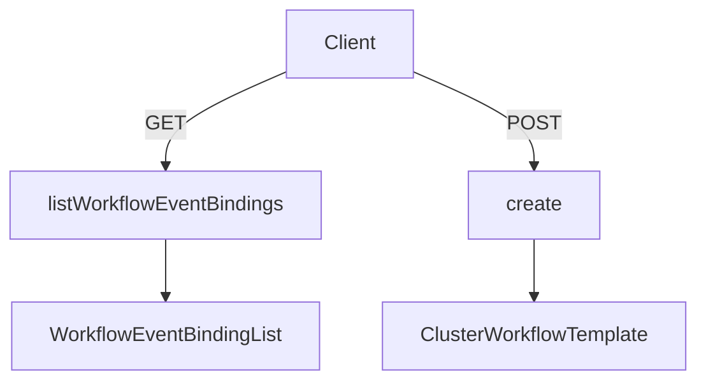

# Overview

The Shared Directory contains reusable components, services, and utilities that are utilized across different parts of the user interface. This directory is essential for maintaining consistency and reducing code duplication within the application.

# Shared Services

Shared services handle various operations such as requests, workflow management, and event handling. For example, the <SwmToken path="ui/src/app/shared/use-collect-event.ts" pos="4:4:4" line-data="export function useCollectEvent(name: string) {">`useCollectEvent`</SwmToken> hook collects events using the <SwmToken path="ui/src/app/shared/use-collect-event.ts" pos="6:1:5" line-data="        services.info.collectEvent(name);">`services.info.collectEvent`</SwmToken> method.

<SwmSnippet path="/ui/src/app/shared/use-collect-event.ts" line="1">

---

The <SwmToken path="ui/src/app/shared/use-collect-event.ts" pos="4:4:4" line-data="export function useCollectEvent(name: string) {">`useCollectEvent`</SwmToken> hook demonstrates how shared services can be used to collect events within the application.

```typescript
import {useEffect} from 'react';
import {services} from './services';

export function useCollectEvent(name: string) {
    useEffect(() => {
        services.info.collectEvent(name);
    }, []);
}
```

---

</SwmSnippet>

# Shared Components

Shared components include UI elements like dropdowns, modals, editors, and buttons. These components are used throughout the application to maintain a consistent look and feel.

# Shared Utilities

Shared utilities provide helper functions and hooks for tasks like local storage management, URL handling, and transitions. For instance, the <SwmToken path="ui/src/app/shared/use-local-storage.ts" pos="3:4:4" line-data="export function useCustomLocalStorage&lt;T&gt;(key: string, initial: T, onError: (err: any) =&gt; T | undefined): [T | undefined, React.Dispatch&lt;T&gt;] {">`useCustomLocalStorage`</SwmToken> hook manages local storage with error handling.

<SwmSnippet path="/ui/src/app/shared/use-local-storage.ts" line="1">

---

The <SwmToken path="ui/src/app/shared/use-local-storage.ts" pos="3:4:4" line-data="export function useCustomLocalStorage&lt;T&gt;(key: string, initial: T, onError: (err: any) =&gt; T | undefined): [T | undefined, React.Dispatch&lt;T&gt;] {">`useCustomLocalStorage`</SwmToken> hook is an example of a shared utility that manages local storage with error handling.

```typescript
import {useState} from 'react';

export function useCustomLocalStorage<T>(key: string, initial: T, onError: (err: any) => T | undefined): [T | undefined, React.Dispatch<T>] {
    const [storedValue, setStoredValue]: [T | undefined, React.Dispatch<T>] = useState(() => {
        if (window === undefined) {
            return initial;
        }
        try {
            const item = window.localStorage.getItem(key);
            // try retrieve if none present, default to initial
            return item ? JSON.parse(item) : initial;
        } catch (err) {
            const val = onError(err) || undefined;
            if (val === undefined) {
                return undefined;
            }
            return val;
        }
    });

    const setValue = (value: T | ((oldVal: T) => T)) => {
```

---

</SwmSnippet>

# Shared Service Endpoints

Shared service endpoints are used to interact with backend services. They include functions for retrieving and creating resources.

## <SwmToken path="ui/src/app/shared/services/event-service.ts" pos="5:1:1" line-data="    listWorkflowEventBindings(namespace: string) {">`listWorkflowEventBindings`</SwmToken>

The <SwmToken path="ui/src/app/shared/services/event-service.ts" pos="5:1:1" line-data="    listWorkflowEventBindings(namespace: string) {">`listWorkflowEventBindings`</SwmToken> function retrieves a list of workflow event bindings for a specified namespace. It sends a GET request to the endpoint `api/v1/workflow-event-bindings/{namespace}` and returns the response as a <SwmToken path="ui/src/app/shared/services/event-service.ts" pos="6:36:36" line-data="        return requests.get(`api/v1/workflow-event-bindings/${namespace}`).then(res =&gt; res.body as WorkflowEventBindingList);">`WorkflowEventBindingList`</SwmToken>.

<SwmSnippet path="/ui/src/app/shared/services/event-service.ts" line="5">

---

The <SwmToken path="ui/src/app/shared/services/event-service.ts" pos="5:1:1" line-data="    listWorkflowEventBindings(namespace: string) {">`listWorkflowEventBindings`</SwmToken> function demonstrates how shared service endpoints can be used to retrieve data from the backend.

```typescript
    listWorkflowEventBindings(namespace: string) {
        return requests.get(`api/v1/workflow-event-bindings/${namespace}`).then(res => res.body as WorkflowEventBindingList);
    }
```

---

</SwmSnippet>

## create

The <SwmToken path="ui/src/app/shared/services/cluster-workflow-template-service.ts" pos="5:1:1" line-data="    create(template: models.ClusterWorkflowTemplate) {">`create`</SwmToken> function in the <SwmToken path="ui/src/app/shared/services/cluster-workflow-template-service.ts" pos="4:4:4" line-data="export const ClusterWorkflowTemplateService = {">`ClusterWorkflowTemplateService`</SwmToken> is used to create a new cluster workflow template. It sends a POST request to the endpoint <SwmPath>[ui/src/app/cluster-workflow-templates/](ui/src/app/cluster-workflow-templates/)</SwmPath> with the template data and returns the created <SwmToken path="ui/src/app/shared/services/cluster-workflow-template-service.ts" pos="5:8:8" line-data="    create(template: models.ClusterWorkflowTemplate) {">`ClusterWorkflowTemplate`</SwmToken>.

<SwmSnippet path="/ui/src/app/shared/services/cluster-workflow-template-service.ts" line="5">

---

The <SwmToken path="ui/src/app/shared/services/cluster-workflow-template-service.ts" pos="5:1:1" line-data="    create(template: models.ClusterWorkflowTemplate) {">`create`</SwmToken> function shows how shared service endpoints can be used to send data to the backend.

```typescript
    create(template: models.ClusterWorkflowTemplate) {
        return requests
            .post(`api/v1/cluster-workflow-templates`)
            .send({template})
            .then(res => res.body as models.ClusterWorkflowTemplate);
    },
```

---

</SwmSnippet>



&nbsp;

*This is an auto-generated document by Swimm 🌊 and has not yet been verified by a human*

<SwmMeta version="3.0.0" repo-id="Z2l0aHViJTNBJTNBaW50dWl0LWFyZ28td29ya2Zsb3dzLWRlbW8lM0ElM0FTd2ltbS1EZW1v" repo-name="intuit-argo-workflows-demo"><sup>Powered by [Swimm](/)</sup></SwmMeta>
