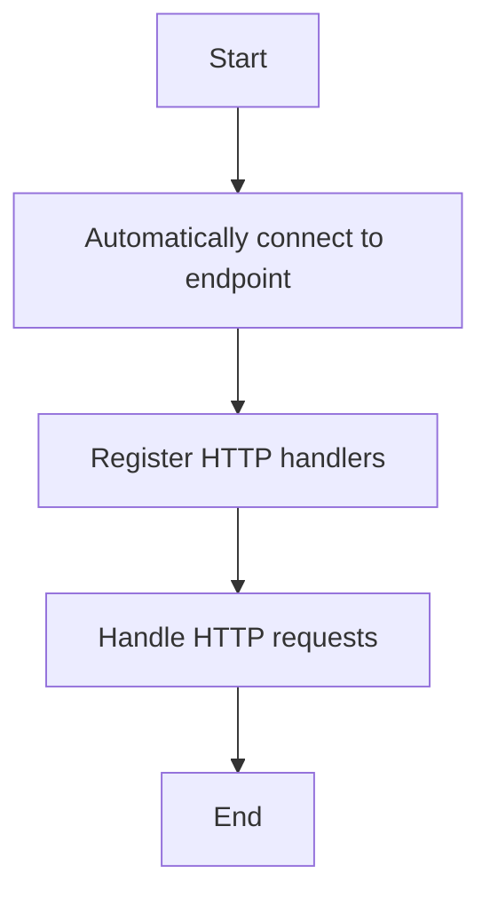

This document will cover the process of registering a workflow service handler, which includes:

1. Automatically connecting to the specified endpoint
2. Registering HTTP handlers for the WorkflowService
3. Handling various HTTP requests for workflow operations.

Technical document: <SwmLink doc-title="Registering a Workflow Service Handler">[Registering a Workflow Service Handler](/.swm/registering-a-workflow-service-handler.yj0nvb28.sw.md)</SwmLink>

# [Automatically Connecting to the Specified Endpoint](http://localhost:5001/repos/Z2l0aHViJTNBJTNBaW50dWl0LWFyZ28td29ya2Zsb3dzLWRlbW8lM0ElM0FTd2ltbS1EZW1v/docs/yj0nvb28#registering-the-workflow-service-handler)

The process begins by automatically connecting to a specified endpoint. This ensures that the workflow service handler is ready to handle HTTP requests. The connection is maintained until the context is completed, ensuring that the service is always available when needed.

# [Registering HTTP Handlers for the WorkflowService](http://localhost:5001/repos/Z2l0aHViJTNBJTNBaW50dWl0LWFyZ28td29ya2Zsb3dzLWRlbW8lM0ElM0FTd2ltbS1EZW1v/docs/yj0nvb28#registering-http-handlers)

Next, the HTTP handlers for the WorkflowService are registered to a provided multiplexer (mux). This step is crucial as it allows the handlers to forward incoming HTTP requests to the gRPC endpoint over the established connection. This setup ensures that the service can handle various workflow operations efficiently.

# [Handling Various HTTP Requests for Workflow Operations](http://localhost:5001/repos/Z2l0aHViJTNBJTNBaW50dWl0LWFyZ28td29ya2Zsb3dzLWRlbW8lM0ElM0FTd2ltbS1EZW1v/docs/yj0nvb28#handling-http-requests)

Finally, the HTTP handlers are configured to manage different HTTP methods such as POST, GET, and PUT. These methods correspond to various workflow operations like creating, retrieving, listing, and monitoring workflows. This comprehensive handling ensures that all necessary workflow operations can be performed through HTTP requests, providing flexibility and ease of use for end-users.

&nbsp;

*This is an auto-generated document by Swimm 🌊 and has not yet been verified by a human*

<SwmMeta version="3.0.0" repo-id="Z2l0aHViJTNBJTNBaW50dWl0LWFyZ28td29ya2Zsb3dzLWRlbW8lM0ElM0FTd2ltbS1EZW1v" repo-name="intuit-argo-workflows-demo">Powered by [Swimm](/)</SwmMeta>
