In this document, we will explain the process of registering a workflow service handler. The process involves several steps to ensure that the workflow service is properly set up to handle HTTP requests.

The flow starts by automatically dialing to a specified endpoint and closing the connection when the context is done. This ensures that the workflow service handler is registered and ready to handle HTTP requests. Next, the HTTP handlers for the <SwmToken path="pkg/apiclient/workflow/workflow.pb.gw.go" pos="1728:16:16" line-data="// RegisterWorkflowServiceHandler registers the http handlers for service WorkflowService to &quot;mux&quot;.">`WorkflowService`</SwmToken> are registered to the provided mux, allowing the handlers to forward requests to the <SwmToken path="pkg/apiclient/workflow/workflow.pb.gw.go" pos="1736:7:7" line-data="// Note: the gRPC framework executes interceptors within the gRPC handler. If the passed in &quot;WorkflowServiceClient&quot;">`gRPC`</SwmToken> endpoint over the given connection. Finally, the HTTP handlers for the <SwmToken path="pkg/apiclient/workflow/workflow.pb.gw.go" pos="1728:16:16" line-data="// RegisterWorkflowServiceHandler registers the http handlers for service WorkflowService to &quot;mux&quot;.">`WorkflowService`</SwmToken> are registered to the mux, forwarding requests to the <SwmToken path="pkg/apiclient/workflow/workflow.pb.gw.go" pos="1736:7:7" line-data="// Note: the gRPC framework executes interceptors within the gRPC handler. If the passed in &quot;WorkflowServiceClient&quot;">`gRPC`</SwmToken> endpoint over the provided <SwmToken path="pkg/apiclient/workflow/workflow.pb.gw.go" pos="1176:20:20" line-data="func request_WorkflowService_PodLogs_0(ctx context.Context, marshaler runtime.Marshaler, client WorkflowServiceClient, req *http.Request, pathParams map[string]string) (WorkflowService_PodLogsClient, runtime.ServerMetadata, error) {">`WorkflowServiceClient`</SwmToken> implementation. This includes handling various HTTP methods like POST, GET, and PUT for different workflow operations such as creating, getting, listing, and watching workflows.

# Flow drill down

```mermaid
graph TD;
      subgraph pkgapiclientworkflowworkflowpbgwgo["pkg/apiclient/workflow/workflow.pb.gw.go"]
10189802522f8283efb4c6d2c00331b4c83d436079f3e0e6b74d173b0d331920(RegisterWorkflowServiceHandlerFromEndpoint):::mainFlowStyle --> 86a1c19948b75eec6f93a04f776739316d95f96733f96fbc92becf25dd755e88(RegisterWorkflowServiceHandler):::mainFlowStyle
end

subgraph pkgapiclientworkflowworkflowpbgwgo["pkg/apiclient/workflow/workflow.pb.gw.go"]
86a1c19948b75eec6f93a04f776739316d95f96733f96fbc92becf25dd755e88(RegisterWorkflowServiceHandler):::mainFlowStyle --> bd6c6e67cfcad162a0cc9b8d643cecbcd19d70c16fe87baffd4dbd94fd58f166(RegisterWorkflowServiceHandlerClient):::mainFlowStyle
end

subgraph pkgapiclientworkflowworkflowpbgwgo["pkg/apiclient/workflow/workflow.pb.gw.go"]
bd6c6e67cfcad162a0cc9b8d643cecbcd19d70c16fe87baffd4dbd94fd58f166(RegisterWorkflowServiceHandlerClient):::mainFlowStyle --> ea0e09c9a481cf91bd8b6221c7dc9a2f8ce24158bf922e5251d792f060b8cf1b(request_WorkflowService_PodLogs_0):::mainFlowStyle
end


      classDef mainFlowStyle color:#000000,fill:#7CB9F4
classDef rootsStyle color:#000000,fill:#00FFF4
classDef Style1 color:#000000,fill:#00FFAA
classDef Style2 color:#000000,fill:#FFFF00
classDef Style3 color:#000000,fill:#AA7CB9
```



<SwmSnippet path="/pkg/apiclient/workflow/workflow.pb.gw.go" line="1703">

---

## Registering the Workflow Service Handler

The function <SwmToken path="pkg/apiclient/workflow/workflow.pb.gw.go" pos="1703:2:2" line-data="// RegisterWorkflowServiceHandlerFromEndpoint is same as RegisterWorkflowServiceHandler but">`RegisterWorkflowServiceHandlerFromEndpoint`</SwmToken> is responsible for automatically dialing to the specified endpoint and closing the connection when the context is done. This ensures that the workflow service handler is registered and ready to handle HTTP requests.

```go
// RegisterWorkflowServiceHandlerFromEndpoint is same as RegisterWorkflowServiceHandler but
// automatically dials to "endpoint" and closes the connection when "ctx" gets done.
func RegisterWorkflowServiceHandlerFromEndpoint(ctx context.Context, mux *runtime.ServeMux, endpoint string, opts []grpc.DialOption) (err error) {
	conn, err := grpc.Dial(endpoint, opts...)
	if err != nil {
		return err
	}
	defer func() {
		if err != nil {
			if cerr := conn.Close(); cerr != nil {
				grpclog.Infof("Failed to close conn to %s: %v", endpoint, cerr)
			}
			return
		}
		go func() {
			<-ctx.Done()
			if cerr := conn.Close(); cerr != nil {
				grpclog.Infof("Failed to close conn to %s: %v", endpoint, cerr)
			}
		}()
	}()
```

---

</SwmSnippet>

<SwmSnippet path="/pkg/apiclient/workflow/workflow.pb.gw.go" line="1728">

---

## Registering HTTP Handlers

The function <SwmToken path="pkg/apiclient/workflow/workflow.pb.gw.go" pos="1728:2:2" line-data="// RegisterWorkflowServiceHandler registers the http handlers for service WorkflowService to &quot;mux&quot;.">`RegisterWorkflowServiceHandler`</SwmToken> registers the HTTP handlers for the <SwmToken path="pkg/apiclient/workflow/workflow.pb.gw.go" pos="1728:16:16" line-data="// RegisterWorkflowServiceHandler registers the http handlers for service WorkflowService to &quot;mux&quot;.">`WorkflowService`</SwmToken> to the provided mux. This allows the handlers to forward requests to the <SwmToken path="pkg/apiclient/workflow/workflow.pb.gw.go" pos="1736:7:7" line-data="// Note: the gRPC framework executes interceptors within the gRPC handler. If the passed in &quot;WorkflowServiceClient&quot;">`gRPC`</SwmToken> endpoint over the given connection.

```go
// RegisterWorkflowServiceHandler registers the http handlers for service WorkflowService to "mux".
// The handlers forward requests to the grpc endpoint over "conn".
func RegisterWorkflowServiceHandler(ctx context.Context, mux *runtime.ServeMux, conn *grpc.ClientConn) error {
	return RegisterWorkflowServiceHandlerClient(ctx, mux, NewWorkflowServiceClient(conn))
}
```

---

</SwmSnippet>

<SwmSnippet path="/pkg/apiclient/workflow/workflow.pb.gw.go" line="1734">

---

## Handling HTTP Requests

The function <SwmToken path="pkg/apiclient/workflow/workflow.pb.gw.go" pos="1734:2:2" line-data="// RegisterWorkflowServiceHandlerClient registers the http handlers for service WorkflowService">`RegisterWorkflowServiceHandlerClient`</SwmToken> registers the HTTP handlers for the <SwmToken path="pkg/apiclient/workflow/workflow.pb.gw.go" pos="1734:16:16" line-data="// RegisterWorkflowServiceHandlerClient registers the http handlers for service WorkflowService">`WorkflowService`</SwmToken> to the mux. It forwards requests to the <SwmToken path="pkg/apiclient/workflow/workflow.pb.gw.go" pos="1736:7:7" line-data="// Note: the gRPC framework executes interceptors within the gRPC handler. If the passed in &quot;WorkflowServiceClient&quot;">`gRPC`</SwmToken> endpoint over the provided <SwmToken path="pkg/apiclient/workflow/workflow.pb.gw.go" pos="1735:36:36" line-data="// to &quot;mux&quot;. The handlers forward requests to the grpc endpoint over the given implementation of &quot;WorkflowServiceClient&quot;.">`WorkflowServiceClient`</SwmToken> implementation. This function handles various HTTP methods like POST, GET, and PUT for different workflow operations such as creating, getting, listing, and watching workflows.

```go
// RegisterWorkflowServiceHandlerClient registers the http handlers for service WorkflowService
// to "mux". The handlers forward requests to the grpc endpoint over the given implementation of "WorkflowServiceClient".
// Note: the gRPC framework executes interceptors within the gRPC handler. If the passed in "WorkflowServiceClient"
// doesn't go through the normal gRPC flow (creating a gRPC client etc.) then it will be up to the passed in
// "WorkflowServiceClient" to call the correct interceptors.
func RegisterWorkflowServiceHandlerClient(ctx context.Context, mux *runtime.ServeMux, client WorkflowServiceClient) error {

	mux.Handle("POST", pattern_WorkflowService_CreateWorkflow_0, func(w http.ResponseWriter, req *http.Request, pathParams map[string]string) {
		ctx, cancel := context.WithCancel(req.Context())
		defer cancel()
		inboundMarshaler, outboundMarshaler := runtime.MarshalerForRequest(mux, req)
		rctx, err := runtime.AnnotateContext(ctx, mux, req)
		if err != nil {
			runtime.HTTPError(ctx, mux, outboundMarshaler, w, req, err)
			return
		}
		resp, md, err := request_WorkflowService_CreateWorkflow_0(rctx, inboundMarshaler, client, req, pathParams)
		ctx = runtime.NewServerMetadataContext(ctx, md)
		if err != nil {
			runtime.HTTPError(ctx, mux, outboundMarshaler, w, req, err)
			return
```

---

</SwmSnippet>

<SwmSnippet path="/pkg/apiclient/workflow/workflow.pb.gw.go" line="1176">

---

### Handling Pod Logs Request

The function <SwmToken path="pkg/apiclient/workflow/workflow.pb.gw.go" pos="1176:2:2" line-data="func request_WorkflowService_PodLogs_0(ctx context.Context, marshaler runtime.Marshaler, client WorkflowServiceClient, req *http.Request, pathParams map[string]string) (WorkflowService_PodLogsClient, runtime.ServerMetadata, error) {">`request_WorkflowService_PodLogs_0`</SwmToken> handles the request for pod logs. It validates the required parameters like namespace, name, and <SwmToken path="pkg/apiclient/workflow/workflow.pb.gw.go" pos="1173:36:36" line-data="	filter_WorkflowService_PodLogs_0 = &amp;utilities.DoubleArray{Encoding: map[string]int{&quot;namespace&quot;: 0, &quot;name&quot;: 1, &quot;podName&quot;: 2}, Base: []int{1, 1, 2, 3, 0, 0, 0}, Check: []int{0, 1, 1, 1, 2, 3, 4}}">`podName`</SwmToken>, and then streams the pod logs from the client. This function ensures that the correct logs are fetched and any errors are appropriately handled.

```go
func request_WorkflowService_PodLogs_0(ctx context.Context, marshaler runtime.Marshaler, client WorkflowServiceClient, req *http.Request, pathParams map[string]string) (WorkflowService_PodLogsClient, runtime.ServerMetadata, error) {
	var protoReq WorkflowLogRequest
	var metadata runtime.ServerMetadata

	var (
		val string
		ok  bool
		err error
		_   = err
	)

	val, ok = pathParams["namespace"]
	if !ok {
		return nil, metadata, status.Errorf(codes.InvalidArgument, "missing parameter %s", "namespace")
	}

	protoReq.Namespace, err = runtime.String(val)

	if err != nil {
		return nil, metadata, status.Errorf(codes.InvalidArgument, "type mismatch, parameter: %s, error: %v", "namespace", err)
	}
```

---

</SwmSnippet>

&nbsp;

*This is an auto-generated document by Swimm 🌊 and has not yet been verified by a human*

<SwmMeta version="3.0.0" repo-id="Z2l0aHViJTNBJTNBaW50dWl0LWFyZ28td29ya2Zsb3dzLWRlbW8lM0ElM0FTd2ltbS1EZW1v" repo-name="intuit-argo-workflows-demo"><sup>Powered by [Swimm](/)</sup></SwmMeta>
