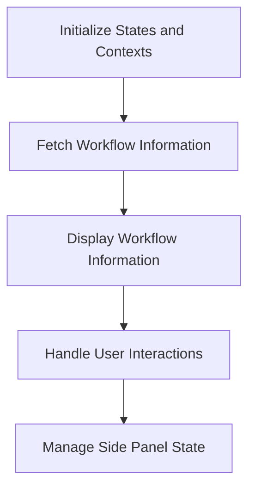

This document will cover the process of rendering and managing workflow details, which includes:

1. Initializing states and contexts
2. Fetching and displaying workflow information
3. Handling user interactions
4. Managing the side panel's state.

Technical document: <SwmLink doc-title="Rendering and Managing Workflow Details">[Rendering and Managing Workflow Details](/.swm/rendering-and-managing-workflow-details.snxj1izv.sw.md)</SwmLink>

# [Initializing States and Contexts](http://localhost:5001/repos/Z2l0aHViJTNBJTNBaW50dWl0LWFyZ28td29ya2Zsb3dzLWRlbW8lM0ElM0FTd2ltbS1EZW1v/docs/snxj1izv#workflowdetails)

The process begins by setting up the necessary states and contexts required for viewing the workflow details. This includes initializing variables such as the current tab, unique identifier (UID), node ID, and the state of the side panel. These initializations ensure that the workflow details view is properly configured and ready to display relevant information to the user.

# [Fetching Workflow Information](http://localhost:5001/repos/Z2l0aHViJTNBJTNBaW50dWl0LWFyZ28td29ya2Zsb3dzLWRlbW8lM0ElM0FTd2ltbS1EZW1v/docs/snxj1izv#workflowdetails)

Once the states and contexts are initialized, the next step is to fetch the workflow information. This involves retrieving data about the workflow, such as its status, nodes, and any associated artifacts. This data is essential for providing a comprehensive view of the workflow's current state and progress.

# [Displaying Workflow Information](http://localhost:5001/repos/Z2l0aHViJTNBJTNBaW50dWl0LWFyZ28td29ya2Zsb3dzLWRlbW8lM0ElM0FTd2ltbS1EZW1v/docs/snxj1izv#workflowdetails)

After fetching the workflow information, it is displayed to the user. This includes showing details such as the workflow's name, status, and any relevant logs or artifacts. The display is designed to be user-friendly, allowing users to easily understand the workflow's current state and any actions that can be taken.

# [Handling User Interactions](http://localhost:5001/repos/Z2l0aHViJTNBJTNBaW50dWl0LWFyZ28td29ya2Zsb3dzLWRlbW8lM0ElM0FTd2ltbS1EZW1v/docs/snxj1izv#getitems)

Users can interact with the workflow details in various ways. For example, they can view logs, delete the workflow, or navigate to related templates. Each interaction is handled by providing the user with actionable options based on the current state of the workflow. For instance, when a user chooses to delete a workflow, they are prompted to confirm the action before it is executed.

# [Managing the Side Panel's State](http://localhost:5001/repos/Z2l0aHViJTNBJTNBaW50dWl0LWFyZ28td29ya2Zsb3dzLWRlbW8lM0ElM0FTd2ltbS1EZW1v/docs/snxj1izv#workflowdetails)

The side panel is used to display additional information or actions related to the workflow. Its state is managed based on user interactions. For example, if a user selects a node within the workflow, the side panel will expand to show details about that node. This dynamic management of the side panel ensures that users have access to relevant information and actions without cluttering the main workflow details view.

&nbsp;

*This is an auto-generated document by Swimm 🌊 and has not yet been verified by a human*

<SwmMeta version="3.0.0" repo-id="Z2l0aHViJTNBJTNBaW50dWl0LWFyZ28td29ya2Zsb3dzLWRlbW8lM0ElM0FTd2ltbS1EZW1v" repo-name="intuit-argo-workflows-demo">Powered by [Swimm](/)</SwmMeta>
