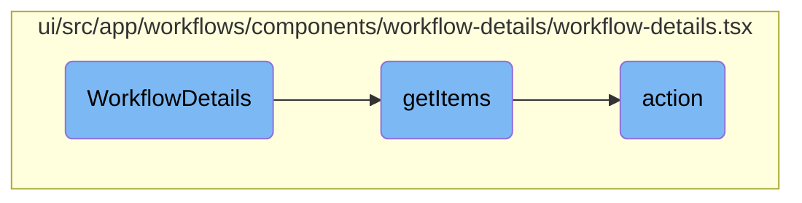

In this document, we will explain the process of rendering and managing the details of a specific workflow. The process involves initializing various states and contexts, fetching and displaying workflow information, handling user interactions, and managing the side panel's state.

The flow starts by initializing the necessary states and contexts needed for the workflow details view. It then fetches and displays the workflow information. The user can interact with the workflow details, such as viewing logs, deleting the workflow, or navigating to related templates. The side panel is used to display additional information or actions related to the workflow, and its state is managed based on user interactions.

# Flow drill down



<SwmSnippet path="/ui/src/app/workflows/components/workflow-details/workflow-details.tsx" line="93">

---

## <SwmToken path="ui/src/app/workflows/components/workflow-details/workflow-details.tsx" pos="93:4:4" line-data="export function WorkflowDetails({history, location, match}: RouteComponentProps&lt;any&gt;) {">`WorkflowDetails`</SwmToken>

The <SwmToken path="ui/src/app/workflows/components/workflow-details/workflow-details.tsx" pos="93:4:4" line-data="export function WorkflowDetails({history, location, match}: RouteComponentProps&lt;any&gt;) {">`WorkflowDetails`</SwmToken> function is responsible for rendering the details of a specific workflow. It initializes various states and context needed for the workflow details view, such as <SwmToken path="ui/src/app/workflows/components/workflow-details/workflow-details.tsx" pos="100:4:4" line-data="    const [tab, setTab] = useState(queryParams.get(&#39;tab&#39;) || &#39;workflow&#39;);">`tab`</SwmToken>, <SwmToken path="ui/src/app/workflows/components/workflow-details/workflow-details.tsx" pos="101:4:4" line-data="    const [uid, setUid] = useState(queryParams.get(&#39;uid&#39;) || &#39;&#39;);">`uid`</SwmToken>, <SwmToken path="ui/src/app/workflows/components/workflow-details/workflow-details.tsx" pos="102:4:4" line-data="    const [nodeId, setNodeId] = useState(queryParams.get(&#39;nodeId&#39;));">`nodeId`</SwmToken>, and <SwmToken path="ui/src/app/workflows/components/workflow-details/workflow-details.tsx" pos="104:4:4" line-data="    const [sidePanel, setSidePanel] = useState(queryParams.get(&#39;sidePanel&#39;));">`sidePanel`</SwmToken>. It also sets up the side panel's width and drag handle properties. The function includes logic to fetch and display workflow information, handle user interactions, and manage the side panel's state.

```tsx
export function WorkflowDetails({history, location, match}: RouteComponentProps<any>) {
    // boiler-plate
    const {navigation, popup} = useContext(Context);
    const queryParams = new URLSearchParams(location.search);
    const namespace = match.params.namespace;
    const name = match.params.name;

    const [tab, setTab] = useState(queryParams.get('tab') || 'workflow');
    const [uid, setUid] = useState(queryParams.get('uid') || '');
    const [nodeId, setNodeId] = useState(queryParams.get('nodeId'));
    const [nodePanelView, setNodePanelView] = useState(queryParams.get('nodePanelView'));
    const [sidePanel, setSidePanel] = useState(queryParams.get('sidePanel'));
    const [parameters, setParameters] = useState<Parameter[]>([]);
    const sidePanelRef = useRef<HTMLDivElement>(null);
    const [workflow, setWorkflow] = useState<Workflow>();
    const [links, setLinks] = useState<Link[]>();
    const [error, setError] = useState<Error>();
    const selectedNode = workflow?.status?.nodes?.[nodeId];
    const selectedArtifact = workflow?.status && findArtifact(workflow.status, nodeId);
    const [selectedTemplateArtifactRepo, setSelectedTemplateArtifactRepo] = useState<ArtifactRepository>();
    const isSidePanelExpanded = !!(selectedNode || selectedArtifact);
```

---

</SwmSnippet>

<SwmSnippet path="/ui/src/app/workflows/components/workflow-details/workflow-details.tsx" line="186">

---

## <SwmToken path="ui/src/app/workflows/components/workflow-details/workflow-details.tsx" pos="186:3:3" line-data="    function getItems() {">`getItems`</SwmToken>

The <SwmToken path="ui/src/app/workflows/components/workflow-details/workflow-details.tsx" pos="186:3:3" line-data="    function getItems() {">`getItems`</SwmToken> function generates a list of available operations for the workflow. It filters out disabled operations and maps each operation to an action that can be performed by the user. For example, it includes actions like deleting the workflow, viewing logs, sharing the workflow, and navigating to related templates. This function is crucial for providing users with actionable options based on the current state of the workflow.

```tsx
    function getItems() {
        const workflowOperationsMap: WorkflowOperations = Operations.WorkflowOperationsMap;
        const items = Object.keys(workflowOperationsMap)
            .filter(actionName => !workflowOperationsMap[actionName].disabled(workflow))
            .map(actionName => {
                const workflowOperation = workflowOperationsMap[actionName];
                return {
                    title: workflowOperation.title.charAt(0).toUpperCase() + workflowOperation.title.slice(1),
                    iconClassName: workflowOperation.iconClassName,
                    action: () => {
                        if (workflowOperation.title === 'DELETE') {
                            popup
                                .confirm('Confirm', () => <DeleteCheck isWfInDB={isArchivedWorkflow(workflow)} isWfInCluster={isWorkflowInCluster(workflow)} />)
                                .then(async yes => {
                                    if (!yes) return;

                                    const allPromises = [];
                                    if (isWorkflowInCluster(workflow)) {
                                        allPromises.push(services.workflows.delete(workflow.metadata.name, workflow.metadata.namespace).catch(setError));
                                    }
                                    if (isArchivedWorkflow(workflow) && (globalDeleteArchived || !isWorkflowInCluster(workflow))) {
```

---

</SwmSnippet>

<SwmSnippet path="/ui/src/app/workflows/components/workflow-details/workflow-details.tsx" line="195">

---

### Handling Delete Operation

The <SwmToken path="ui/src/app/workflows/components/workflow-details/workflow-details.tsx" pos="195:1:1" line-data="                    action: () =&gt; {">`action`</SwmToken> function handles various workflow operations. For instance, when the user chooses to delete a workflow, it confirms the action with the user and then proceeds to delete the workflow from both the cluster and the archive if applicable. This ensures that the workflow is completely removed based on the user's confirmation.

```tsx
                    action: () => {
                        if (workflowOperation.title === 'DELETE') {
                            popup
                                .confirm('Confirm', () => <DeleteCheck isWfInDB={isArchivedWorkflow(workflow)} isWfInCluster={isWorkflowInCluster(workflow)} />)
                                .then(async yes => {
                                    if (!yes) return;

                                    const allPromises = [];
                                    if (isWorkflowInCluster(workflow)) {
                                        allPromises.push(services.workflows.delete(workflow.metadata.name, workflow.metadata.namespace).catch(setError));
                                    }
                                    if (isArchivedWorkflow(workflow) && (globalDeleteArchived || !isWorkflowInCluster(workflow))) {
                                        allPromises.push(services.workflows.deleteArchived(workflow.metadata.uid, workflow.metadata.namespace).catch(setError));
                                    }
                                    await Promise.all(allPromises);
                                    if (error !== null) {
                                        return;
                                    }

                                    navigation.goto(uiUrl(`workflows/${workflow.metadata.namespace}`));
                                });
```

---

</SwmSnippet>

<SwmSnippet path="/ui/src/app/workflows/components/workflow-details/workflow-details.tsx" line="216">

---

### Handling Resubmit and Retry Operations

The <SwmToken path="ui/src/app/workflows/components/workflow-details/workflow-details.tsx" pos="195:1:1" line-data="                    action: () =&gt; {">`action`</SwmToken> function also handles resubmitting and retrying workflows. When the user selects these operations, it sets the side panel to the respective views (<SwmToken path="ui/src/app/workflows/components/workflow-details/workflow-details.tsx" pos="217:4:4" line-data="                            setSidePanel(&#39;resubmit&#39;);">`resubmit`</SwmToken> or <SwmToken path="ui/src/app/workflows/components/workflow-details/workflow-details.tsx" pos="219:4:4" line-data="                            setSidePanel(&#39;retry&#39;);">`retry`</SwmToken>), allowing the user to perform these actions seamlessly.

```tsx
                        } else if (workflowOperation.title === 'RESUBMIT') {
                            setSidePanel('resubmit');
                        } else if (workflowOperation.title === 'RETRY') {
                            setSidePanel('retry');
                        } else {
```

---

</SwmSnippet>

<SwmSnippet path="/ui/src/app/workflows/components/workflow-details/workflow-details.tsx" line="221">

---

### Handling Other Operations

For other operations, the <SwmToken path="ui/src/app/workflows/components/workflow-details/workflow-details.tsx" pos="224:3:3" line-data="                                workflowOperation.action(workflow).catch(setError);">`action`</SwmToken> function confirms the action with the user and then executes the operation. This ensures that the user is aware of the action being performed and can cancel if necessary.

```tsx
                            popup.confirm('Confirm', `Are you sure you want to ${workflowOperation.title.toLowerCase()} this workflow?`).then(yes => {
                                if (!yes) return;

                                workflowOperation.action(workflow).catch(setError);
                            });
                        }
                    }
```

---

</SwmSnippet>

&nbsp;

*This is an auto-generated document by Swimm 🌊 and has not yet been verified by a human*

<SwmMeta version="3.0.0" repo-id="Z2l0aHViJTNBJTNBaW50dWl0LWFyZ28td29ya2Zsb3dzLWRlbW8lM0ElM0FTd2ltbS1EZW1v" repo-name="intuit-argo-workflows-demo"><sup>Powered by [Swimm](/)</sup></SwmMeta>
