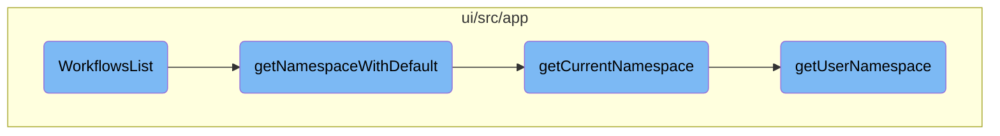

In this document, we will explain the process of rendering and managing a list of workflows. The process involves initializing various states, filtering workflows, and managing the selection of workflows for batch actions.

The flow starts by initializing different states such as namespace, pagination, phases, labels, and others. It then filters the workflows based on specific dates and manages the selection of workflows for batch actions. The process ensures that a valid namespace is always returned by checking several sources and defaulting to 'default' if none are found.

# Flow drill down



<SwmSnippet path="/ui/src/app/workflows/components/workflows-list/workflows-list.tsx" line="54">

---

## <SwmToken path="ui/src/app/workflows/components/workflows-list/workflows-list.tsx" pos="54:4:4" line-data="export function WorkflowsList({match, location, history}: RouteComponentProps&lt;any&gt;) {">`WorkflowsList`</SwmToken>

The <SwmToken path="ui/src/app/workflows/components/workflows-list/workflows-list.tsx" pos="54:4:4" line-data="export function WorkflowsList({match, location, history}: RouteComponentProps&lt;any&gt;) {">`WorkflowsList`</SwmToken> function is responsible for rendering the list of workflows. It initializes various states such as <SwmToken path="ui/src/app/workflows/components/workflows-list/workflows-list.tsx" pos="58:4:4" line-data="    const [namespace, setNamespace] = useState(nsUtils.getNamespace(match.params.namespace) || &#39;&#39;);">`namespace`</SwmToken>, <SwmToken path="ui/src/app/workflows/components/workflows-list/workflows-list.tsx" pos="59:4:4" line-data="    const [pagination, setPagination] = useState&lt;Pagination&gt;(() =&gt; {">`pagination`</SwmToken>, <SwmToken path="ui/src/app/workflows/components/workflows-list/workflows-list.tsx" pos="66:4:4" line-data="    const [phases, setPhases] = useState&lt;WorkflowPhase[]&gt;(() =&gt; {">`phases`</SwmToken>, <SwmToken path="ui/src/app/workflows/components/workflows-list/workflows-list.tsx" pos="73:4:4" line-data="    const [labels, setLabels] = useState&lt;string[]&gt;(() =&gt; {">`labels`</SwmToken>, <SwmToken path="ui/src/app/workflows/components/workflows-list/workflows-list.tsx" pos="80:4:4" line-data="    const [createdAfter, setCreatedAfter] = useState&lt;Date&gt;();">`createdAfter`</SwmToken>, <SwmToken path="ui/src/app/workflows/components/workflows-list/workflows-list.tsx" pos="81:4:4" line-data="    const [finishedBefore, setFinishedBefore] = useState&lt;Date&gt;();">`finishedBefore`</SwmToken>, <SwmToken path="ui/src/app/workflows/components/workflows-list/workflows-list.tsx" pos="82:4:4" line-data="    const [selectedWorkflows, setSelectedWorkflows] = useState(new Map&lt;string, models.Workflow&gt;());">`selectedWorkflows`</SwmToken>, <SwmToken path="ui/src/app/workflows/components/workflows-list/workflows-list.tsx" pos="27:10:10" line-data="import {WorkflowsRow} from &#39;../workflows-row/workflows-row&#39;;">`workflows`</SwmToken>, <SwmToken path="ui/src/app/workflows/components/workflows-list/workflows-list.tsx" pos="84:4:4" line-data="    const [links, setLinks] = useState&lt;models.Link[]&gt;([]);">`links`</SwmToken>, <SwmToken path="ui/src/app/workflows/components/workflows-list/workflows-list.tsx" pos="85:4:4" line-data="    const [columns, setColumns] = useState&lt;models.Column[]&gt;([]);">`columns`</SwmToken>, and <SwmToken path="ui/src/app/workflows/components/workflows-list/workflows-list.tsx" pos="11:14:14" line-data="import {ErrorNotice} from &#39;../../../shared/components/error-notice&#39;;">`error`</SwmToken>. It also filters workflows based on the <SwmToken path="ui/src/app/workflows/components/workflows-list/workflows-list.tsx" pos="80:4:4" line-data="    const [createdAfter, setCreatedAfter] = useState&lt;Date&gt;();">`createdAfter`</SwmToken> and <SwmToken path="ui/src/app/workflows/components/workflows-list/workflows-list.tsx" pos="81:4:4" line-data="    const [finishedBefore, setFinishedBefore] = useState&lt;Date&gt;();">`finishedBefore`</SwmToken> dates and manages the selection of workflows for batch actions.

```tsx
export function WorkflowsList({match, location, history}: RouteComponentProps<any>) {
    const queryParams = new URLSearchParams(location.search);
    const {navigation} = useContext(Context);

    const [namespace, setNamespace] = useState(nsUtils.getNamespace(match.params.namespace) || '');
    const [pagination, setPagination] = useState<Pagination>(() => {
        const savedPaginationLimit = storage.getItem('options', {}).paginationLimit || undefined;
        return {
            offset: queryParams.get('offset') || undefined,
            limit: parseLimit(queryParams.get('limit')) || savedPaginationLimit || 50
        };
    });
    const [phases, setPhases] = useState<WorkflowPhase[]>(() => {
        const savedOptions = storage.getItem('options', {});
        // selectedPhases is a legacy name, used here for backward-compat with old storage
        const savedPhases = savedOptions.phases || savedOptions.selectedPhases || [];
        const phaseQueryParam = queryParams.getAll('phase') as WorkflowPhase[];
        return phaseQueryParam.length > 0 ? phaseQueryParam : savedPhases;
    });
    const [labels, setLabels] = useState<string[]>(() => {
        const savedOptions = storage.getItem('options', {});
```

---

</SwmSnippet>

<SwmSnippet path="/ui/src/app/shared/namespaces.ts" line="61">

---

## <SwmToken path="ui/src/app/shared/namespaces.ts" pos="62:4:4" line-data="export function getNamespaceWithDefault(namespace: string) {">`getNamespaceWithDefault`</SwmToken>

The <SwmToken path="ui/src/app/shared/namespaces.ts" pos="62:4:4" line-data="export function getNamespaceWithDefault(namespace: string) {">`getNamespaceWithDefault`</SwmToken> function ensures that a valid namespace is always returned. It checks the provided namespace, the current namespace, the user namespace, and the managed namespace, defaulting to 'default' if none are found.

```typescript
// return a namespace, never return null/undefined/empty string, default to "default"
export function getNamespaceWithDefault(namespace: string) {
    return namespace || getCurrentNamespace() || getUserNamespace() || getManagedNamespace() || 'default';
}
```

---

</SwmSnippet>

<SwmSnippet path="/ui/src/app/shared/namespaces.ts" line="52">

---

## <SwmToken path="ui/src/app/shared/namespaces.ts" pos="52:4:4" line-data="export function getCurrentNamespace() {">`getCurrentNamespace`</SwmToken>

The <SwmToken path="ui/src/app/shared/namespaces.ts" pos="52:4:4" line-data="export function getCurrentNamespace() {">`getCurrentNamespace`</SwmToken> function retrieves the current namespace from local storage. If it is not found, it falls back to the user namespace or the managed namespace.

```typescript
export function getCurrentNamespace() {
    return fixLocalStorageString(localStorage.getItem(currentNamespaceKey)) ?? (getUserNamespace() || getManagedNamespace());
}
```

---

</SwmSnippet>

<SwmSnippet path="/ui/src/app/shared/namespaces.ts" line="27">

---

## <SwmToken path="ui/src/app/shared/namespaces.ts" pos="27:2:2" line-data="function getUserNamespace() {">`getUserNamespace`</SwmToken>

The <SwmToken path="ui/src/app/shared/namespaces.ts" pos="27:2:2" line-data="function getUserNamespace() {">`getUserNamespace`</SwmToken> function retrieves the user namespace from local storage. This is used as a fallback when the current namespace is not available.

```typescript
function getUserNamespace() {
    return fixLocalStorageString(localStorage.getItem(userNamespaceKey));
}
```

---

</SwmSnippet>

&nbsp;

*This is an auto-generated document by Swimm 🌊 and has not yet been verified by a human*

<SwmMeta version="3.0.0" repo-id="Z2l0aHViJTNBJTNBaW50dWl0LWFyZ28td29ya2Zsb3dzLWRlbW8lM0ElM0FTd2ltbS1EZW1v" repo-name="intuit-argo-workflows-demo"><sup>Powered by [Swimm](/)</sup></SwmMeta>
