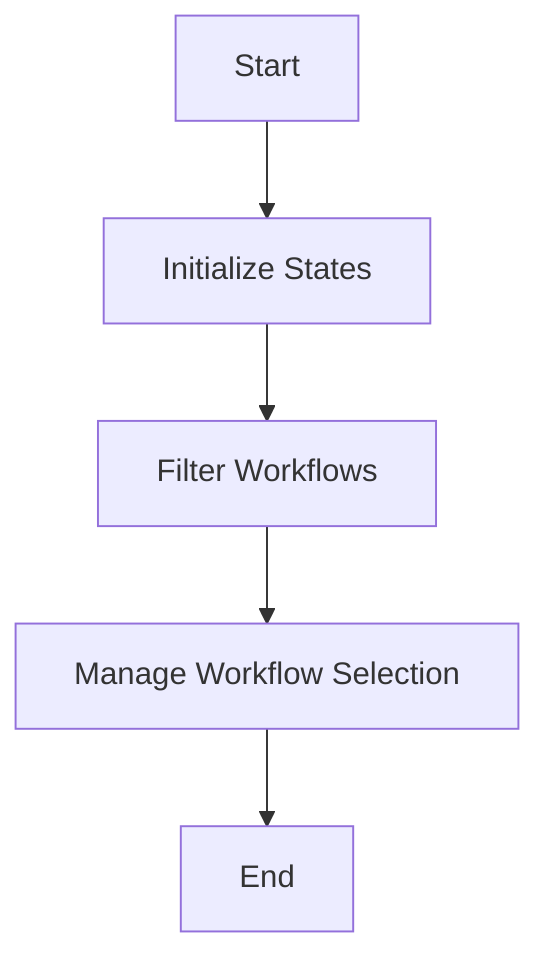

This document will cover the process of rendering and managing workflows, which includes:

1. Initializing states
2. Filtering workflows
3. Managing workflow selection for batch actions.

Technical document: <SwmLink doc-title="Rendering and Managing Workflows">[Rendering and Managing Workflows](/.swm/rendering-and-managing-workflows.9mzygm1o.sw.md)</SwmLink>

# [Initializing States](http://localhost:5001/repos/Z2l0aHViJTNBJTNBaW50dWl0LWFyZ28td29ya2Zsb3dzLWRlbW8lM0ElM0FTd2ltbS1EZW1v/docs/9mzygm1o#initializing-states)

The process begins by initializing various states that are essential for managing workflows. These states include namespace, pagination, phases, labels, createdAfter, finishedBefore, selectedWorkflows, workflows, links, columns, and error. Each of these states plays a crucial role in ensuring that the workflows are managed efficiently. For example, the namespace state determines the scope within which the workflows are managed, while pagination helps in handling large sets of workflows by breaking them into manageable pages.

# [Filtering Workflows](http://localhost:5001/repos/Z2l0aHViJTNBJTNBaW50dWl0LWFyZ28td29ya2Zsb3dzLWRlbW8lM0ElM0FTd2ltbS1EZW1v/docs/9mzygm1o#filtering-workflows)

Once the states are initialized, the next step is to filter the workflows based on specific criteria. This includes filtering by the dates they were created (createdAfter) and the dates they were finished (finishedBefore). This filtering is essential for users who need to focus on workflows within a particular time frame. For instance, a user might want to see only the workflows that were created in the last week or those that were completed before a certain date.

# [Managing Workflow Selection for Batch Actions](http://localhost:5001/repos/Z2l0aHViJTNBJTNBaW50dWl0LWFyZ28td29ya2Zsb3dzLWRlbW8lM0ElM0FTd2ltbS1EZW1v/docs/9mzygm1o#managing-workflow-selection-for-batch-actions)

The final step in the process is managing the selection of workflows for batch actions. This involves allowing users to select multiple workflows and perform actions on them simultaneously. For example, users might want to delete multiple workflows at once or mark several workflows as completed. This feature enhances user efficiency by reducing the time and effort required to manage workflows individually.

&nbsp;

*This is an auto-generated document by Swimm 🌊 and has not yet been verified by a human*

<SwmMeta version="3.0.0" repo-id="Z2l0aHViJTNBJTNBaW50dWl0LWFyZ28td29ya2Zsb3dzLWRlbW8lM0ElM0FTd2ltbS1EZW1v" repo-name="intuit-argo-workflows-demo">Powered by [Swimm](/)</SwmMeta>
