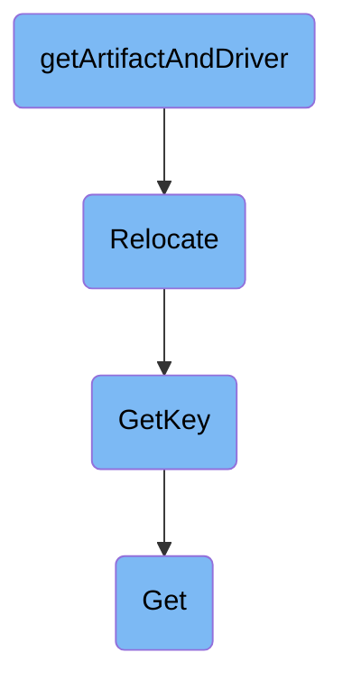

In this document, we will explain the process of retrieving and relocating an artifact. The process involves several steps, including retrieving the artifact and its associated driver, determining the artifact's location, and relocating the artifact if necessary.

The flow starts with retrieving the artifact and its associated driver. Next, it checks if the artifact is an input or output and determines its location based on various sources. Finally, it relocates the artifact if needed and appends the filename to the artifact key if provided.

# Flow drill down



<SwmSnippet path="/server/artifacts/artifact_server.go" line="388">

---

## Retrieving and Relocating the Artifact

The <SwmToken path="server/artifacts/artifact_server.go" pos="388:9:9" line-data="func (a *ArtifactServer) getArtifactAndDriver(ctx context.Context, nodeId, artifactName string, isInput bool, wf *wfv1.Workflow, fileName *string) (*wfv1.Artifact, common.ArtifactDriver, error) {">`getArtifactAndDriver`</SwmToken> function is responsible for retrieving the artifact and its associated driver. It first retrieves the node status and checks if the artifact is an input or output. Then, it determines the artifact's location based on various sources such as the artifact itself, controller configmap, workflow spec, or template. Finally, it relocates the artifact if necessary and appends the filename to the artifact key if provided.

```go
func (a *ArtifactServer) getArtifactAndDriver(ctx context.Context, nodeId, artifactName string, isInput bool, wf *wfv1.Workflow, fileName *string) (*wfv1.Artifact, common.ArtifactDriver, error) {

	kubeClient := auth.GetKubeClient(ctx)

	var art *wfv1.Artifact

	nodeStatus, err := wf.Status.Nodes.Get(nodeId)
	if err != nil {
		log.Errorf("Was unable to retrieve node for %s", nodeId)
		return nil, nil, fmt.Errorf("was not able to retrieve node")
	}
	if isInput {
		art = nodeStatus.Inputs.GetArtifactByName(artifactName)
	} else {
		art = nodeStatus.Outputs.GetArtifactByName(artifactName)
	}
	if art == nil {
		return nil, nil, fmt.Errorf("artifact not found: %s, isInput=%t, Workflow Status=%+v", artifactName, isInput, wf.Status)
	}

	// Artifact Location can be defined in various places:
```

---

</SwmSnippet>

<SwmSnippet path="/pkg/apis/workflow/v1alpha1/workflow_types.go" line="1248">

---

### Relocating the Artifact

The <SwmToken path="pkg/apis/workflow/v1alpha1/workflow_types.go" pos="1248:9:9" line-data="func (a *ArtifactLocation) Relocate(l *ArtifactLocation) error {">`Relocate`</SwmToken> function copies all location information from the provided parameter to the artifact, except for the key. This is done only if the artifact does not already have a location. If the provided location is nil, an error is returned.

```go
func (a *ArtifactLocation) Relocate(l *ArtifactLocation) error {
	if a.HasLocation() {
		return nil
	}
	if l == nil {
		return fmt.Errorf("template artifact location not set")
	}
	key, err := a.GetKey()
	if err != nil {
		return err
	}
	*a = *l.DeepCopy()
	return a.SetKey(key)
}
```

---

</SwmSnippet>

<SwmSnippet path="/pkg/apis/workflow/v1alpha1/workflow_types.go" line="1274">

---

### Getting the Artifact Key

The <SwmToken path="pkg/apis/workflow/v1alpha1/workflow_types.go" pos="1274:9:9" line-data="func (a *ArtifactLocation) GetKey() (string, error) {">`GetKey`</SwmToken> function retrieves the key for the artifact location. It first calls the <SwmToken path="pkg/apis/workflow/v1alpha1/workflow_types.go" pos="1275:10:10" line-data="	v, err := a.Get()">`Get`</SwmToken> function to obtain the artifact location type and then returns the key associated with that type.

```go
func (a *ArtifactLocation) GetKey() (string, error) {
	v, err := a.Get()
	if err != nil {
		return "", err
	}
	return v.GetKey()
}
```

---

</SwmSnippet>

<SwmSnippet path="/pkg/apis/workflow/v1alpha1/workflow_types.go" line="1168">

---

### Getting the Artifact Location Type

The <SwmToken path="pkg/apis/workflow/v1alpha1/workflow_types.go" pos="1168:9:9" line-data="func (a *ArtifactLocation) Get() (ArtifactLocationType, error) {">`Get`</SwmToken> function determines the type of artifact location by checking various possible storage backends such as Artifactory, Azure, Git, GCS, HDFS, HTTP, OSS, Raw, and <SwmToken path="pkg/apis/workflow/v1alpha1/workflow_types.go" pos="1187:9:9" line-data="	} else if a.S3 != nil {">`S3`</SwmToken>. If none of these are configured, an error is returned.

```go
func (a *ArtifactLocation) Get() (ArtifactLocationType, error) {
	if a == nil {
		return nil, fmt.Errorf("key unsupported: cannot get key for artifact location, because it is invalid")
	} else if a.Artifactory != nil {
		return a.Artifactory, nil
	} else if a.Azure != nil {
		return a.Azure, nil
	} else if a.Git != nil {
		return a.Git, nil
	} else if a.GCS != nil {
		return a.GCS, nil
	} else if a.HDFS != nil {
		return a.HDFS, nil
	} else if a.HTTP != nil {
		return a.HTTP, nil
	} else if a.OSS != nil {
		return a.OSS, nil
	} else if a.Raw != nil {
		return a.Raw, nil
	} else if a.S3 != nil {
		return a.S3, nil
```

---

</SwmSnippet>

&nbsp;

*This is an auto-generated document by Swimm 🌊 and has not yet been verified by a human*

<SwmMeta version="3.0.0" repo-id="Z2l0aHViJTNBJTNBaW50dWl0LWFyZ28td29ya2Zsb3dzLWRlbW8lM0ElM0FTd2ltbS1EZW1v" repo-name="intuit-argo-workflows-demo"><sup>Powered by [Swimm](/)</sup></SwmMeta>
