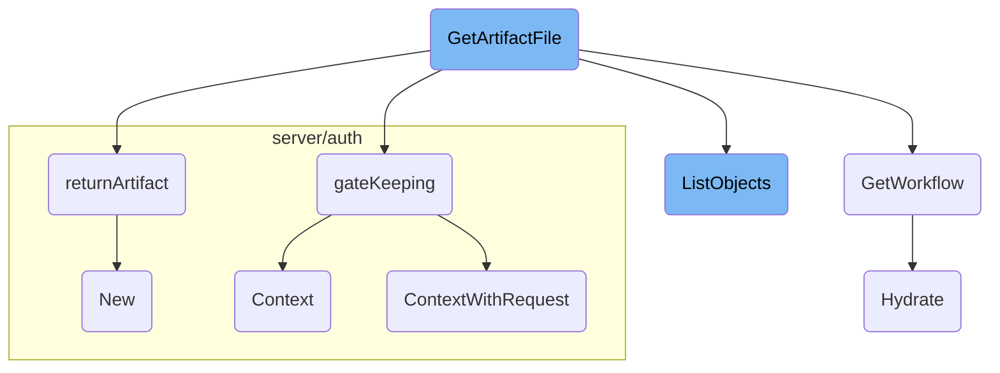

In this document, we will explain the process of retrieving artifact files. The process involves several steps including parsing the request, verifying user authorization, retrieving workflow details, listing objects in a directory, and streaming the artifact content.

The flow starts with parsing the request URL to extract necessary parameters. Then, it verifies if the user is authorized to access the artifact. Depending on whether the artifact is part of an archived workflow or a current workflow, it retrieves the workflow details and validates access. If the artifact is a directory, it lists the objects within it. Finally, it streams the file content back to the client.

# Flow drill down



<SwmSnippet path="/server/artifacts/artifact_server.go" line="66">

---

## Handling Artifact Retrieval

The <SwmToken path="server/artifacts/artifact_server.go" pos="74:9:9" line-data="func (a *ArtifactServer) GetArtifactFile(w http.ResponseWriter, r *http.Request) {">`GetArtifactFile`</SwmToken> function handles the retrieval of artifact files. It parses the request URL to extract necessary parameters such as namespace, workflow ID, node ID, and artifact name. It then verifies if the user is authorized to access the artifact by calling the <SwmToken path="server/artifacts/artifact_server.go" pos="336:9:9" line-data="func (a *ArtifactServer) gateKeeping(r *http.Request, ns types.NamespacedRequest) (context.Context, error) {">`gateKeeping`</SwmToken> function. Depending on whether the artifact is part of an archived workflow or a current workflow, it retrieves the workflow details and validates access. Finally, it either lists the objects if the artifact is a directory or streams the file content back to the client.

```go
// single endpoint to be able to handle serving directories as well as files, both those that have been archived and those that haven't
// Valid requests:
//
//	/artifact-files/{namespace}/[archived-workflows|workflows]/{id}/{nodeId}/[inputs|outputs]/{artifactName}
//	/artifact-files/{namespace}/[archived-workflows|workflows]/{id}/{nodeId}/[inputs|outputs]/{artifactName}/{fileName}
//	/artifact-files/{namespace}/[archived-workflows|workflows]/{id}/{nodeId}/[inputs|outputs]/{artifactName}/{fileDir}/.../{fileName}
//
// 'id' field represents 'uid' for archived workflows and 'name' for non-archived
func (a *ArtifactServer) GetArtifactFile(w http.ResponseWriter, r *http.Request) {

	const (
		namespaceIndex      = 2
		archiveDiscrimIndex = 3
		idIndex             = 4
		nodeIdIndex         = 5
		directionIndex      = 6
		artifactNameIndex   = 7
		fileNameFirstIndex  = 8
	)

	var fileName *string
```

---

</SwmSnippet>

<SwmSnippet path="/server/artifacts/artifact_server.go" line="336">

---

### Verifying User Authorization

The <SwmToken path="server/artifacts/artifact_server.go" pos="336:9:9" line-data="func (a *ArtifactServer) gateKeeping(r *http.Request, ns types.NamespacedRequest) (context.Context, error) {">`gateKeeping`</SwmToken> function is responsible for verifying user authorization. It extracts the authorization token from the request header or cookie and creates a new context with this token. This context is then used to check if the user has the necessary permissions to access the requested artifact.

```go
func (a *ArtifactServer) gateKeeping(r *http.Request, ns types.NamespacedRequest) (context.Context, error) {
	token := r.Header.Get("Authorization")
	if token == "" {
		cookie, err := r.Cookie("authorization")
		if err != nil {
			if err != http.ErrNoCookie {
				return nil, err
			}
		} else {
			token = cookie.Value
		}
	}
	ctx := metadata.NewIncomingContext(r.Context(), metadata.MD{"authorization": []string{token}})
	return a.gatekeeper.ContextWithRequest(ctx, ns)
}
```

---

</SwmSnippet>

<SwmSnippet path="/server/workflow/workflow_server.go" line="139">

---

### Retrieving Workflow Details

The <SwmToken path="server/workflow/workflow_server.go" pos="139:9:9" line-data="func (s *workflowServer) GetWorkflow(ctx context.Context, req *workflowpkg.WorkflowGetRequest) (*wfv1.Workflow, error) {">`GetWorkflow`</SwmToken> function retrieves the details of a workflow. It fetches the workflow from the workflow client and validates it. If the workflow status nodes are not excluded, it hydrates the workflow to include additional details. This function ensures that the workflow details are accurate and up-to-date before any further processing.

```go
func (s *workflowServer) GetWorkflow(ctx context.Context, req *workflowpkg.WorkflowGetRequest) (*wfv1.Workflow, error) {
	wfGetOption := metav1.GetOptions{}
	if req.GetOptions != nil {
		wfGetOption = *req.GetOptions
	}
	wfClient := auth.GetWfClient(ctx)
	wf, err := s.getWorkflow(ctx, wfClient, req.Namespace, req.Name, wfGetOption)
	if err != nil {
		return nil, sutils.ToStatusError(err, codes.Internal)
	}
	err = s.validateWorkflow(wf)
	if err != nil {
		return nil, sutils.ToStatusError(err, codes.InvalidArgument)
	}
	cleaner := fields.NewCleaner(req.Fields)
	if !cleaner.WillExclude("status.nodes") {
		if err := s.hydrator.Hydrate(wf); err != nil {
			return nil, sutils.ToStatusError(err, codes.Internal)
		}
	}
	newWf := &wfv1.Workflow{}
```

---

</SwmSnippet>

<SwmSnippet path="/workflow/artifacts/gcs/gcs.go" line="346">

---

### Listing Objects in a Directory

The <SwmToken path="workflow/artifacts/gcs/gcs.go" pos="346:9:9" line-data="func (g *ArtifactDriver) ListObjects(artifact *wfv1.Artifact) ([]string, error) {">`ListObjects`</SwmToken> function lists the objects within a directory in a Google Cloud Storage bucket. It uses a backoff strategy to handle transient errors and retries the operation if necessary. This function is crucial for handling directories within artifacts, allowing users to navigate and access individual files.

```go
func (g *ArtifactDriver) ListObjects(artifact *wfv1.Artifact) ([]string, error) {
	var files []string
	err := waitutil.Backoff(defaultRetry,
		func() (bool, error) {
			log.Infof("GCS List bucket: %s, key: %s", artifact.GCS.Bucket, artifact.GCS.Key)
			client, err := g.newGCSClient()
			if err != nil {
				log.Warnf("Failed to create new GCS client: %v", err)
				return !isTransientGCSErr(err), err
			}
			defer client.Close()
			files, err = listByPrefix(client, artifact.GCS.Bucket, artifact.GCS.Key, "")
			if err != nil {
				return !isTransientGCSErr(err), err
			}
			return true, nil
		})
	return files, err
}
```

---

</SwmSnippet>

<SwmSnippet path="/server/artifacts/artifact_server.go" line="459">

---

### Streaming Artifact Content

The <SwmToken path="server/artifacts/artifact_server.go" pos="459:9:9" line-data="func (a *ArtifactServer) returnArtifact(w http.ResponseWriter, art *wfv1.Artifact, driver common.ArtifactDriver) error {">`returnArtifact`</SwmToken> function streams the content of an artifact file to the client. It opens a stream to the artifact using the artifact driver and sets appropriate headers for the response. This function ensures that the file content is delivered efficiently and securely to the client.

```go
func (a *ArtifactServer) returnArtifact(w http.ResponseWriter, art *wfv1.Artifact, driver common.ArtifactDriver) error {
	stream, err := driver.OpenStream(art)
	if err != nil {
		return err
	}

	defer func() {
		if err := stream.Close(); err != nil {
			log.WithFields(log.Fields{"stream": stream}).WithError(err).Warning("Error closing stream")
		}
	}()

	key, _ := art.GetKey()
	w.Header().Add("Content-Disposition", fmt.Sprintf(`filename="%s"`, path.Base(key)))
	w.Header().Add("Content-Type", mime.TypeByExtension(path.Ext(key)))
	w.Header().Add("Content-Security-Policy", env.GetString("ARGO_ARTIFACT_CONTENT_SECURITY_POLICY", "sandbox; base-uri 'none'; default-src 'none'; img-src 'self'; style-src 'self' 'unsafe-inline'"))
	w.Header().Add("X-Frame-Options", env.GetString("ARGO_ARTIFACT_X_FRAME_OPTIONS", "SAMEORIGIN"))

	_, err = io.Copy(w, stream)
	if err != nil {
		errStr := fmt.Sprintf("failed to stream artifact: %v", err)
```

---

</SwmSnippet>

&nbsp;

*This is an auto-generated document by Swimm 🌊 and has not yet been verified by a human*

<SwmMeta version="3.0.0" repo-id="Z2l0aHViJTNBJTNBaW50dWl0LWFyZ28td29ya2Zsb3dzLWRlbW8lM0ElM0FTd2ltbS1EZW1v" repo-name="intuit-argo-workflows-demo"><sup>Powered by [Swimm](/)</sup></SwmMeta>
