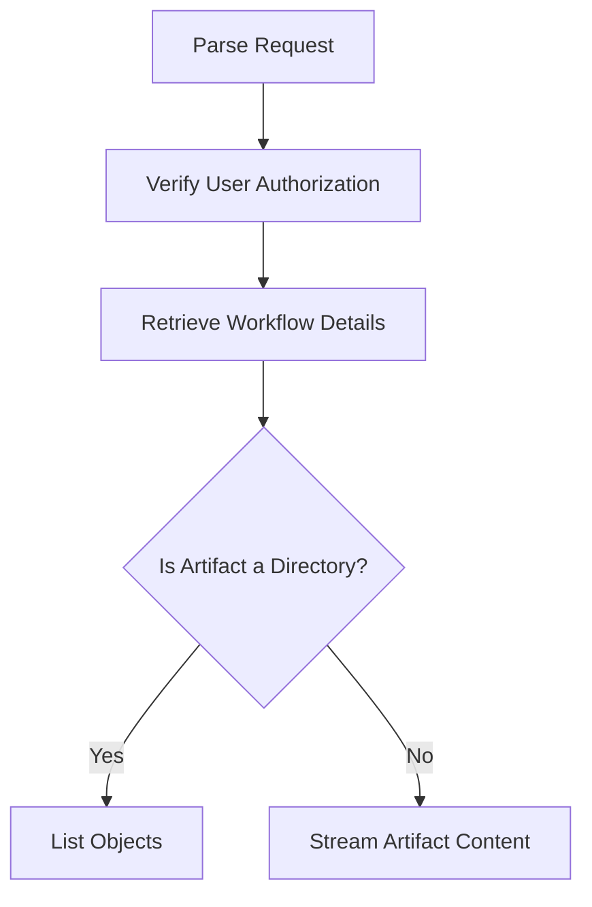

This document will cover the process of retrieving artifact files, which includes:

1. Parsing the request
2. Verifying user authorization
3. Retrieving workflow details
4. Listing objects in a directory
5. Streaming the artifact content.

Technical document: <SwmLink doc-title="Retrieving Artifact Files Flow">[Retrieving Artifact Files Flow](/.swm/retrieving-artifact-files-flow.sk2kkibv.sw.md)</SwmLink>

# [Parsing the Request](http://localhost:5001/repos/Z2l0aHViJTNBJTNBaW50dWl0LWFyZ28td29ya2Zsb3dzLWRlbW8lM0ElM0FTd2ltbS1EZW1v/docs/sk2kkibv#handling-artifact-retrieval)

The process begins with parsing the request URL to extract necessary parameters such as namespace, workflow ID, node ID, and artifact name. This step ensures that the system understands what specific artifact the user is requesting. The parameters help in identifying the exact location and details of the artifact within the system.

# [Verifying User Authorization](http://localhost:5001/repos/Z2l0aHViJTNBJTNBaW50dWl0LWFyZ28td29ya2Zsb3dzLWRlbW8lM0ElM0FTd2ltbS1EZW1v/docs/sk2kkibv#verifying-user-authorization)

Next, the system verifies if the user is authorized to access the requested artifact. This involves extracting the authorization token from the request header or cookie and creating a new context with this token. The system then checks if the user has the necessary permissions to access the artifact. This step is crucial for ensuring that only authorized users can access sensitive or restricted data.

# [Retrieving Workflow Details](http://localhost:5001/repos/Z2l0aHViJTNBJTNBaW50dWl0LWFyZ28td29ya2Zsb3dzLWRlbW8lM0ElM0FTd2ltbS1EZW1v/docs/sk2kkibv#retrieving-workflow-details)

Depending on whether the artifact is part of an archived workflow or a current workflow, the system retrieves the workflow details. It fetches the workflow from the workflow client and validates it. If the workflow status nodes are not excluded, it hydrates the workflow to include additional details. This step ensures that the workflow details are accurate and up-to-date before any further processing.

# [Listing Objects in a Directory](http://localhost:5001/repos/Z2l0aHViJTNBJTNBaW50dWl0LWFyZ28td29ya2Zsb3dzLWRlbW8lM0ElM0FTd2ltbS1EZW1v/docs/sk2kkibv#listing-objects-in-a-directory)

If the artifact is a directory, the system lists the objects within it. This involves using a backoff strategy to handle transient errors and retrying the operation if necessary. This step is important for handling directories within artifacts, allowing users to navigate and access individual files.

# [Streaming Artifact Content](http://localhost:5001/repos/Z2l0aHViJTNBJTNBaW50dWl0LWFyZ28td29ya2Zsb3dzLWRlbW8lM0ElM0FTd2ltbS1EZW1v/docs/sk2kkibv#streaming-artifact-content)

Finally, the system streams the content of the artifact file to the client. It opens a stream to the artifact using the artifact driver and sets appropriate headers for the response. This step ensures that the file content is delivered efficiently and securely to the client.

&nbsp;

*This is an auto-generated document by Swimm 🌊 and has not yet been verified by a human*

<SwmMeta version="3.0.0" repo-id="Z2l0aHViJTNBJTNBaW50dWl0LWFyZ28td29ya2Zsb3dzLWRlbW8lM0ElM0FTd2ltbS1EZW1v" repo-name="intuit-argo-workflows-demo">Powered by [Swimm](/)</SwmMeta>
