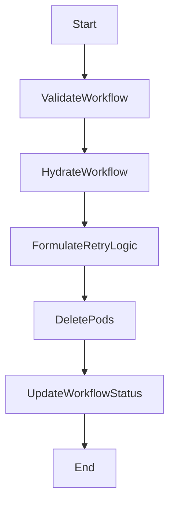

Retrying a workflow involves several key steps to ensure that a failed workflow can be retried successfully. This document will cover:

1. Validating the workflow
2. Hydrating the workflow
3. Formulating the retry logic
4. Deleting associated pods
5. Updating the workflow status

Technical document: <SwmLink doc-title="Retrying a Workflow">[Retrying a Workflow](/.swm/retrying-a-workflow.ij7i4fc0.sw.md)</SwmLink>

# [Validating the workflow](http://localhost:5001/repos/Z2l0aHViJTNBJTNBaW50dWl0LWFyZ28td29ya2Zsb3dzLWRlbW8lM0ElM0FTd2ltbS1EZW1v/docs/ij7i4fc0#retryworkflow)

The first step in retrying a workflow is to validate it. This ensures that the workflow is in a proper state to be retried. Validation checks if the workflow has failed or encountered an error, making it eligible for a retry. If the workflow is not in a failed state, it cannot be retried.

# [Hydrating the workflow](http://localhost:5001/repos/Z2l0aHViJTNBJTNBaW50dWl0LWFyZ28td29ya2Zsb3dzLWRlbW8lM0ElM0FTd2ltbS1EZW1v/docs/ij7i4fc0#hydrate)

Hydrating the workflow involves loading any offloaded node status information back into the workflow. This step is crucial for large workflows where node status information might have been offloaded to reduce the size of the workflow object. Hydration ensures that all necessary information is available for the retry process.

# [Formulating the retry logic](http://localhost:5001/repos/Z2l0aHViJTNBJTNBaW50dWl0LWFyZ28td29ya2Zsb3dzLWRlbW8lM0ElM0FTd2ltbS1EZW1v/docs/ij7i4fc0#formulateretryworkflow)

Formulating the retry logic involves resetting certain fields and deleting failed steps from the workflow. This step prepares the workflow to be retried by clearing out any previous errors and setting it back to a running state. It also involves handling the deletion of any pods associated with the failed steps to ensure a clean retry.

# [Deleting associated pods](http://localhost:5001/repos/Z2l0aHViJTNBJTNBaW50dWl0LWFyZ28td29ya2Zsb3dzLWRlbW8lM0ElM0FTd2ltbS1EZW1v/docs/ij7i4fc0#formulateretryworkflow)

Deleting associated pods is an important step to ensure that any resources used by the failed workflow are cleaned up. This prevents resource leaks and ensures that the retry process starts with a clean slate. The pods associated with the failed steps are identified and deleted as part of this process.

# [Updating the workflow status](http://localhost:5001/repos/Z2l0aHViJTNBJTNBaW50dWl0LWFyZ28td29ya2Zsb3dzLWRlbW8lM0ElM0FTd2ltbS1EZW1v/docs/ij7i4fc0#retryworkflow)

The final step in retrying a workflow is to update its status. This involves marking the workflow as running again and resetting any status fields that indicate the workflow has completed. Updating the status ensures that the workflow controller recognizes the workflow as active and ready to be retried.

&nbsp;

*This is an auto-generated document by Swimm 🌊 and has not yet been verified by a human*

<SwmMeta version="3.0.0" repo-id="Z2l0aHViJTNBJTNBaW50dWl0LWFyZ28td29ya2Zsb3dzLWRlbW8lM0ElM0FTd2ltbS1EZW1v" repo-name="intuit-argo-workflows-demo">Powered by [Swimm](/)</SwmMeta>
