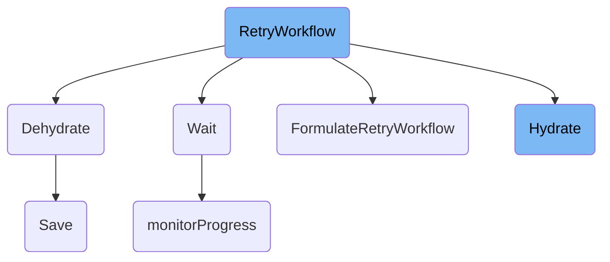

In this document, we will explain the process of retrying a workflow. The process involves validating and hydrating the workflow, formulating the retry logic, and handling the deletion of associated pods.

The flow starts with validating the workflow to ensure it is in a proper state. Next, the workflow is hydrated to load any offloaded node status information. The retry logic is then formulated, which involves resetting certain fields and deleting failed steps. Finally, the associated pods are deleted, and the workflow status is updated.

# Flow drill down



<SwmSnippet path="/server/workflow/workflow_server.go" line="430">

---

## <SwmToken path="server/workflow/workflow_server.go" pos="430:9:9" line-data="func (s *workflowServer) RetryWorkflow(ctx context.Context, req *workflowpkg.WorkflowRetryRequest) (*wfv1.Workflow, error) {">`RetryWorkflow`</SwmToken>

The <SwmToken path="server/workflow/workflow_server.go" pos="430:9:9" line-data="func (s *workflowServer) RetryWorkflow(ctx context.Context, req *workflowpkg.WorkflowRetryRequest) (*wfv1.Workflow, error) {">`RetryWorkflow`</SwmToken> function is responsible for managing the retry logic for workflows. It starts by validating the workflow and hydrating it to ensure it is in a proper state. It then formulates the retry logic, which involves resetting certain fields and deleting failed steps. Finally, it handles the deletion of pods associated with the workflow and updates the workflow status.

```go
func (s *workflowServer) RetryWorkflow(ctx context.Context, req *workflowpkg.WorkflowRetryRequest) (*wfv1.Workflow, error) {
	wfClient := auth.GetWfClient(ctx)
	kubeClient := auth.GetKubeClient(ctx)

	wf, err := s.getWorkflow(ctx, wfClient, req.Namespace, req.Name, metav1.GetOptions{})
	if err != nil {
		return nil, sutils.ToStatusError(err, codes.Internal)
	}

	err = s.validateWorkflow(wf)
	if err != nil {
		return nil, sutils.ToStatusError(err, codes.InvalidArgument)
	}

	err = s.hydrator.Hydrate(wf)
	if err != nil {
		return nil, sutils.ToStatusError(err, codes.Internal)
	}

	wf, podsToDelete, err := util.FormulateRetryWorkflow(ctx, wf, req.RestartSuccessful, req.NodeFieldSelector, req.Parameters)
	if err != nil {
```

---

</SwmSnippet>

<SwmSnippet path="/workflow/hydrator/hydrator.go" line="93">

---

## Dehydrate

The <SwmToken path="workflow/hydrator/hydrator.go" pos="93:8:8" line-data="func (h hydrator) Dehydrate(wf *wfv1.Workflow) error {">`Dehydrate`</SwmToken> function is used to reduce the size of the workflow object by offloading node status information. This is particularly useful for large workflows to ensure they do not exceed size limits.

```go
func (h hydrator) Dehydrate(wf *wfv1.Workflow) error {
	if !h.IsHydrated(wf) {
		return nil
	}
	var err error
	log.WithField("Workflow Size", wf.Size()).Info("Workflow to be dehydrated")
	if !alwaysOffloadNodeStatus {
		err = packer.CompressWorkflowIfNeeded(wf)
		if err == nil {
			wf.Status.OffloadNodeStatusVersion = ""
			return nil
		}
	}
	if packer.IsTooLargeError(err) || alwaysOffloadNodeStatus {
		var offloadVersion string
		var errMsg string
		if err != nil {
			errMsg += err.Error()
		}
		offloadErr := waitutil.Backoff(writeRetry, func() (bool, error) {
			var offloadErr error
```

---

</SwmSnippet>

<SwmSnippet path="/workflow/executor/executor.go" line="1113">

---

## Wait

The <SwmToken path="workflow/executor/executor.go" pos="1113:2:2" line-data="// Wait is the sidecar container logic which waits for the main container to complete.">`Wait`</SwmToken> function is responsible for waiting for the main container to complete. It also monitors for updates in the pod annotations and handles the termination of sidecars upon completion.

```go
// Wait is the sidecar container logic which waits for the main container to complete.
// Also monitors for updates in the pod annotations which may change (e.g. terminate)
// Upon completion, kills any sidecars after it finishes.
func (we *WorkflowExecutor) Wait(ctx context.Context) error {
	containerNames := we.Template.GetMainContainerNames()
	// only monitor progress if both tick durations are >0
	if we.annotationPatchTickDuration != 0 && we.readProgressFileTickDuration != 0 {
		go we.monitorProgress(ctx, os.Getenv(common.EnvVarProgressFile))
	} else {
		log.WithField("annotationPatchTickDuration", we.annotationPatchTickDuration).WithField("readProgressFileTickDuration", we.readProgressFileTickDuration).Info("monitoring progress disabled")
	}

	go we.monitorDeadline(ctx, containerNames)

	err := retryutil.OnError(executorretry.ExecutorRetry, errorsutil.IsTransientErr, func() error {
		return we.RuntimeExecutor.Wait(ctx, containerNames)
	})

	log.WithError(err).Info("Main container completed")

	if err != nil && err != context.Canceled {
```

---

</SwmSnippet>

<SwmSnippet path="/workflow/util/util.go" line="844">

---

## <SwmToken path="workflow/util/util.go" pos="844:2:2" line-data="// FormulateRetryWorkflow formulates a previous workflow to be retried, deleting all failed steps as well as the onExit node (and children)">`FormulateRetryWorkflow`</SwmToken>

The <SwmToken path="workflow/util/util.go" pos="844:2:2" line-data="// FormulateRetryWorkflow formulates a previous workflow to be retried, deleting all failed steps as well as the onExit node (and children)">`FormulateRetryWorkflow`</SwmToken> function formulates a previous workflow to be retried. It deletes all failed steps and resets fields that indicate the workflow has completed. It also handles the deletion of pods associated with failed steps.

```go
// FormulateRetryWorkflow formulates a previous workflow to be retried, deleting all failed steps as well as the onExit node (and children)
func FormulateRetryWorkflow(ctx context.Context, wf *wfv1.Workflow, restartSuccessful bool, nodeFieldSelector string, parameters []string) (*wfv1.Workflow, []string, error) {
	switch wf.Status.Phase {
	case wfv1.WorkflowFailed, wfv1.WorkflowError:
	case wfv1.WorkflowSucceeded:
		if !(restartSuccessful && len(nodeFieldSelector) > 0) {
			return nil, nil, errors.Errorf(errors.CodeBadRequest, "To retry a succeeded workflow, set the options restartSuccessful and nodeFieldSelector")
		}
	default:
		return nil, nil, errors.Errorf(errors.CodeBadRequest, "Cannot retry a workflow in phase %s", wf.Status.Phase)
	}

	newWF := wf.DeepCopy()

	// Delete/reset fields which indicate workflow completed
	delete(newWF.Labels, common.LabelKeyCompleted)
	delete(newWF.Labels, common.LabelKeyWorkflowArchivingStatus)
	newWF.Status.Conditions.UpsertCondition(wfv1.Condition{Status: metav1.ConditionFalse, Type: wfv1.ConditionTypeCompleted})
	newWF.ObjectMeta.Labels[common.LabelKeyPhase] = string(wfv1.NodeRunning)
	newWF.Status.Phase = wfv1.WorkflowRunning
	newWF.Status.Nodes = make(wfv1.Nodes)
```

---

</SwmSnippet>

<SwmSnippet path="/workflow/hydrator/hydrator.go" line="72">

---

## Hydrate

The <SwmToken path="workflow/hydrator/hydrator.go" pos="72:8:8" line-data="func (h hydrator) Hydrate(wf *wfv1.Workflow) error {">`Hydrate`</SwmToken> function is responsible for decompressing the workflow and loading offloaded node status information. This ensures that the workflow is in a proper state for further processing.

```go
func (h hydrator) Hydrate(wf *wfv1.Workflow) error {
	err := packer.DecompressWorkflow(wf)
	if err != nil {
		return err
	}
	if wf.Status.IsOffloadNodeStatus() {
		var offloadedNodes wfv1.Nodes
		err := waitutil.Backoff(readRetry, func() (bool, error) {
			offloadedNodes, err = h.offloadNodeStatusRepo.Get(string(wf.UID), wf.GetOffloadNodeStatusVersion())
			return !errorsutil.IsTransientErr(err), err
		})
		if err != nil {
			return err
		}
		h.HydrateWithNodes(wf, offloadedNodes)
		log.WithField("Workflow Size", wf.Size()).Info("Workflow hydrated")
	}

	return nil
}
```

---

</SwmSnippet>

<SwmSnippet path="/workflow/executor/executor.go" line="1139">

---

## <SwmToken path="workflow/executor/executor.go" pos="1139:2:2" line-data="// monitorProgress monitors for self-reported progress in the progressFile and patches the pod annotations with the parsed progress.">`monitorProgress`</SwmToken>

The <SwmToken path="workflow/executor/executor.go" pos="1139:2:2" line-data="// monitorProgress monitors for self-reported progress in the progressFile and patches the pod annotations with the parsed progress.">`monitorProgress`</SwmToken> function monitors <SwmToken path="workflow/executor/executor.go" pos="1139:8:10" line-data="// monitorProgress monitors for self-reported progress in the progressFile and patches the pod annotations with the parsed progress.">`self-reported`</SwmToken> progress in a specified file and updates the pod annotations with the parsed progress. This helps in tracking the progress of the workflow execution.

```go
// monitorProgress monitors for self-reported progress in the progressFile and patches the pod annotations with the parsed progress.
//
// The function reads the last line of the `progressFile` every `readFileTickDuration`.
// If the line matches `N/M`, will set the progress annotation to the parsed progress value.
// Every `annotationPatchTickDuration` the pod is patched with the updated annotations. This way the controller
// gets notified of new self reported progress.
func (we *WorkflowExecutor) monitorProgress(ctx context.Context, progressFile string) {
	annotationPatchTicker := time.NewTicker(we.annotationPatchTickDuration)
	defer annotationPatchTicker.Stop()
	fileTicker := time.NewTicker(we.readProgressFileTickDuration)
	defer fileTicker.Stop()

	lastLine := ""
	progressFile = filepath.Clean(progressFile)

	for {
		select {
		case <-ctx.Done():
			log.WithError(ctx.Err()).Info("stopping progress monitor (context done)")
			return
		case <-annotationPatchTicker.C:
```

---

</SwmSnippet>

<SwmSnippet path="/workflow/artifacts/gcs/gcs.go" line="215">

---

## Save

The <SwmToken path="workflow/artifacts/gcs/gcs.go" pos="215:2:2" line-data="// Save an artifact to GCS compliant storage, e.g., uploading a local file to GCS bucket">`Save`</SwmToken> function is responsible for saving an artifact to GCS-compliant storage. It handles the uploading of a local file to a GCS bucket, ensuring that the artifact is stored correctly.

```go
// Save an artifact to GCS compliant storage, e.g., uploading a local file to GCS bucket
func (g *ArtifactDriver) Save(path string, outputArtifact *wfv1.Artifact) error {
	err := waitutil.Backoff(defaultRetry,
		func() (bool, error) {
			key := filepath.Clean(outputArtifact.GCS.Key)
			log.Infof("GCS Save path: %s, key: %s", path, key)
			client, err := g.newGCSClient()
			if err != nil {
				return !isTransientGCSErr(err), err
			}
			defer client.Close()
			err = uploadObjects(client, outputArtifact.GCS.Bucket, key, path)
			if err != nil {
				return !isTransientGCSErr(err), err
			}
			return true, nil
		})
	return err
}
```

---

</SwmSnippet>

&nbsp;

*This is an auto-generated document by Swimm 🌊 and has not yet been verified by a human*

<SwmMeta version="3.0.0" repo-id="Z2l0aHViJTNBJTNBaW50dWl0LWFyZ28td29ya2Zsb3dzLWRlbW8lM0ElM0FTd2ltbS1EZW1v" repo-name="intuit-argo-workflows-demo"><sup>Powered by [Swimm](/)</sup></SwmMeta>
