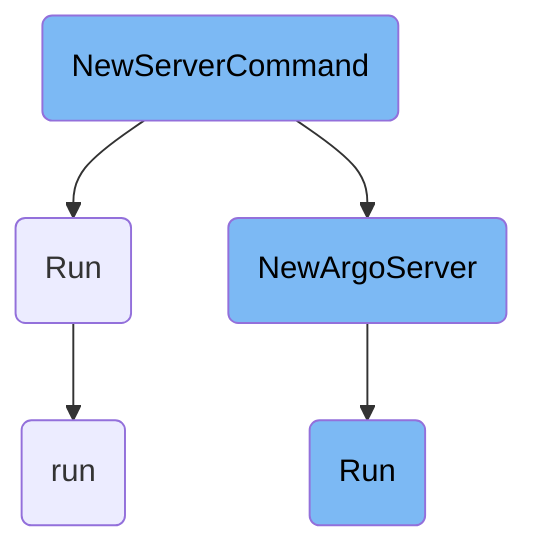

In this document, we will explain the process of setting up and running the Argo Server. The process involves initializing the server with various configurations and then starting it to handle incoming requests.

The flow starts with initializing the Argo Server by setting up configurations like authentication modes, TLS settings, and namespace management. Once the server is configured, it is started to handle incoming requests. The server listens for both <SwmToken path="server/apiserver/argoserver.go" pos="265:15:15" line-data="	// Cmux is used to support servicing gRPC and HTTP1.1+JSON on the same port">`gRPC`</SwmToken> and HTTP connections and manages services like event recording and artifact management.

# Flow drill down



<SwmSnippet path="/cmd/argo/commands/server.go" line="38">

---

## Initializing the Argo Server

The <SwmToken path="cmd/argo/commands/server.go" pos="38:2:2" line-data="func NewServerCommand() *cobra.Command {">`NewServerCommand`</SwmToken> function is responsible for setting up the Argo Server. It initializes various configurations such as authentication modes, TLS settings, and namespace management. It also sets up the command-line interface for starting the server.

```go
func NewServerCommand() *cobra.Command {
	var (
		authModes                []string
		configMap                string
		port                     int
		baseHRef                 string
		secure                   bool
		tlsCertificateSecretName string
		hsts                     bool
		namespaced               bool   // --namespaced
		managedNamespace         string // --managed-namespace
		enableOpenBrowser        bool
		eventOperationQueueSize  int
		eventWorkerCount         int
		eventAsyncDispatch       bool
		frameOptions             string
		accessControlAllowOrigin string
		apiRateLimit             uint64
		kubeAPIQPS               float32
		kubeAPIBurst             int
		allowedLinkProtocol      []string
```

---

</SwmSnippet>

<SwmSnippet path="/server/apiserver/argoserver.go" line="197">

---

## Running the Argo Server

The <SwmToken path="server/apiserver/argoserver.go" pos="197:9:9" line-data="func (as *argoServer) Run(ctx context.Context, port int, browserOpenFunc func(string)) {">`Run`</SwmToken> method in <SwmPath>[server/apiserver/argoserver.go](server/apiserver/argoserver.go)</SwmPath> is responsible for starting the Argo Server. It configures the server, sets up necessary services like event recording and artifact management, and starts listening for incoming requests. It also handles both <SwmToken path="server/apiserver/argoserver.go" pos="265:15:15" line-data="	// Cmux is used to support servicing gRPC and HTTP1.1+JSON on the same port">`gRPC`</SwmToken> and HTTP connections.

```go
func (as *argoServer) Run(ctx context.Context, port int, browserOpenFunc func(string)) {
	config, err := as.configController.Get(ctx)
	if err != nil {
		log.Fatal(err)
	}
	err = config.Sanitize(as.allowedLinkProtocol)
	if err != nil {
		log.Fatal(err)
	}
	log.WithFields(log.Fields{"version": argo.GetVersion().Version, "instanceID": config.InstanceID}).Info("Starting Argo Server")
	instanceIDService := instanceid.NewService(config.InstanceID)
	offloadRepo := sqldb.ExplosiveOffloadNodeStatusRepo
	wfArchive := sqldb.NullWorkflowArchive
	persistence := config.Persistence
	if persistence != nil {
		session, err := sqldb.CreateDBSession(as.clients.Kubernetes, as.namespace, persistence)
		if err != nil {
			log.Fatal(err)
		}
		tableName, err := sqldb.GetTableName(persistence)
		if err != nil {
```

---

</SwmSnippet>

<SwmSnippet path="/workflow/cron/operator.go" line="85">

---

### Handling Cron Workflow Execution

The <SwmToken path="workflow/cron/operator.go" pos="85:9:9" line-data="func (woc *cronWfOperationCtx) run(ctx context.Context, scheduledRuntime time.Time) {">`run`</SwmToken> method in <SwmPath>[workflow/cron/operator.go](workflow/cron/operator.go)</SwmPath> handles the execution of cron workflows. It validates the workflow, checks stopping conditions, enforces runtime policies, and submits the workflow for execution. This ensures that scheduled workflows are executed correctly and any errors are reported.

```go
func (woc *cronWfOperationCtx) run(ctx context.Context, scheduledRuntime time.Time) {
	defer woc.persistUpdate(ctx)

	woc.log.Infof("Running %s", woc.name)

	// If the cron workflow has a schedule that was just updated, update its annotation
	if woc.cronWf.IsUsingNewSchedule() {
		woc.cronWf.SetSchedule(woc.cronWf.Spec.GetScheduleWithTimezoneString())
	}

	err := woc.validateCronWorkflow(ctx)
	if err != nil {
		return
	}

	completed, err := woc.checkStopingCondition()
	if err != nil {
		woc.reportCronWorkflowError(ctx, v1alpha1.ConditionTypeSpecError, fmt.Sprintf("failed to check CronWorkflow '%s' stopping condition: %s", woc.cronWf.Name, err))
		return
	} else if completed {
		woc.setAsCompleted()
```

---

</SwmSnippet>

&nbsp;

*This is an auto-generated document by Swimm 🌊 and has not yet been verified by a human*

<SwmMeta version="3.0.0" repo-id="Z2l0aHViJTNBJTNBaW50dWl0LWFyZ28td29ya2Zsb3dzLWRlbW8lM0ElM0FTd2ltbS1EZW1v" repo-name="intuit-argo-workflows-demo"><sup>Powered by [Swimm](/)</sup></SwmMeta>
