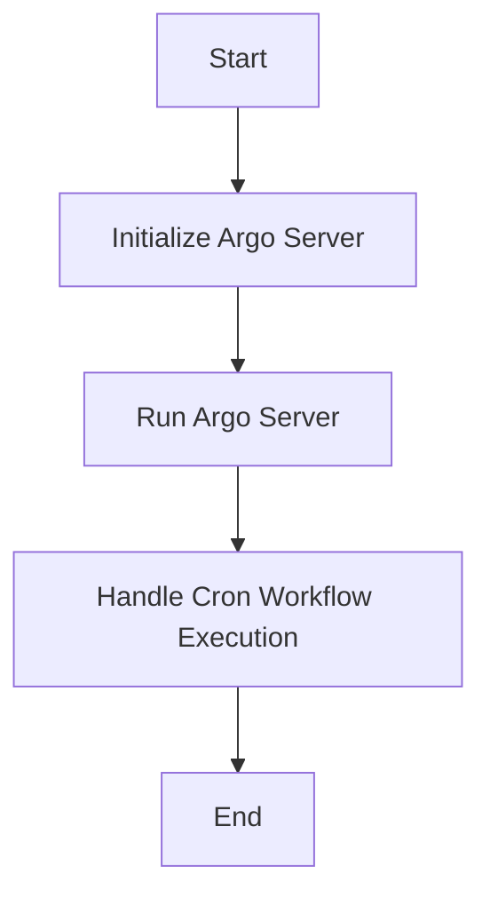

This document will cover the process of setting up and running the Argo Server, which includes:

1. Initializing the Argo Server
2. Running the Argo Server
3. Handling Cron Workflow Execution

Technical document: <SwmLink doc-title="Setting Up and Running the Argo Server">[Setting Up and Running the Argo Server](/.swm/setting-up-and-running-the-argo-server.2skz0ne7.sw.md)</SwmLink>

# [Initializing the Argo Server](http://localhost:5001/repos/Z2l0aHViJTNBJTNBaW50dWl0LWFyZ28td29ya2Zsb3dzLWRlbW8lM0ElM0FTd2ltbS1EZW1v/docs/2skz0ne7#initializing-the-argo-server)

The initialization of the Argo Server involves setting up various configurations that are essential for its operation. These configurations include:

1. **Authentication Modes**: This determines how users will authenticate with the server. Different modes can be set to ensure secure access.
2. **TLS Settings**: These settings ensure that the communication between the server and clients is encrypted, providing a secure channel.
3. **Namespace Management**: This involves setting up the namespaces within which the server will operate. Namespaces help in organizing and managing resources efficiently.

Once these configurations are set, the server is ready to be started. This step is crucial as it lays the foundation for the server's operation, ensuring that it is secure and well-organized.

# [Running the Argo Server](http://localhost:5001/repos/Z2l0aHViJTNBJTNBaW50dWl0LWFyZ28td29ya2Zsb3dzLWRlbW8lM0ElM0FTd2ltbS1EZW1v/docs/2skz0ne7#running-the-argo-server)

Running the Argo Server involves starting it with the configurations set during initialization. The server performs several tasks to ensure it is ready to handle incoming requests:

1. **Configuring the Server**: The server reads the configurations and sets up necessary services like event recording and artifact management.
2. **Starting Services**: Services such as event recording and artifact management are started. These services are essential for the server's operation as they handle various tasks like recording events and managing artifacts.
3. **Listening for Connections**: The server starts listening for both gRPC and HTTP connections. This allows clients to connect to the server and interact with it.

This step is important as it ensures that the server is fully operational and ready to handle requests from clients.

# [Handling Cron Workflow Execution](http://localhost:5001/repos/Z2l0aHViJTNBJTNBaW50dWl0LWFyZ28td29ya2Zsb3dzLWRlbW8lM0ElM0FTd2ltbS1EZW1v/docs/2skz0ne7#handling-cron-workflow-execution)

Handling Cron Workflow Execution involves managing the execution of scheduled workflows. The server performs several tasks to ensure that these workflows are executed correctly:

1. **Validating the Workflow**: The server validates the workflow to ensure it is correctly configured and ready for execution.
2. **Checking Stopping Conditions**: The server checks if there are any conditions that should stop the workflow from executing. This ensures that workflows are only executed when appropriate.
3. **Enforcing Runtime Policies**: The server enforces any runtime policies that are in place. These policies ensure that workflows are executed within the defined constraints.
4. **Submitting the Workflow for Execution**: Once all checks are done, the workflow is submitted for execution. The server monitors the execution and reports any errors.

This step is crucial as it ensures that scheduled workflows are executed correctly and any issues are reported promptly.

&nbsp;

*This is an auto-generated document by Swimm 🌊 and has not yet been verified by a human*

<SwmMeta version="3.0.0" repo-id="Z2l0aHViJTNBJTNBaW50dWl0LWFyZ28td29ya2Zsb3dzLWRlbW8lM0ElM0FTd2ltbS1EZW1v" repo-name="intuit-argo-workflows-demo">Powered by [Swimm](/)</SwmMeta>
