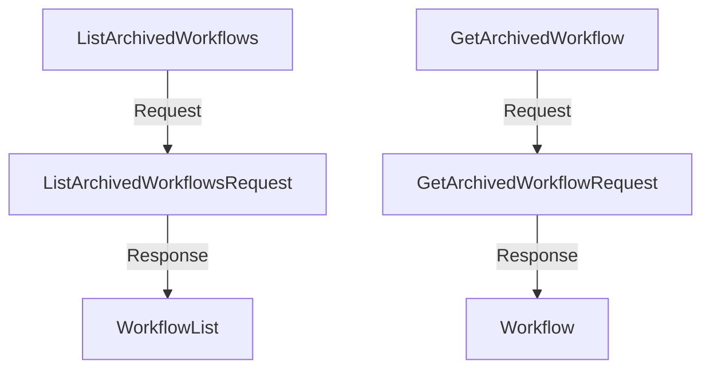

# Overview

The <SwmToken path="pkg/apiclient/workflowarchive/workflow-archive.pb.gw.go" pos="9:2:2" line-data="package workflowarchive">`workflowarchive`</SwmToken> package within the <SwmToken path="pkg/apiclient/workflowarchive/workflow-archive.pb.gw.go" pos="2:7:7" line-data="// source: pkg/apiclient/workflowarchive/workflow-archive.proto">`apiclient`</SwmToken> directory is responsible for managing archived workflows. It defines various request and response messages for operations such as listing, retrieving, deleting, retrying, and resubmitting archived workflows. The package also includes a <SwmToken path="pkg/apiclient/workflowarchive/workflow-archive.pb.gw.go" pos="7:4:4" line-data="It translates gRPC into RESTful JSON APIs.">`gRPC`</SwmToken> service definition, <SwmToken path="pkg/apiclient/workflowarchive/workflow-archive.proto" pos="50:2:2" line-data="service ArchivedWorkflowService {">`ArchivedWorkflowService`</SwmToken>, which provides methods to perform these operations.

# <SwmToken path="pkg/apiclient/workflowarchive/workflow-archive.pb.gw.go" pos="7:4:4" line-data="It translates gRPC into RESTful JSON APIs.">`gRPC`</SwmToken> to <SwmToken path="pkg/apiclient/workflowarchive/workflow-archive.pb.gw.go" pos="7:8:8" line-data="It translates gRPC into RESTful JSON APIs.">`RESTful`</SwmToken> JSON <SwmToken path="pkg/apiclient/workflowarchive/workflow-archive.pb.gw.go" pos="7:12:12" line-data="It translates gRPC into RESTful JSON APIs.">`APIs`</SwmToken>

The package translates <SwmToken path="pkg/apiclient/workflowarchive/workflow-archive.pb.gw.go" pos="7:4:4" line-data="It translates gRPC into RESTful JSON APIs.">`gRPC`</SwmToken> methods into <SwmToken path="pkg/apiclient/workflowarchive/workflow-archive.pb.gw.go" pos="7:8:8" line-data="It translates gRPC into RESTful JSON APIs.">`RESTful`</SwmToken> JSON <SwmToken path="pkg/apiclient/workflowarchive/workflow-archive.pb.gw.go" pos="7:12:12" line-data="It translates gRPC into RESTful JSON APIs.">`APIs`</SwmToken>, allowing for HTTP-based interactions with archived workflows. This ensures compatibility with the proto package and includes methods for marshaling and unmarshaling the defined messages.

<SwmSnippet path="/pkg/apiclient/workflowarchive/workflow-archive.pb.gw.go" line="7">

---

The package translates <SwmToken path="pkg/apiclient/workflowarchive/workflow-archive.pb.gw.go" pos="7:4:4" line-data="It translates gRPC into RESTful JSON APIs.">`gRPC`</SwmToken> methods into <SwmToken path="pkg/apiclient/workflowarchive/workflow-archive.pb.gw.go" pos="7:8:8" line-data="It translates gRPC into RESTful JSON APIs.">`RESTful`</SwmToken> JSON <SwmToken path="pkg/apiclient/workflowarchive/workflow-archive.pb.gw.go" pos="7:12:12" line-data="It translates gRPC into RESTful JSON APIs.">`APIs`</SwmToken>, allowing for HTTP-based interactions with archived workflows.

```go
It translates gRPC into RESTful JSON APIs.
*/
package workflowarchive
```

---

</SwmSnippet>

# Request and Response Messages

The package defines the <SwmToken path="pkg/apiclient/workflowarchive/workflow-archive.proto" pos="10:2:2" line-data="message ListArchivedWorkflowsRequest {">`ListArchivedWorkflowsRequest`</SwmToken> message, which includes fields like <SwmToken path="pkg/apiclient/workflowarchive/workflow-archive.proto" pos="11:17:17" line-data="  k8s.io.apimachinery.pkg.apis.meta.v1.ListOptions listOptions = 1;">`listOptions`</SwmToken>, <SwmToken path="pkg/apiclient/workflowarchive/workflow-archive.proto" pos="12:3:3" line-data="  string namePrefix = 2;">`namePrefix`</SwmToken>, and <SwmToken path="pkg/apiclient/workflowarchive/workflow-archive.proto" pos="13:3:3" line-data="  string namespace = 3;">`namespace`</SwmToken> for listing archived workflows.

<SwmSnippet path="/pkg/apiclient/workflowarchive/workflow-archive.proto" line="10">

---

Defines the <SwmToken path="pkg/apiclient/workflowarchive/workflow-archive.proto" pos="10:2:2" line-data="message ListArchivedWorkflowsRequest {">`ListArchivedWorkflowsRequest`</SwmToken> message, which includes fields like <SwmToken path="pkg/apiclient/workflowarchive/workflow-archive.proto" pos="11:17:17" line-data="  k8s.io.apimachinery.pkg.apis.meta.v1.ListOptions listOptions = 1;">`listOptions`</SwmToken>, <SwmToken path="pkg/apiclient/workflowarchive/workflow-archive.proto" pos="12:3:3" line-data="  string namePrefix = 2;">`namePrefix`</SwmToken>, and <SwmToken path="pkg/apiclient/workflowarchive/workflow-archive.proto" pos="13:3:3" line-data="  string namespace = 3;">`namespace`</SwmToken> for listing archived workflows.

```protocol buffer
message ListArchivedWorkflowsRequest {
  k8s.io.apimachinery.pkg.apis.meta.v1.ListOptions listOptions = 1;
  string namePrefix = 2;
  string namespace = 3;
```

---

</SwmSnippet>

# <SwmToken path="pkg/apiclient/workflowarchive/workflow-archive.proto" pos="50:2:2" line-data="service ArchivedWorkflowService {">`ArchivedWorkflowService`</SwmToken>

The <SwmToken path="pkg/apiclient/workflowarchive/workflow-archive.proto" pos="50:2:2" line-data="service ArchivedWorkflowService {">`ArchivedWorkflowService`</SwmToken> provides methods such as <SwmToken path="pkg/apiclient/workflowarchive/workflow-archive.proto" pos="51:3:3" line-data="  rpc ListArchivedWorkflows(ListArchivedWorkflowsRequest) returns (github.com.argoproj.argo_workflows.v3.pkg.apis.workflow.v1alpha1.WorkflowList) {">`ListArchivedWorkflows`</SwmToken>, which returns a list of archived workflows.

<SwmSnippet path="/pkg/apiclient/workflowarchive/workflow-archive.proto" line="50">

---

The <SwmToken path="pkg/apiclient/workflowarchive/workflow-archive.proto" pos="50:2:2" line-data="service ArchivedWorkflowService {">`ArchivedWorkflowService`</SwmToken> provides methods such as <SwmToken path="pkg/apiclient/workflowarchive/workflow-archive.proto" pos="51:3:3" line-data="  rpc ListArchivedWorkflows(ListArchivedWorkflowsRequest) returns (github.com.argoproj.argo_workflows.v3.pkg.apis.workflow.v1alpha1.WorkflowList) {">`ListArchivedWorkflows`</SwmToken>, which returns a list of archived workflows.

```protocol buffer
service ArchivedWorkflowService {
  rpc ListArchivedWorkflows(ListArchivedWorkflowsRequest) returns (github.com.argoproj.argo_workflows.v3.pkg.apis.workflow.v1alpha1.WorkflowList) {
    option (google.api.http).get = "/api/v1/archived-workflows";
```

---

</SwmSnippet>

# Main Functions

There are several main functions in this package, including <SwmToken path="pkg/apiclient/workflowarchive/workflow-archive.proto" pos="51:3:3" line-data="  rpc ListArchivedWorkflows(ListArchivedWorkflowsRequest) returns (github.com.argoproj.argo_workflows.v3.pkg.apis.workflow.v1alpha1.WorkflowList) {">`ListArchivedWorkflows`</SwmToken>, <SwmToken path="pkg/apiclient/workflowarchive/workflow-archive.proto" pos="54:3:3" line-data="  rpc GetArchivedWorkflow(GetArchivedWorkflowRequest) returns (github.com.argoproj.argo_workflows.v3.pkg.apis.workflow.v1alpha1.Workflow) {">`GetArchivedWorkflow`</SwmToken>, <SwmToken path="pkg/apiclient/workflowarchive/workflow-archive.pb.gw.go" pos="177:10:10" line-data="	msg, err := client.DeleteArchivedWorkflow(ctx, &amp;protoReq, grpc.Header(&amp;metadata.HeaderMD), grpc.Trailer(&amp;metadata.TrailerMD))">`DeleteArchivedWorkflow`</SwmToken>, <SwmToken path="pkg/apiclient/workflowarchive/workflow-archive.pb.gw.go" pos="318:10:10" line-data="	msg, err := client.RetryArchivedWorkflow(ctx, &amp;protoReq, grpc.Header(&amp;metadata.HeaderMD), grpc.Trailer(&amp;metadata.TrailerMD))">`RetryArchivedWorkflow`</SwmToken>, and <SwmToken path="pkg/apiclient/workflowarchive/workflow-archive.pb.gw.go" pos="388:10:10" line-data="	msg, err := client.ResubmitArchivedWorkflow(ctx, &amp;protoReq, grpc.Header(&amp;metadata.HeaderMD), grpc.Trailer(&amp;metadata.TrailerMD))">`ResubmitArchivedWorkflow`</SwmToken>. We will dive a little into <SwmToken path="pkg/apiclient/workflowarchive/workflow-archive.proto" pos="51:3:3" line-data="  rpc ListArchivedWorkflows(ListArchivedWorkflowsRequest) returns (github.com.argoproj.argo_workflows.v3.pkg.apis.workflow.v1alpha1.WorkflowList) {">`ListArchivedWorkflows`</SwmToken> and <SwmToken path="pkg/apiclient/workflowarchive/workflow-archive.proto" pos="54:3:3" line-data="  rpc GetArchivedWorkflow(GetArchivedWorkflowRequest) returns (github.com.argoproj.argo_workflows.v3.pkg.apis.workflow.v1alpha1.Workflow) {">`GetArchivedWorkflow`</SwmToken>.

## <SwmToken path="pkg/apiclient/workflowarchive/workflow-archive.proto" pos="51:3:3" line-data="  rpc ListArchivedWorkflows(ListArchivedWorkflowsRequest) returns (github.com.argoproj.argo_workflows.v3.pkg.apis.workflow.v1alpha1.WorkflowList) {">`ListArchivedWorkflows`</SwmToken>

The <SwmToken path="pkg/apiclient/workflowarchive/workflow-archive.proto" pos="51:3:3" line-data="  rpc ListArchivedWorkflows(ListArchivedWorkflowsRequest) returns (github.com.argoproj.argo_workflows.v3.pkg.apis.workflow.v1alpha1.WorkflowList) {">`ListArchivedWorkflows`</SwmToken> function is used to list all archived workflows. It takes a context and a <SwmToken path="pkg/apiclient/workflowarchive/workflow-archive.proto" pos="10:2:2" line-data="message ListArchivedWorkflowsRequest {">`ListArchivedWorkflowsRequest`</SwmToken> as input and returns a <SwmToken path="pkg/apiclient/workflowarchive/workflow-archive.proto" pos="51:29:29" line-data="  rpc ListArchivedWorkflows(ListArchivedWorkflowsRequest) returns (github.com.argoproj.argo_workflows.v3.pkg.apis.workflow.v1alpha1.WorkflowList) {">`WorkflowList`</SwmToken>.

<SwmSnippet path="/pkg/apiclient/workflowarchive/workflow-archive.pb.go" line="620">

---

The <SwmToken path="pkg/apiclient/workflowarchive/workflow-archive.pb.go" pos="620:9:9" line-data="func (c *archivedWorkflowServiceClient) ListArchivedWorkflows(ctx context.Context, in *ListArchivedWorkflowsRequest, opts ...grpc.CallOption) (*v1alpha1.WorkflowList, error) {">`ListArchivedWorkflows`</SwmToken> function is used to list all archived workflows. It takes a context and a <SwmToken path="pkg/apiclient/workflowarchive/workflow-archive.pb.go" pos="620:21:21" line-data="func (c *archivedWorkflowServiceClient) ListArchivedWorkflows(ctx context.Context, in *ListArchivedWorkflowsRequest, opts ...grpc.CallOption) (*v1alpha1.WorkflowList, error) {">`ListArchivedWorkflowsRequest`</SwmToken> as input and returns a <SwmToken path="pkg/apiclient/workflowarchive/workflow-archive.pb.go" pos="620:36:36" line-data="func (c *archivedWorkflowServiceClient) ListArchivedWorkflows(ctx context.Context, in *ListArchivedWorkflowsRequest, opts ...grpc.CallOption) (*v1alpha1.WorkflowList, error) {">`WorkflowList`</SwmToken>.

```go
func (c *archivedWorkflowServiceClient) ListArchivedWorkflows(ctx context.Context, in *ListArchivedWorkflowsRequest, opts ...grpc.CallOption) (*v1alpha1.WorkflowList, error) {
	out := new(v1alpha1.WorkflowList)
	err := c.cc.Invoke(ctx, "/workflowarchive.ArchivedWorkflowService/ListArchivedWorkflows", in, out, opts...)
	if err != nil {
		return nil, err
	}
```

---

</SwmSnippet>

## <SwmToken path="pkg/apiclient/workflowarchive/workflow-archive.proto" pos="54:3:3" line-data="  rpc GetArchivedWorkflow(GetArchivedWorkflowRequest) returns (github.com.argoproj.argo_workflows.v3.pkg.apis.workflow.v1alpha1.Workflow) {">`GetArchivedWorkflow`</SwmToken>

The <SwmToken path="pkg/apiclient/workflowarchive/workflow-archive.proto" pos="54:3:3" line-data="  rpc GetArchivedWorkflow(GetArchivedWorkflowRequest) returns (github.com.argoproj.argo_workflows.v3.pkg.apis.workflow.v1alpha1.Workflow) {">`GetArchivedWorkflow`</SwmToken> function retrieves a specific archived workflow based on the provided <SwmToken path="pkg/apiclient/workflowarchive/workflow-archive.proto" pos="54:5:5" line-data="  rpc GetArchivedWorkflow(GetArchivedWorkflowRequest) returns (github.com.argoproj.argo_workflows.v3.pkg.apis.workflow.v1alpha1.Workflow) {">`GetArchivedWorkflowRequest`</SwmToken>. It returns a <SwmToken path="pkg/apiclient/workflowarchive/workflow-archive.proto" pos="54:29:29" line-data="  rpc GetArchivedWorkflow(GetArchivedWorkflowRequest) returns (github.com.argoproj.argo_workflows.v3.pkg.apis.workflow.v1alpha1.Workflow) {">`Workflow`</SwmToken>.

<SwmSnippet path="/pkg/apiclient/workflowarchive/workflow-archive.pb.go" line="629">

---

The <SwmToken path="pkg/apiclient/workflowarchive/workflow-archive.pb.go" pos="629:9:9" line-data="func (c *archivedWorkflowServiceClient) GetArchivedWorkflow(ctx context.Context, in *GetArchivedWorkflowRequest, opts ...grpc.CallOption) (*v1alpha1.Workflow, error) {">`GetArchivedWorkflow`</SwmToken> function retrieves a specific archived workflow based on the provided <SwmToken path="pkg/apiclient/workflowarchive/workflow-archive.pb.go" pos="629:21:21" line-data="func (c *archivedWorkflowServiceClient) GetArchivedWorkflow(ctx context.Context, in *GetArchivedWorkflowRequest, opts ...grpc.CallOption) (*v1alpha1.Workflow, error) {">`GetArchivedWorkflowRequest`</SwmToken>. It returns a <SwmToken path="pkg/apiclient/workflowarchive/workflow-archive.pb.go" pos="629:36:36" line-data="func (c *archivedWorkflowServiceClient) GetArchivedWorkflow(ctx context.Context, in *GetArchivedWorkflowRequest, opts ...grpc.CallOption) (*v1alpha1.Workflow, error) {">`Workflow`</SwmToken>.

```go
func (c *archivedWorkflowServiceClient) GetArchivedWorkflow(ctx context.Context, in *GetArchivedWorkflowRequest, opts ...grpc.CallOption) (*v1alpha1.Workflow, error) {
	out := new(v1alpha1.Workflow)
	err := c.cc.Invoke(ctx, "/workflowarchive.ArchivedWorkflowService/GetArchivedWorkflow", in, out, opts...)
	if err != nil {
		return nil, err
	}
```

---

</SwmSnippet>

# Workflowarchive Endpoints

The <SwmToken path="pkg/apiclient/workflowarchive/workflow-archive.pb.gw.go" pos="9:2:2" line-data="package workflowarchive">`workflowarchive`</SwmToken> package provides several endpoints for interacting with archived workflows.

## <SwmToken path="pkg/apiclient/workflowarchive/workflow-archive.proto" pos="51:3:3" line-data="  rpc ListArchivedWorkflows(ListArchivedWorkflowsRequest) returns (github.com.argoproj.argo_workflows.v3.pkg.apis.workflow.v1alpha1.WorkflowList) {">`ListArchivedWorkflows`</SwmToken>

The <SwmToken path="pkg/apiclient/workflowarchive/workflow-archive.proto" pos="51:3:3" line-data="  rpc ListArchivedWorkflows(ListArchivedWorkflowsRequest) returns (github.com.argoproj.argo_workflows.v3.pkg.apis.workflow.v1alpha1.WorkflowList) {">`ListArchivedWorkflows`</SwmToken> endpoint allows users to retrieve a list of archived workflows. It is defined as a <SwmToken path="pkg/apiclient/workflowarchive/workflow-archive.pb.gw.go" pos="7:4:4" line-data="It translates gRPC into RESTful JSON APIs.">`gRPC`</SwmToken> method and translated into a <SwmToken path="pkg/apiclient/workflowarchive/workflow-archive.pb.gw.go" pos="7:8:8" line-data="It translates gRPC into RESTful JSON APIs.">`RESTful`</SwmToken> API with the URL <SwmToken path="pkg/apiclient/workflowarchive/workflow-archive.proto" pos="52:16:23" line-data="    option (google.api.http).get = &quot;/api/v1/archived-workflows&quot;;">`/api/v1/archived-workflows`</SwmToken>. The request message is <SwmToken path="pkg/apiclient/workflowarchive/workflow-archive.proto" pos="10:2:2" line-data="message ListArchivedWorkflowsRequest {">`ListArchivedWorkflowsRequest`</SwmToken>, and the response is a list of workflows.

<SwmSnippet path="/pkg/apiclient/workflowarchive/workflow-archive.proto" line="50">

---

The <SwmToken path="pkg/apiclient/workflowarchive/workflow-archive.proto" pos="51:3:3" line-data="  rpc ListArchivedWorkflows(ListArchivedWorkflowsRequest) returns (github.com.argoproj.argo_workflows.v3.pkg.apis.workflow.v1alpha1.WorkflowList) {">`ListArchivedWorkflows`</SwmToken> endpoint allows users to retrieve a list of archived workflows. It is defined as a <SwmToken path="pkg/apiclient/workflowarchive/workflow-archive.pb.gw.go" pos="7:4:4" line-data="It translates gRPC into RESTful JSON APIs.">`gRPC`</SwmToken> method and translated into a <SwmToken path="pkg/apiclient/workflowarchive/workflow-archive.pb.gw.go" pos="7:8:8" line-data="It translates gRPC into RESTful JSON APIs.">`RESTful`</SwmToken> API with the URL <SwmToken path="pkg/apiclient/workflowarchive/workflow-archive.proto" pos="52:16:23" line-data="    option (google.api.http).get = &quot;/api/v1/archived-workflows&quot;;">`/api/v1/archived-workflows`</SwmToken>. The request message is <SwmToken path="pkg/apiclient/workflowarchive/workflow-archive.proto" pos="51:5:5" line-data="  rpc ListArchivedWorkflows(ListArchivedWorkflowsRequest) returns (github.com.argoproj.argo_workflows.v3.pkg.apis.workflow.v1alpha1.WorkflowList) {">`ListArchivedWorkflowsRequest`</SwmToken>, and the response is a list of workflows.

```protocol buffer
service ArchivedWorkflowService {
  rpc ListArchivedWorkflows(ListArchivedWorkflowsRequest) returns (github.com.argoproj.argo_workflows.v3.pkg.apis.workflow.v1alpha1.WorkflowList) {
    option (google.api.http).get = "/api/v1/archived-workflows";
  }
```

---

</SwmSnippet>

## <SwmToken path="pkg/apiclient/workflowarchive/workflow-archive.proto" pos="54:3:3" line-data="  rpc GetArchivedWorkflow(GetArchivedWorkflowRequest) returns (github.com.argoproj.argo_workflows.v3.pkg.apis.workflow.v1alpha1.Workflow) {">`GetArchivedWorkflow`</SwmToken>

The <SwmToken path="pkg/apiclient/workflowarchive/workflow-archive.proto" pos="54:3:3" line-data="  rpc GetArchivedWorkflow(GetArchivedWorkflowRequest) returns (github.com.argoproj.argo_workflows.v3.pkg.apis.workflow.v1alpha1.Workflow) {">`GetArchivedWorkflow`</SwmToken> endpoint retrieves a specific archived workflow by its UID. This endpoint is accessible via the URL <SwmToken path="pkg/apiclient/workflowarchive/workflow-archive.proto" pos="55:16:27" line-data="    option (google.api.http).get = &quot;/api/v1/archived-workflows/{uid}&quot;;">`/api/v1/archived-workflows/{uid}`</SwmToken>. The request message is <SwmToken path="pkg/apiclient/workflowarchive/workflow-archive.proto" pos="54:5:5" line-data="  rpc GetArchivedWorkflow(GetArchivedWorkflowRequest) returns (github.com.argoproj.argo_workflows.v3.pkg.apis.workflow.v1alpha1.Workflow) {">`GetArchivedWorkflowRequest`</SwmToken>, and the response is a single workflow.

<SwmSnippet path="/pkg/apiclient/workflowarchive/workflow-archive.proto" line="54">

---

The <SwmToken path="pkg/apiclient/workflowarchive/workflow-archive.proto" pos="54:3:3" line-data="  rpc GetArchivedWorkflow(GetArchivedWorkflowRequest) returns (github.com.argoproj.argo_workflows.v3.pkg.apis.workflow.v1alpha1.Workflow) {">`GetArchivedWorkflow`</SwmToken> endpoint retrieves a specific archived workflow by its UID. This endpoint is accessible via the URL <SwmToken path="pkg/apiclient/workflowarchive/workflow-archive.proto" pos="55:16:27" line-data="    option (google.api.http).get = &quot;/api/v1/archived-workflows/{uid}&quot;;">`/api/v1/archived-workflows/{uid}`</SwmToken>. The request message is <SwmToken path="pkg/apiclient/workflowarchive/workflow-archive.proto" pos="54:5:5" line-data="  rpc GetArchivedWorkflow(GetArchivedWorkflowRequest) returns (github.com.argoproj.argo_workflows.v3.pkg.apis.workflow.v1alpha1.Workflow) {">`GetArchivedWorkflowRequest`</SwmToken>, and the response is a single workflow.

```protocol buffer
  rpc GetArchivedWorkflow(GetArchivedWorkflowRequest) returns (github.com.argoproj.argo_workflows.v3.pkg.apis.workflow.v1alpha1.Workflow) {
    option (google.api.http).get = "/api/v1/archived-workflows/{uid}";
  }
```

---

</SwmSnippet>



&nbsp;

*This is an auto-generated document by Swimm 🌊 and has not yet been verified by a human*

<SwmMeta version="3.0.0" repo-id="Z2l0aHViJTNBJTNBaW50dWl0LWFyZ28td29ya2Zsb3dzLWRlbW8lM0ElM0FTd2ltbS1EZW1v" repo-name="intuit-argo-workflows-demo"><sup>Powered by [Swimm](/)</sup></SwmMeta>
