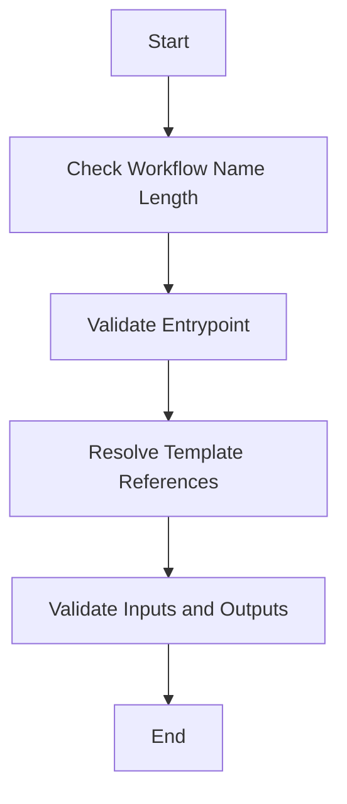

The process of validating a workflow involves several steps to ensure that the workflow adheres to the required specifications before execution. This document will cover:

1. Checking the workflow name length
2. Validating the entrypoint
3. Ensuring all template references are correctly resolved
4. Validating inputs and outputs of the templates

Technical document: <SwmLink doc-title="Workflow Validation Process">[Workflow Validation Process](/.swm/workflow-validation-process.shucexos.sw.md)</SwmLink>

# [Checking the Workflow Name Length](http://localhost:5001/repos/Z2l0aHViJTNBJTNBaW50dWl0LWFyZ28td29ya2Zsb3dzLWRlbW8lM0ElM0FTd2ltbS1EZW1v/docs/shucexos#validateworkflow)

The first step in the workflow validation process is to check if the workflow name is within the allowed length. This is important because names that are too long can cause issues in the system. The maximum allowed length for a workflow name is 63 characters. If the name exceeds this length, the workflow will not be validated and an error will be returned to the user.

# [Validating the Entrypoint](http://localhost:5001/repos/Z2l0aHViJTNBJTNBaW50dWl0LWFyZ28td29ya2Zsb3dzLWRlbW8lM0ElM0FTd2ltbS1EZW1v/docs/shucexos#validateworkflow)

The next step is to validate the entrypoint of the workflow. The entrypoint is the starting point of the workflow and must be correctly defined. This involves checking if the entrypoint exists and is correctly specified in the workflow definition. If the entrypoint is not valid, the workflow cannot be executed, and an error will be returned.

# [Ensuring All Template References Are Correctly Resolved](http://localhost:5001/repos/Z2l0aHViJTNBJTNBaW50dWl0LWFyZ28td29ya2Zsb3dzLWRlbW8lM0ElM0FTd2ltbS1EZW1v/docs/shucexos#validatetemplateholder)

In this step, the system checks all the template references within the workflow to ensure they exist and are correctly defined. This includes validating the retry strategy and resolving any template references. If any template reference is missing or incorrectly defined, the workflow will not be validated. This step is crucial for ensuring that each part of the workflow can be executed without errors.

# [Validating Inputs and Outputs of the Templates](http://localhost:5001/repos/Z2l0aHViJTNBJTNBaW50dWl0LWFyZ28td29ya2Zsb3dzLWRlbW8lM0ElM0FTd2ltbS1EZW1v/docs/shucexos#validatetemplate)

The final step in the validation process is to check the inputs and outputs of the templates. This involves ensuring that all required inputs are provided and correctly formatted, and that the outputs conform to the expected formats. If any input or output is not valid, the workflow will not be validated. This step ensures that the workflow can process data correctly and produce the expected results.

&nbsp;

*This is an auto-generated document by Swimm 🌊 and has not yet been verified by a human*

<SwmMeta version="3.0.0" repo-id="Z2l0aHViJTNBJTNBaW50dWl0LWFyZ28td29ya2Zsb3dzLWRlbW8lM0ElM0FTd2ltbS1EZW1v" repo-name="intuit-argo-workflows-demo">Powered by [Swimm](/)</SwmMeta>
