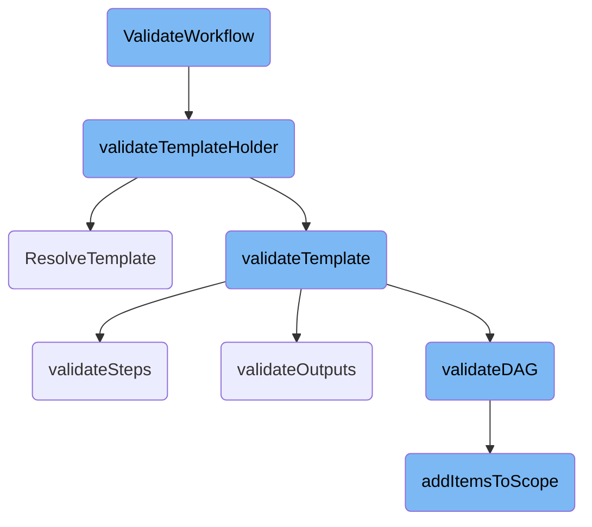
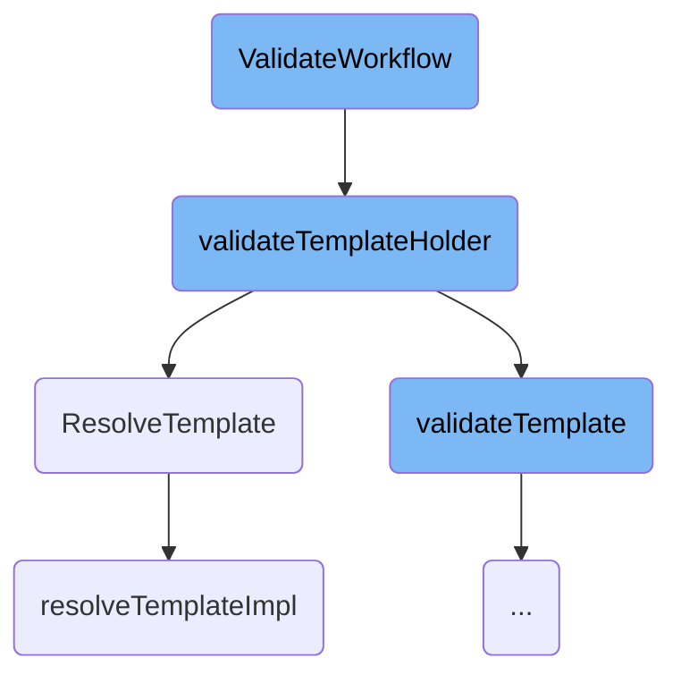
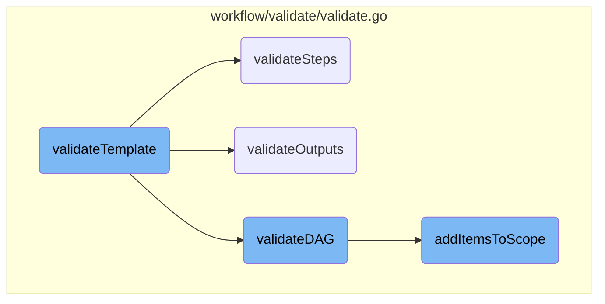

This document outlines the process of validating a workflow. The validation process ensures that the workflow adheres to the required specifications before execution. It involves checking the workflow name length, validating the entrypoint, and ensuring that all template references are correctly resolved.

The validation process starts by checking if the workflow name is within the allowed length. Then, it validates the entrypoint to ensure it is correctly defined. Next, it checks all the template references to make sure they exist and are correctly defined. This includes validating the retry strategy and resolving any template references. Finally, it validates the inputs and outputs of the templates to ensure they conform to the expected formats.

Here is a high level diagram of the flow, showing only the most important functions:



# Flow drill down

First, we'll zoom into this section of the flow:



<SwmSnippet path="/workflow/validate/validate.go" line="139">

---

## <SwmToken path="workflow/validate/validate.go" pos="139:2:2" line-data="// ValidateWorkflow accepts a workflow and performs validation against it.">`ValidateWorkflow`</SwmToken>

The <SwmToken path="workflow/validate/validate.go" pos="139:2:2" line-data="// ValidateWorkflow accepts a workflow and performs validation against it.">`ValidateWorkflow`</SwmToken> function is responsible for validating the entire workflow. It checks the workflow name length, validates the entrypoint, and ensures that all template references are correctly resolved. This function ensures that the workflow adheres to the required specifications before execution.

```go
// ValidateWorkflow accepts a workflow and performs validation against it.
func ValidateWorkflow(wftmplGetter templateresolution.WorkflowTemplateNamespacedGetter, cwftmplGetter templateresolution.ClusterWorkflowTemplateGetter, wf *wfv1.Workflow, opts ValidateOpts) error {
	ctx := newTemplateValidationCtx(wf, opts)
	tmplCtx := templateresolution.NewContext(wftmplGetter, cwftmplGetter, wf, wf)
	var wfSpecHolder wfv1.WorkflowSpecHolder
	var wfTmplRef *wfv1.TemplateRef
	var err error

	if len(wf.Name) > maxCharsInObjectName {
		return fmt.Errorf("workflow name %q must not be more than 63 characters long (currently %d)", wf.Name, len(wf.Name))
	}

	entrypoint := wf.Spec.Entrypoint

	hasWorkflowTemplateRef := wf.Spec.WorkflowTemplateRef != nil

	if hasWorkflowTemplateRef {
		err := ValidateWorkflowTemplateRefFields(wf.Spec)
		if err != nil {
			return err
		}
```

---

</SwmSnippet>

<SwmSnippet path="/workflow/validate/validate.go" line="540">

---

## <SwmToken path="workflow/validate/validate.go" pos="540:2:2" line-data="// validateTemplateHolder validates a template holder and returns the validated template.">`validateTemplateHolder`</SwmToken>

The <SwmToken path="workflow/validate/validate.go" pos="540:2:2" line-data="// validateTemplateHolder validates a template holder and returns the validated template.">`validateTemplateHolder`</SwmToken> function validates a template holder by checking if the template reference or template name is provided and ensuring that the template exists. It also validates the retry strategy of the resolved template. This function is crucial for ensuring that each template within the workflow is correctly defined and can be executed without errors.

```go
// validateTemplateHolder validates a template holder and returns the validated template.
func (ctx *templateValidationCtx) validateTemplateHolder(tmplHolder wfv1.TemplateReferenceHolder, tmplCtx *templateresolution.Context, args wfv1.ArgumentsProvider, workflowTemplateValidation bool) (*wfv1.Template, error) {
	tmplRef := tmplHolder.GetTemplateRef()
	tmplName := tmplHolder.GetTemplateName()
	if tmplRef != nil {
		if tmplName != "" {
			return nil, errors.New(errors.CodeBadRequest, "template name cannot be specified with templateRef.")
		}
		if tmplRef.Name == "" {
			return nil, errors.New(errors.CodeBadRequest, "resource name is required")
		}
		if tmplRef.Template == "" {
			return nil, errors.New(errors.CodeBadRequest, "template name is required")
		}
		if err := VerifyResolvedVariables(tmplRef); err != nil {
			logrus.Warnf("template reference need resolution: %v", err)
			return nil, nil
		}
	} else if tmplName != "" {
		_, err := tmplCtx.GetTemplateByName(tmplName)
		if err != nil {
```

---

</SwmSnippet>

<SwmSnippet path="/workflow/templateresolution/context.go" line="169">

---

## <SwmToken path="workflow/templateresolution/context.go" pos="169:2:2" line-data="// ResolveTemplate digs into referenes and returns a merged template.">`ResolveTemplate`</SwmToken>

The <SwmToken path="workflow/templateresolution/context.go" pos="169:2:2" line-data="// ResolveTemplate digs into referenes and returns a merged template.">`ResolveTemplate`</SwmToken> function is the entry point for resolving template references. It calls the <SwmToken path="workflow/templateresolution/context.go" pos="172:5:5" line-data="	return ctx.resolveTemplateImpl(tmplHolder)">`resolveTemplateImpl`</SwmToken> function to dig into the references and return a merged template. This function is essential for handling complex workflows where templates may reference other templates.

```go
// ResolveTemplate digs into referenes and returns a merged template.
// This method is the public start point of template resolution.
func (ctx *Context) ResolveTemplate(tmplHolder wfv1.TemplateReferenceHolder) (*Context, *wfv1.Template, bool, error) {
	return ctx.resolveTemplateImpl(tmplHolder)
}
```

---

</SwmSnippet>

<SwmSnippet path="/workflow/templateresolution/context.go" line="175">

---

### <SwmToken path="workflow/templateresolution/context.go" pos="175:2:2" line-data="// resolveTemplateImpl digs into references and returns a merged template.">`resolveTemplateImpl`</SwmToken>

The <SwmToken path="workflow/templateresolution/context.go" pos="175:2:2" line-data="// resolveTemplateImpl digs into references and returns a merged template.">`resolveTemplateImpl`</SwmToken> function processes template references and merges them to form a final resolved template. It handles intermediate parameter passing and ensures that shallower templates overwrite deeper ones. This function is key to ensuring that the final template used in the workflow is correctly constructed and includes all necessary inputs and arguments.

```go
// resolveTemplateImpl digs into references and returns a merged template.
// This method processes inputs and arguments so the inputs of the final
// resolved template include intermediate parameter passing.
// The other fields are just merged and shallower templates overwrite deeper.
func (ctx *Context) resolveTemplateImpl(tmplHolder wfv1.TemplateReferenceHolder) (*Context, *wfv1.Template, bool, error) {
	ctx.log = ctx.log.WithFields(log.Fields{
		"base": common.GetTemplateGetterString(ctx.tmplBase),
		"tmpl": common.GetTemplateHolderString(tmplHolder),
	})
	ctx.log.Debug("Resolving the template")

	templateStored := false
	var tmpl *wfv1.Template
	if ctx.workflow != nil {
		// Check if the template has been stored.
		scope := ctx.tmplBase.GetResourceScope()
		resourceName := ctx.tmplBase.GetName()
		tmpl = ctx.workflow.GetStoredTemplate(scope, resourceName, tmplHolder)
	}
	if tmpl != nil {
		ctx.log.Debug("Found stored template")
```

---

</SwmSnippet>

Now, lets zoom into this section of the flow:



<SwmSnippet path="/workflow/validate/validate.go" line="417">

---

## Validating Template Type

The first step in <SwmToken path="workflow/validate/validate.go" pos="415:9:9" line-data="func (ctx *templateValidationCtx) validateTemplate(tmpl *wfv1.Template, tmplCtx *templateresolution.Context, args wfv1.ArgumentsProvider, workflowTemplateValidation bool) error {">`validateTemplate`</SwmToken> is to validate the type of the template using <SwmToken path="workflow/validate/validate.go" pos="417:7:7" line-data="	if err := validateTemplateType(tmpl); err != nil {">`validateTemplateType`</SwmToken>. This ensures that the template conforms to expected types before proceeding further.

```go
	if err := validateTemplateType(tmpl); err != nil {
		return err
	}
```

---

</SwmSnippet>

<SwmSnippet path="/workflow/validate/validate.go" line="421">

---

## Validating Template Inputs

Next, the function <SwmToken path="workflow/validate/validate.go" pos="421:8:8" line-data="	scope, err := validateInputs(tmpl)">`validateInputs`</SwmToken> is called to validate the inputs of the template. This step ensures that all required inputs are correctly defined and available.

```go
	scope, err := validateInputs(tmpl)
	if err != nil {
		return err
```

---

</SwmSnippet>

<SwmSnippet path="/workflow/validate/validate.go" line="426">

---

## Handling Init Containers

The function then validates any init containers defined in the template using <SwmToken path="workflow/validate/validate.go" pos="426:9:9" line-data="	if err := ctx.validateInitContainers(tmpl.InitContainers); err != nil {">`validateInitContainers`</SwmToken>. This step ensures that the init containers are correctly configured.

```go
	if err := ctx.validateInitContainers(tmpl.InitContainers); err != nil {
		return err
	}
```

---

</SwmSnippet>

<SwmSnippet path="/workflow/validate/validate.go" line="489">

---

## Validating Steps Template

If the template type is <SwmToken path="workflow/validate/validate.go" pos="596:30:30" line-data="	for _, tmplType := range []interface{}{tmpl.Container, tmpl.ContainerSet, tmpl.Steps, tmpl.Script, tmpl.Resource, tmpl.DAG, tmpl.Suspend, tmpl.Data, tmpl.HTTP, tmpl.Plugin} {">`Steps`</SwmToken>, the function <SwmToken path="workflow/validate/validate.go" pos="490:7:7" line-data="		err = ctx.validateSteps(scope, tmplCtx, newTmpl, workflowTemplateValidation)">`validateSteps`</SwmToken> is called. This function ensures that each step within the template is correctly defined and unique.

```go
	case wfv1.TemplateTypeSteps:
		err = ctx.validateSteps(scope, tmplCtx, newTmpl, workflowTemplateValidation)
	case wfv1.TemplateTypeDAG:
```

---

</SwmSnippet>

<SwmSnippet path="/workflow/validate/validate.go" line="492">

---

## Validating DAG Template

If the template type is <SwmToken path="workflow/validate/validate.go" pos="596:45:45" line-data="	for _, tmplType := range []interface{}{tmpl.Container, tmpl.ContainerSet, tmpl.Steps, tmpl.Script, tmpl.Resource, tmpl.DAG, tmpl.Suspend, tmpl.Data, tmpl.HTTP, tmpl.Plugin} {">`DAG`</SwmToken>, the function <SwmToken path="workflow/validate/validate.go" pos="492:7:7" line-data="		err = ctx.validateDAG(scope, tmplCtx, newTmpl, workflowTemplateValidation)">`validateDAG`</SwmToken> is invoked. This function ensures that the DAG structure is valid, including tasks and dependencies.

```go
		err = ctx.validateDAG(scope, tmplCtx, newTmpl, workflowTemplateValidation)
	default:
```

---

</SwmSnippet>

<SwmSnippet path="/workflow/validate/validate.go" line="499">

---

## Validating Outputs

Finally, the function <SwmToken path="workflow/validate/validate.go" pos="499:5:5" line-data="	err = validateOutputs(scope, ctx.globalParams, newTmpl, workflowTemplateValidation)">`validateOutputs`</SwmToken> is called to validate the outputs of the template. This step ensures that all outputs are correctly defined and conform to expected formats.

```go
	err = validateOutputs(scope, ctx.globalParams, newTmpl, workflowTemplateValidation)
	if err != nil {
		return err
	}
```

---

</SwmSnippet>

# Where is this flow used?

This flow is used multiple times in the codebase as represented in the following diagram:

(Note - these are only some of the entry points of this flow)

```mermaid
graph TD;
      subgraph workflowcontroller["workflow/controller"]
8c42356d0aad8a081949b278d4a0004926383e84a2e921e327c8d66022ba15c6(runWorker):::rootsStyle --> 4c4f845de8376b0a134ec5585f8224b0ffa2f1237abf54f83fc7c145c2c28283(processNextItem)
end

subgraph workflowcontroller["workflow/controller"]
4c4f845de8376b0a134ec5585f8224b0ffa2f1237abf54f83fc7c145c2c28283(processNextItem) --> 413a986de2cf6fa8b5dfd150e0d0595378ba7e3f2a5c998c5de284b2b8cfce3e(operate)
end

subgraph workflowcontroller["workflow/controller"]
413a986de2cf6fa8b5dfd150e0d0595378ba7e3f2a5c998c5de284b2b8cfce3e(operate) --> 534ff33e0a42ac362c6c2b47c7d3141c157c374eaae1eecf4304647cbc38ea45(executeWfLifeCycleHook)
end

subgraph workflowcontroller["workflow/controller"]
534ff33e0a42ac362c6c2b47c7d3141c157c374eaae1eecf4304647cbc38ea45(executeWfLifeCycleHook) --> c7f9352b10f081fd8e34be01474532e7c99d4fbfe299d93333d437bd20785e6f(executeTemplate)
end

subgraph workflowcontroller["workflow/controller"]
c7f9352b10f081fd8e34be01474532e7c99d4fbfe299d93333d437bd20785e6f(executeTemplate) --> 5462b92de2314f5715eda4915073fddb71185c8d36b6c6f4e427437ac46b8ec3(executeDAG)
end

subgraph workflowcontroller["workflow/controller"]
5462b92de2314f5715eda4915073fddb71185c8d36b6c6f4e427437ac46b8ec3(executeDAG) --> 745f252957e8cffe989e6f65d76caddb43b966e0235944dcf53b655479ada9d5(executeDAGTask)
end

subgraph workflowcontroller["workflow/controller"]
745f252957e8cffe989e6f65d76caddb43b966e0235944dcf53b655479ada9d5(executeDAGTask) --> 56255d1bafe98dbf0871b12a69e1779644efd990d34841c8867682e1abbdbd38(resolveDependencyReferences)
end

subgraph workflowcontroller["workflow/controller"]
56255d1bafe98dbf0871b12a69e1779644efd990d34841c8867682e1abbdbd38(resolveDependencyReferences) --> cfae7ef231dd0054584813703a7c72f5d10215b774b334ee66e809cad2452d34(resolveArtifact)
end

subgraph workflowcontroller["workflow/controller"]
cfae7ef231dd0054584813703a7c72f5d10215b774b334ee66e809cad2452d34(resolveArtifact) --> 3e1cec86c12def1f82f7bfc8213d49d16f15cc1c0ad4d4f6cfa423301252a6e1(resolveVar)
end

subgraph utiltemplateresolvevargo["util/template/resolve_var.go"]
3e1cec86c12def1f82f7bfc8213d49d16f15cc1c0ad4d4f6cfa423301252a6e1(resolveVar) --> cc99a3482c14b1763382360ab3e95fa33b6f96ab6639b0d2198a3646761335ac(ResolveVar)
end

subgraph workflowcron["workflow/cron"]
cc99a3482c14b1763382360ab3e95fa33b6f96ab6639b0d2198a3646761335ac(ResolveVar) --> 2ee2177c5aa9168dc1b6730c9fb9438c151eae85b64f76f2b3217df917db2611(Run)
end

subgraph workflowcron["workflow/cron"]
2ee2177c5aa9168dc1b6730c9fb9438c151eae85b64f76f2b3217df917db2611(Run) --> 0a3e2c85f818a71d387f53fa7df2ea757049fc408180f043d94a7f735edfc56e(run)
end

0a3e2c85f818a71d387f53fa7df2ea757049fc408180f043d94a7f735edfc56e(run) --> 7f520abad02020f7ee1451bfcc3246026aede82fc17411f6928ac4fb332b3c47(SubmitWorkflow)

7f520abad02020f7ee1451bfcc3246026aede82fc17411f6928ac4fb332b3c47(SubmitWorkflow) --> e1dab4a870142fbd6b4def6145fa8ea7f7f307b6d4836d758a43706e27259c04(ValidateWorkflow):::mainFlowStyle

subgraph cmdargoexeccommands["cmd/argoexec/commands"]
227eaee48f790cb276fab7c3bb5c4aed07dc34a153c81931559b3ec413b1cb32(main):::rootsStyle --> d89e8dd758bf1ff0737066881c041dfcef3cf75b9ed25451cba9aae54a9780b1(NewRootCommand)
end

subgraph cmdargoexeccommands["cmd/argoexec/commands"]
d89e8dd758bf1ff0737066881c041dfcef3cf75b9ed25451cba9aae54a9780b1(NewRootCommand) --> 411b9ed21503be91cedcbfd8c367a3b6716a32a11b8024627d5b95fd8bfc253f(NewAgentCommand)
end

subgraph cmdargoexeccommands["cmd/argoexec/commands"]
411b9ed21503be91cedcbfd8c367a3b6716a32a11b8024627d5b95fd8bfc253f(NewAgentCommand) --> 5dd6e280005523016abbd5e17695e8898882e19559de22382e06c0e496cd8f7b(NewAgentMainCommand)
end

5dd6e280005523016abbd5e17695e8898882e19559de22382e06c0e496cd8f7b(NewAgentMainCommand) --> 79db6d48c0b00caa06e48f666b1a049071324d9de2e520fff5fc9cee23dabcab(Agent)

79db6d48c0b00caa06e48f666b1a049071324d9de2e520fff5fc9cee23dabcab(Agent) --> 7e43448e8bdb7d718f942bc86dfede8688ead215b80966cd3489b0aa93ef05bc(taskWorker)

7e43448e8bdb7d718f942bc86dfede8688ead215b80966cd3489b0aa93ef05bc(taskWorker) --> 55fd1a96783890554abd15057c1b5cd0d805464f1e56df51748fe85a8fd8b256(processTask)

subgraph workflowcontroller["workflow/controller"]
55fd1a96783890554abd15057c1b5cd0d805464f1e56df51748fe85a8fd8b256(processTask) --> c7f9352b10f081fd8e34be01474532e7c99d4fbfe299d93333d437bd20785e6f(executeTemplate)
end

subgraph hackdocs["hack/docs"]
227eaee48f790cb276fab7c3bb5c4aed07dc34a153c81931559b3ec413b1cb32(main):::rootsStyle --> c2026e2ff1482503e37d8dbc2b22188144d6fa0e8caf3bc6abacfafdc41f5066(generateCLIDocs)
end

subgraph cmdargocommandsrootgo["cmd/argo/commands/root.go"]
c2026e2ff1482503e37d8dbc2b22188144d6fa0e8caf3bc6abacfafdc41f5066(generateCLIDocs) --> 60c01fa4c15a8c073050eb54095d813a5014911b369fc5bd56bb39ac02e61328(NewCommand)
end

subgraph cmdargocommandsarchive["cmd/argo/commands/archive"]
60c01fa4c15a8c073050eb54095d813a5014911b369fc5bd56bb39ac02e61328(NewCommand) --> 51b6ed5e23743b37a8b72b2295cde0270b7dcd062f58ac76caf2ab32665bf734(NewArchiveCommand)
end

subgraph cmdargocommandsarchive["cmd/argo/commands/archive"]
51b6ed5e23743b37a8b72b2295cde0270b7dcd062f58ac76caf2ab32665bf734(NewArchiveCommand) --> cbedbbcd63d38e1e19508fca6f4ae9cb96aba809e6efa7332df31bfef44ce507(NewResubmitCommand)
end

subgraph cmdargocommandsarchive["cmd/argo/commands/archive"]
cbedbbcd63d38e1e19508fca6f4ae9cb96aba809e6efa7332df31bfef44ce507(NewResubmitCommand) --> 6df525b137fd591b228e6197d4f562b8bfcd58170992c8fc92802b5c64d38f7c(resubmitArchivedWorkflows)
end

6df525b137fd591b228e6197d4f562b8bfcd58170992c8fc92802b5c64d38f7c(resubmitArchivedWorkflows) --> e1dca2266cf66100ed8fbb3036c3b6eb2689ad34c336646f0c2554aec4954b1e(ResubmitArchivedWorkflow)

e1dca2266cf66100ed8fbb3036c3b6eb2689ad34c336646f0c2554aec4954b1e(ResubmitArchivedWorkflow) --> 8a657e569e0da5fa67ca222f142728be90f13a00e8d56eb1de66bd6b3be48b2c(SubmitWorkflow)

8a657e569e0da5fa67ca222f142728be90f13a00e8d56eb1de66bd6b3be48b2c(SubmitWorkflow) --> e1dab4a870142fbd6b4def6145fa8ea7f7f307b6d4836d758a43706e27259c04(ValidateWorkflow):::mainFlowStyle

subgraph cmdargocommandsrootgo["cmd/argo/commands/root.go"]
227eaee48f790cb276fab7c3bb5c4aed07dc34a153c81931559b3ec413b1cb32(main):::rootsStyle --> 60c01fa4c15a8c073050eb54095d813a5014911b369fc5bd56bb39ac02e61328(NewCommand)
end

subgraph workflowcron["workflow/cron"]
eaa1da0156579baf94b8cbd0dc6439a2fbbd4045237de9e03acde69afb147b65(runCronWorker):::rootsStyle --> bce992da81cc93622a480dd76ab35774b36aa7bf3924ae8dbc334f333a9753ce(processNextCronItem)
end

subgraph workflowcron["workflow/cron"]
bce992da81cc93622a480dd76ab35774b36aa7bf3924ae8dbc334f333a9753ce(processNextCronItem) --> 0248132081ce5923eb72c2e5216f5b67346ecff453e78d58b8b54969639dc814(runOutstandingWorkflows)
end

subgraph workflowcron["workflow/cron"]
0248132081ce5923eb72c2e5216f5b67346ecff453e78d58b8b54969639dc814(runOutstandingWorkflows) --> 0a3e2c85f818a71d387f53fa7df2ea757049fc408180f043d94a7f735edfc56e(run)
end


      classDef mainFlowStyle color:#000000,fill:#7CB9F4
classDef rootsStyle color:#000000,fill:#00FFF4
classDef Style1 color:#000000,fill:#00FFAA
classDef Style2 color:#000000,fill:#FFFF00
classDef Style3 color:#000000,fill:#AA7CB9
```



&nbsp;

*This is an auto-generated document by Swimm 🌊 and has not yet been verified by a human*

<SwmMeta version="3.0.0" repo-id="Z2l0aHViJTNBJTNBaW50dWl0LWFyZ28td29ya2Zsb3dzLWRlbW8lM0ElM0FTd2ltbS1EZW1v" repo-name="intuit-argo-workflows-demo"><sup>Powered by [Swimm](/)</sup></SwmMeta>
